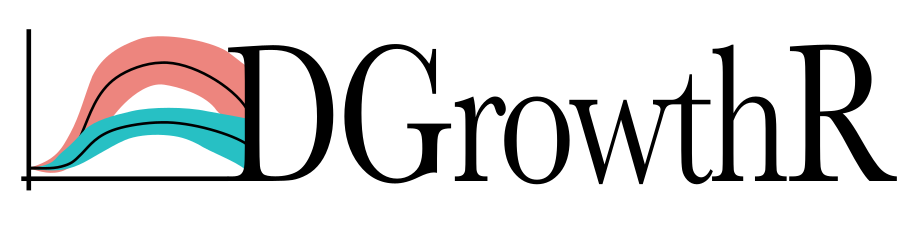

```{r setup, include = FALSE}
knitr::opts_chunk$set(
  collapse = TRUE,
  comment = "#>",
  fig.path = "man/figures/README-",
  out.width = "100%"
)
```




This repository hosts the `DGrowthR` R package and the workflow for the detailed analysis of publicly available datasets mentioned in our pre-print. This workflow is designed to showcase the application of the `DGrowthR` package to model complex, non-linear dynamics of bacterial growth using Gaussian Process Regression.


## Installation Guide

To install the `DGrowthR` R package directly from this repository. First make sure you clone the repository and enter into the cloned folder. Then you can execute the following commands in R.

1. Ensure that you have the `devtools` package installed. If not, you can install it using the following command

```{r install.devtools, eval=FALSE}

# Install devtools
install.packages("devtools")

# Load the library
library(devtools)
```


2. Use the `install` function to install the `DGrowthR` package:
```{r install.dgrowthr, eval=FALSE}

install()

```


## How to use `DGrowthR`. 
  
An overview of the main functionalities of `DGrowthR` with concrete examples can be found in our [tutorial vignette]


## Analysis workflow. 

Additionally, you see our analysis of publicly available datasets from the [Brochado 2018](https://www.nature.com/articles/s41586-018-0278-9) and [Brenzinger 2024](https://www.nature.com/articles/s41564-023-01556-y) studies.

All steps are in our [workflow] folder


   
   
   
   
   
