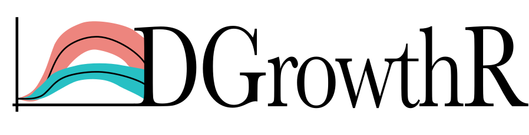
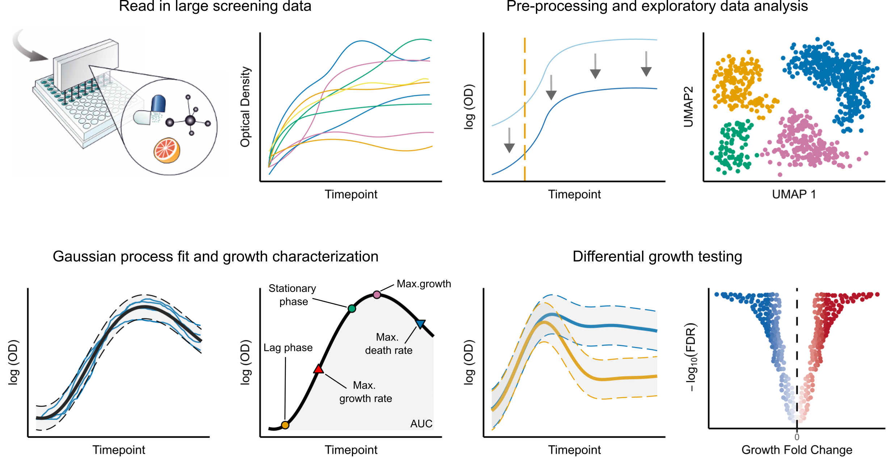

# DGrowthR: A comprehensive workflow for growth curve analysis

This repository hosts the `DGrowthR` R package and the workflow for the
detailed analysis of publicly available datasets mentioned in our
pre-print. This workflow is designed to showcase the application of the
`DGrowthR` package to model complex, non-linear dynamics of bacterial
growth using Gaussian Process Regression.



> [!TIP]
> For more details, check out our pre-print [Statistical end-to-end analysis of large-scale microbial growth data with DGrowthR](https://www.biorxiv.org/content/10.1101/2025.03.25.645164v2) on bioRxiv.

## Installation Guide

To install the `DGrowthR` R package directly from this repository. First
make sure you clone the repository and enter into the cloned folder.
Then you can execute the following commands in R.

1.  Ensure that you have the `devtools` package installed. If not, you
    can install it using the following command

```r
# Install devtools
install.packages("devtools")

# Load the library
library(devtools)
```

2.  Use the `install` function to install the `DGrowthR` package:

```r
install()
```

## How to use `DGrowthR`.

An overview of the main functionalities of `DGrowthR` with concrete
examples can be found in our [tutorial
vignette](https://github.com/bio-datascience/DGrowthR/blob/main/vignettes/DGrowthR.Rmd)

## Analysis workflow.

Additionally, you see our analysis of publicly available datasets from
the [Brochado 2018](https://www.nature.com/articles/s41586-018-0278-9)
and [Brenzinger
2024](https://www.nature.com/articles/s41564-023-01556-y) studies.

All steps are in our
[workflow](https://github.com/bio-datascience/DGrowthR/tree/main/workflow)
folder
