# Get started

This page aims to give an overview of `DGrowthR` and introduce you to
the main functions that you might want to use for your own analysis.
Broadly speaking, this tutorial is divided into the following sections:

1.  [Preparing your data for
    `DGrowthR`](#preparing-your-data-for-dgrowthr). \[Required\]
2.  Preparing a DGrowthR object. \[Required\]
3.  Pre-processing. \[Required\]
4.  Exploratory data analysis.  
5.  Growth parameter calculation.  
6.  Differential growth testing.
7.  Multiple differential growth testing.

``` r
library("DGrowthR")
library("tidyverse")

# We also need the permApprox package for the permutation test in the growth comparison section
# Here we install if it wasn't already installed
if(!requireNamespace("permApprox", quietly = TRUE)) {
  remotes::install_github("stefpeschel/permApprox")
}
```

## Preparing your data for `DGrowthR`.

To start our analysis we first need to prepare a
[`DGrowthR::DGrowthR()`](https://bio-datascience.github.io/DGrowthR/reference/DGrowthR-class.md)
object. To do this, we require two sources of information:  
1. Growth data. 2. Metadata.

Below we will go into more details of each one.

### Growth data.

`DGrowthR` can be used to analyse growth data from multi-well plate
readers. Depending on the specific platform that is used, the actual
output of each machine might look slightly different. **`DGrowthR`
assumes your data consists of simultaneous measurements of growth**,
preferably that are regularly interspaced. This means that the growth
across all wells is measured at the same time and, ideally, that the
time between measurements is always the same. If the data is not
measured at regular intervals, `DGrowthR` will still be able to analyze
your data. Examples of the kinds of data the can be used can be seen in
our [Source
Data](https://github.com/bio-datascience/DGrowthR/tree/main/Source_Data)
folder.

\*\* Below is an example of the data collected for one 384 well plate
from [Brenzinger
2024](https://www.nature.com/articles/s41564-023-01556-y). This
dataframe could be used directly to build a
[`DGrowthR::DGrowthR()`](https://bio-datascience.github.io/DGrowthR/reference/DGrowthR-class.md)
object. The important features include: \*\*

1.  A column called **Time**: The values in this column indicate the
    time at which the OD measurements were made for all of the wells in
    this plate. The units of the **Time** column (seconds, minutes,
    hours) are taken *as is*. No unit conversion is performed by
    `DGrowthR`.  
2.  Columns indicating wells: All of the columns besides the **Time**
    column indicate the wells in the plate. The values are the measured
    optical density in each well at a specific time point.  
3.  An arbitrary number of wells can be present (typically 384 or 96).
    Typically, each well is identified as a combination of an uppercase
    letter followed by a number, with no spaces. This information is
    used to identify each individual growth curve.

[Source_Data/Brenzinger_2024/wt_1_OD.txt](https://github.com/bio-datascience/DGrowthR/blob/main/Source_Data/Brenzinger_2024/od_data/wt_1_OD.txt)

``` r
  
# Read example data from Brenzinger 2024
example_brenzinger <- read.delim("../Source_Data/Brenzinger_2024/od_data/wt_1_OD.txt", 
                                 sep = '\t')

tibble(example_brenzinger) %>% 
  rmarkdown::paged_table()
```

As stated above, this data frame could be used directly by `DGrowthR`.

#### What if I want to analyze data from multiple plates?.

This is definitely possible with `DGrowthR`. There are just a couple of
things to keep in mind:

1.  The data for each plate should be in separate files.

2.  It is assumed that measurements are taken at roughly the same
    timepoints across all plates. This means that the **Time** column
    should be roughly the same for all plates. Due to small variations
    between different plate measurements, the values in the **Time**
    column might be slightly different.

3.  Each growth curve will now be identified as the combination of
    {plate name}\_{well}.

In order to read the data from multiple plates, harmonize the **Time**
column, and assign individual curve identifiers in a way that can be
used by `DGrowthR`, we provide a standalone function called
[`read_multiple_plates()`](https://bio-datascience.github.io/DGrowthR/reference/read_multiple_plates.md).
Below, we use it to read all of the data from the [Brenzinger
2024](https://www.nature.com/articles/s41564-023-01556-y) study. In this
case we know that 20 measurements are taken; the time between the first
and second measurement is ~2 hours, followed by regular 44 minute
intervals. This can help us create a common time vector for all files.

``` r

# Create common time vector
common_time_vector <- c(0, 2, seq(from=2.739, by=0.739, length.out=18))
 
# Read all OD data
brenzinger_data <- read_multiple_plates(path_target = "../Source_Data/Brenzinger_2024/od_data/",
                                        time_vector = common_time_vector)
#> The following OD data was found: dCBASS_1_OD.txt, dCBASS_2_OD.txt, dCBASS_3_OD.txt, wt_1_OD.txt, wt_2_OD.txt, wt_3_OD.txt
```

The output of this function is a list with two data frames. First is the
“od_data” data frame. As you can see, it has a common **Time** column
with each individual growth curve in remaining columns. Each growth is
now identified with a **curve_id** which is built as
{plate_name}\_{well}, with the plate_name actually just being the name
of the file from which the data was read, without the extension. In
total there are 20 measurements for 2,304 (384 \* 6) growth curves!

``` r

# Show the first five columns of the complete OD data
brenzinger_od <- brenzinger_data[["od_data"]] 


brenzinger_od %>% 
  rmarkdown::paged_table()
```

Additionally, a “metadata” data frame is provided. This data frame
explains where each **curve_id** is coming from. The plate name (file
name without the extension) and the original well are explicitly
mentioned.

``` r

brenzinger_metadata <- brenzinger_data[["metadata"]] 


brenzinger_metadata %>% 
  rmarkdown::paged_table()
```

This sets us up nicely to now discuss the metadata.

### Metadata.

The metadata contains all of the information relevant to the
experimental setup. The information contained here can be quite
arbitrary and suit the needs of the researcher. For example, it can
contain information about the conditions under which each growth curve
was measured, replicate number, batch number, etc. Importantly, there
must be a column named **curve_id**, that contains the names of all of
the growth curves present in the data frame with the optical density
information.

In our case, we will use the information about genotype, compound and
concentration provided by the original study.

``` r

# Information about each plate
database.df <- read_tsv("../Source_Data/Brenzinger_2024/Database.txt", 
                        show_col_types = FALSE) %>% 
  separate(Strain, into = c("genotype", NA)) %>% 
  select(file_id, genotype, Rep_Nr) %>% 
  mutate(plate_name = tools::file_path_sans_ext(file_id))

# Information about each well
mapper.df <- read_tsv("../Source_Data/Brenzinger_2024/Map.txt",
                       show_col_types = FALSE) %>% 
  rename("well" = "Well")


# Add this information to the metadata data frame
brenzinger_metadata <- brenzinger_metadata %>% 
  left_join(database.df, by="plate_name") %>% 
  left_join(mapper.df, by="well") %>% 
  unite("genotype_well", c(genotype, well), sep="_", remove=FALSE)

brenzinger_metadata %>% 
  rmarkdown::paged_table()
```

Now we have a lot more information about the conditions under which each
growth curve was gathered. With these sources of information, we can now
build our
[`DGrowthR::DGrowthR()`](https://bio-datascience.github.io/DGrowthR/reference/DGrowthR-class.md)
object.

## Building a DGrowth object.

Once we are satisfied with our growth data and metadata data frames, we
can instantiate a `DgrowthR()` object with the `DgrowthRFromData()`
function.

``` r

# Instantiate a DGrowthR object
dgobj <- DGrowthRFromData(od_data = brenzinger_od,
                          metadata = brenzinger_metadata)
#> Creating a DGrowthR object...
#> 2304 growth curves.
#> 20 timepoints.
#> 8 covariates (including well).
```

We now have a DGrowthR object. This is the heart of our package. All
functions require a `DGrowthR` object as input. For example, we can
quickly visually inspect our data using the
[`plot_growth_curves()`](https://bio-datascience.github.io/DGrowthR/reference/plot_growth_curves.md)
function.

``` r

plot_growth_curves(dgobj)
```

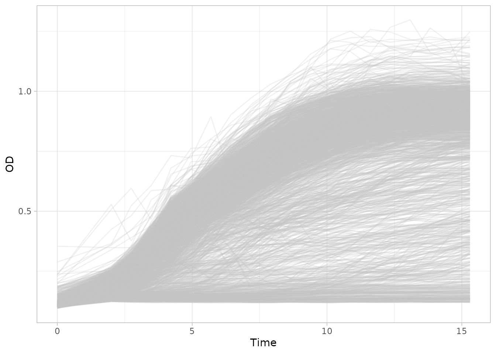

We can inspect our growth curves using variables of the metadata with
the `facet` and `color` parameters.

``` r

plot_growth_curves(dgobj, facet="plate_name", color="genotype")
```

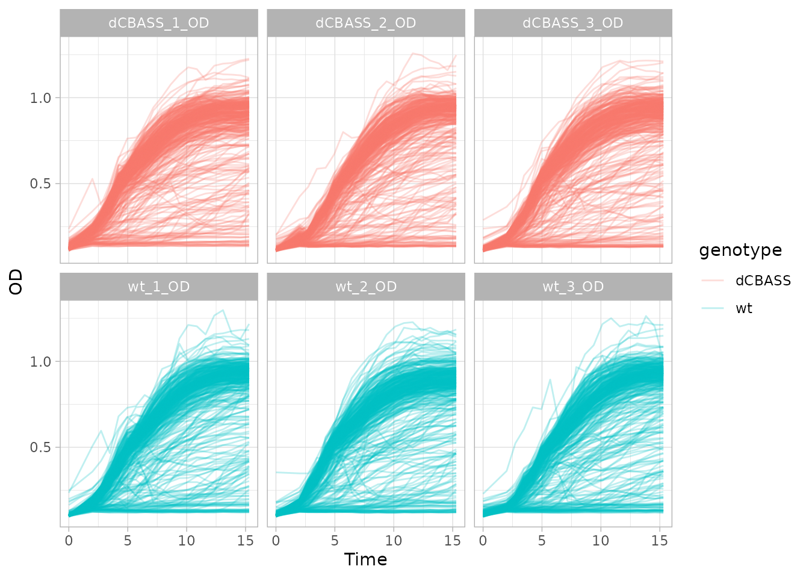

It’s worth mentioning that all of the plots returned by `DGrowthR`
functions are [ggplot](https://ggplot2.tidyverse.org/) objects. Meaning
you may further customize them to your liking using ggplot syntax and
functions.

Now that our data is ready we can start pre-processing.

## Pre-processing.

Pre-processing growth curves is essential before performing any
analysis. This is done by the
[`preprocess_data()`](https://bio-datascience.github.io/DGrowthR/reference/preprocess_data.md)
function. The following transformations are performed:

1.  First the user may specify if some of the initial growth
    measurements should be ignored with the `skip_first_n_timepoints`
    parameter. All growth curves would be shortened so they start at
    timepoint skip_first_n_timepoints + 1.

2.  The optical density measurements are log-transformed. This enables
    accurate estimation of growth parameters such as maximum specific
    growth rate, end of lag phase, etc. Both the log and linear scaled
    data are conserved.

3.  Baseline correction is performed by subtracting the initial OD
    measurement from the rest of the growth curve.

``` r

dgobj <- preprocess_data(dgobj)
#> Log-transforming the growth measurements...
#> Using OD from timepoint 1 as baseline.
```

We can see how our data has been transformed.

``` r

plot_growth_curves(dgobj, facet="plate_name", color="genotype")
```

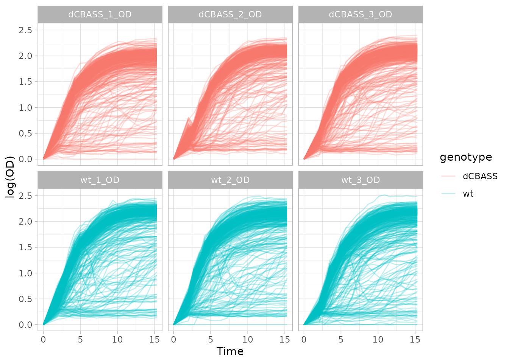

Notice how now the y-axis starts at 0.

## Low dimensional representations.

Now that we have pre-processed data we can compute a low-dimensional
representation of our data. `DGrowthR` offers the possibility to do this
either with a functional PCA, or a UMAP embedding.

``` r

dgobj <- estimate_fpca(dgobj)
#> [DGrowthR::estimate_fpca] >> Estimating functional Principal Components
#> [DGrowthR::estimate_fpca] >> Embedding optical density data
#> Warning in CheckData(Ly, Lt): There is a time gap of at least 10% of the
#> observed range across subjects
dgobj <- estimate_umap(dgobj)
#> [DGrowthR::estimate_umap] >> Estimating functional UMAP
#> [DGrowthR::estimate_umap] >> Embedding optical density data
```

Now we can plot both representations and see what we observe

``` r

plot_fpca(dgobj)
```


``` r


plot_umap(dgobj)
```


``` r
plot_fpca(dgobj)
```

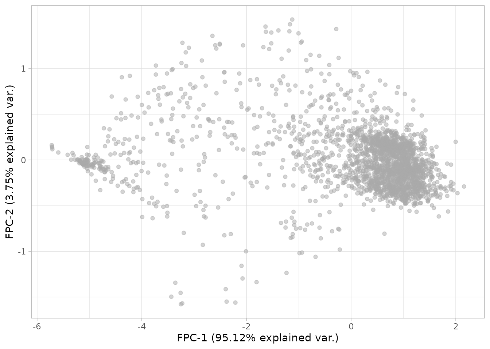

``` r


plot_umap(dgobj)
```

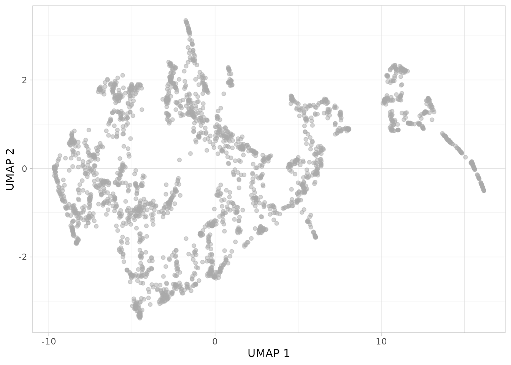

This is looking interesting. One can further investigate what is being
captured by coloring a given covariate in the metadata.

``` r

plot_umap(dgobj, color = "genotype")
```

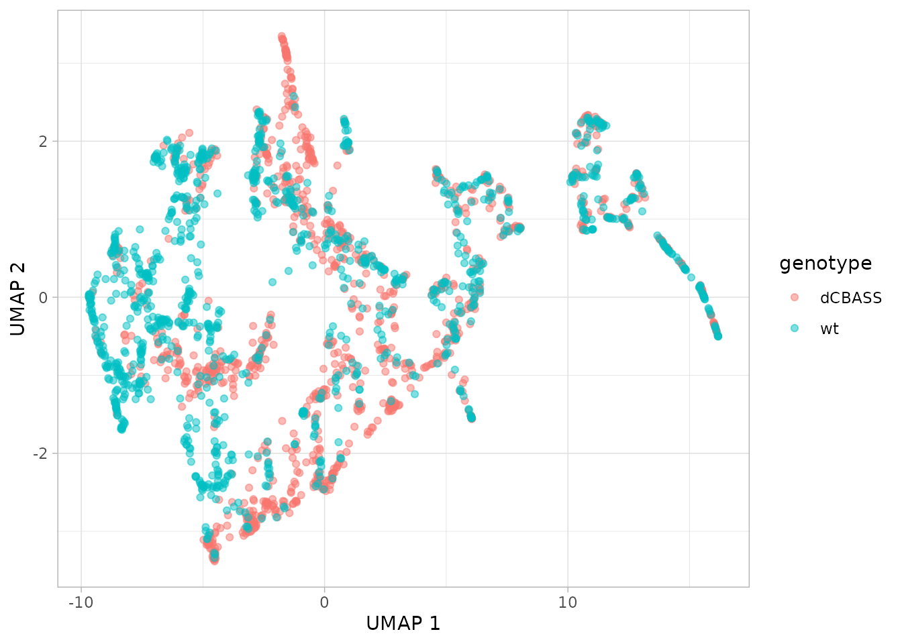

One can also visualize certain growth parameters that are calculated by
DGrowthR. That is discussed in the next section.

## Clustering.

One can cluster growth curves based on their low-dimensinal embeddings
in the fPCA or UMAP. This is acheived by the \`

``` r

# Clustering based on FPCA coordinates
dgobj <- clustering(dgobj, embedding="fpca")
#> Clustering using fPCA coordinates...
#> [DGrowthR::clustering] >> Density based clustering with DBSCAN
#> [DGrowthR::clustering] >> Using K-nearest neighbors: 23
#> [DGrowthR::clustering] >> Automatic determination of optimal eps...
#> [DGrowthR::clustering] >> Using eps value: 0.258811281594046
#> [DGrowthR::clustering] >> Updating cluster_assignment slot..
#> [DGrowthR::clustering] >> Finished


# Now you can plot cluster assignment
plot_fpca(dgobj, color = "cluster_assignment")
```

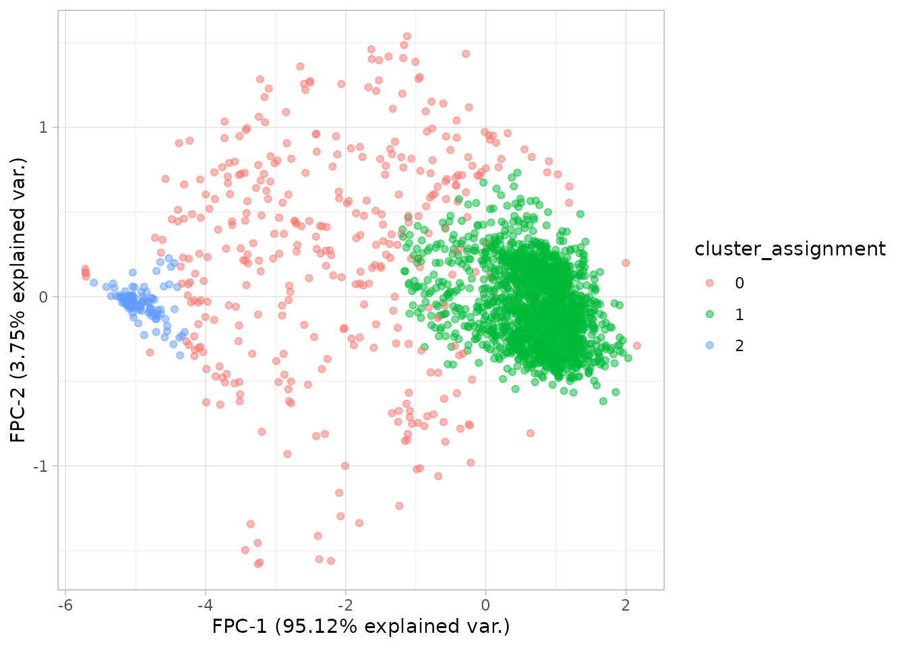

Since we know that we are clustering the individual growth curves, we
can plot our growth curves with updated metadata

``` r

plot_growth_curves(dgobj, facet="cluster_assignment", color="genotype")
```

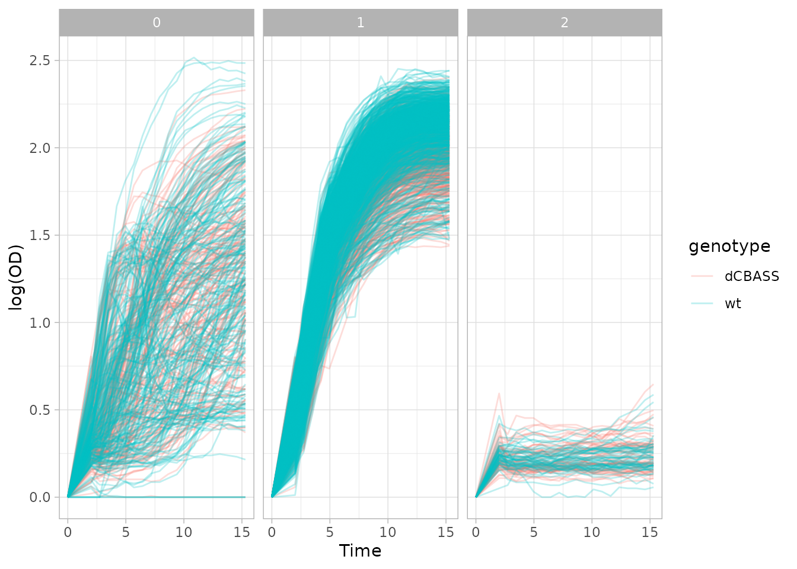

Of course one can play around with clustering by changing the UMAP or
fPCA embedding parameters, and also the clustering parameters
themselves.

## Estimating growth parameters.

Now that we have explored our data a bit, we can get some growth
statistics from our data. In principle, we could do this directly after
pre-processing. One of the main features of `DGrowthR` is htat it does
not assume a specific functional form our growth curves. This means that
we can flexibly model growth curves that do follow a typical sigmoidal
shape. Briefly, a Gaussian Process (GP) is fit to our growth data (we
use the [laGP](https://www.jstatsoft.org/article/view/v072i01) package
for this), and the main growth statistics are gathered from the mean
posterior.

The growth parameters computed are:

1.  **max_growth**: The maximum growth achieved.  
2.  **max_growth_time**: The Time at which **max_growth** was reached.  
3.  **AUC**: The empirical area under the curve.  
4.  **growth_loss**: The maximum decrease of growth after the moment of
    maximum growth.  
5.  **max_growth_rate_timepoint**: The Time at which the maximum growth
    rate is acheived.  
6.  **max_growth_rate**: The maximum specific growth rate.  
7.  **doubling_time**: Equal to $log(2)/\text{max\_growth\_rate}$.
8.  **max_death_rate_timepoint**: The Time where the lowest growth rate
    is observed.  
9.  **max_death_rate**: Maximum rate of death. Properly speaking it is
    the lowest growth rate.  
10. **lag_phase_timepoint**: The Time where lag phase ends and
    exponential growth begins. We find this as the maximum of the second
    derivative *before* **max_growth_rate_timepoint**.
11. **growth_at_lag_phase**: Amount of growth when lag phase ends.  
12. **stationary_phase_timepoint**: The Time where the stationary phase
    starts. We find this as the minimum of the second derivative *after*
    **max_growth_rate_timepoint**. In a typical growth curve, this would
    correspond to the beginning of the stationary phase. 13
    **growth_at_stationary_phase**: The amount of growth at
    **stationary_phase_timepoint**.

**KEEP IN MIND** the values reported are in the units that were used
during modelling. Since our data was log transformed during
pre-processing, all growth parameters are in units of log(OD).

To estimate growth parameters, we can use the
[`estimate_growth_parameters()`](https://bio-datascience.github.io/DGrowthR/reference/estimate_growth_parameters.md)
function.

``` r

dgobj.curve_modelling <- estimate_growth_parameters(dgobj, save_gp_data = TRUE)
#> [DGrowthR::estimate_growth_parameters] >> Fitting GP models and estimating growth parameters...
#> [DGrowthR::estimate_growth_parameters] >> Modelling the curve_id field from metadata. 2304 models will be created.
#>   |                                                                              |                                                                      |   0%  |                                                                              |                                                                      |   1%  |                                                                              |=                                                                     |   1%  |                                                                              |=                                                                     |   2%  |                                                                              |==                                                                    |   2%  |                                                                              |==                                                                    |   3%  |                                                                              |==                                                                    |   4%  |                                                                              |===                                                                   |   4%  |                                                                              |===                                                                   |   5%  |                                                                              |====                                                                  |   5%  |                                                                              |====                                                                  |   6%  |                                                                              |=====                                                                 |   6%  |                                                                              |=====                                                                 |   7%  |                                                                              |=====                                                                 |   8%  |                                                                              |======                                                                |   8%  |                                                                              |======                                                                |   9%  |                                                                              |=======                                                               |   9%  |                                                                              |=======                                                               |  10%  |                                                                              |=======                                                               |  11%  |                                                                              |========                                                              |  11%  |                                                                              |========                                                              |  12%  |                                                                              |=========                                                             |  12%  |                                                                              |=========                                                             |  13%  |                                                                              |=========                                                             |  14%  |                                                                              |==========                                                            |  14%  |                                                                              |==========                                                            |  15%  |                                                                              |===========                                                           |  15%  |                                                                              |===========                                                           |  16%  |                                                                              |============                                                          |  16%  |                                                                              |============                                                          |  17%  |                                                                              |============                                                          |  18%  |                                                                              |=============                                                         |  18%  |                                                                              |=============                                                         |  19%  |                                                                              |==============                                                        |  19%  |                                                                              |==============                                                        |  20%  |                                                                              |==============                                                        |  21%  |                                                                              |===============                                                       |  21%  |                                                                              |===============                                                       |  22%  |                                                                              |================                                                      |  22%  |                                                                              |================                                                      |  23%  |                                                                              |================                                                      |  24%  |                                                                              |=================                                                     |  24%  |                                                                              |=================                                                     |  25%  |                                                                              |==================                                                    |  25%  |                                                                              |==================                                                    |  26%  |                                                                              |===================                                                   |  26%  |                                                                              |===================                                                   |  27%  |                                                                              |===================                                                   |  28%  |                                                                              |====================                                                  |  28%  |                                                                              |====================                                                  |  29%  |                                                                              |=====================                                                 |  29%  |                                                                              |=====================                                                 |  30%  |                                                                              |=====================                                                 |  31%  |                                                                              |======================                                                |  31%  |                                                                              |======================                                                |  32%  |                                                                              |=======================                                               |  32%  |                                                                              |=======================                                               |  33%  |                                                                              |=======================                                               |  34%  |                                                                              |========================                                              |  34%  |                                                                              |========================                                              |  35%  |                                                                              |=========================                                             |  35%  |                                                                              |=========================                                             |  36%  |                                                                              |==========================                                            |  36%  |                                                                              |==========================                                            |  37%  |                                                                              |==========================                                            |  38%  |                                                                              |===========================                                           |  38%  |                                                                              |===========================                                           |  39%  |                                                                              |============================                                          |  39%  |                                                                              |============================                                          |  40%  |                                                                              |============================                                          |  41%  |                                                                              |=============================                                         |  41%  |                                                                              |=============================                                         |  42%  |                                                                              |==============================                                        |  42%  |                                                                              |==============================                                        |  43%  |                                                                              |==============================                                        |  44%  |                                                                              |===============================                                       |  44%  |                                                                              |===============================                                       |  45%  |                                                                              |================================                                      |  45%  |                                                                              |================================                                      |  46%  |                                                                              |=================================                                     |  46%  |                                                                              |=================================                                     |  47%  |                                                                              |=================================                                     |  48%  |                                                                              |==================================                                    |  48%  |                                                                              |==================================                                    |  49%  |                                                                              |===================================                                   |  49%  |                                                                              |===================================                                   |  50%  |                                                                              |===================================                                   |  51%  |                                                                              |====================================                                  |  51%  |                                                                              |====================================                                  |  52%  |                                                                              |=====================================                                 |  52%  |                                                                              |=====================================                                 |  53%  |                                                                              |=====================================                                 |  54%  |                                                                              |======================================                                |  54%  |                                                                              |======================================                                |  55%  |                                                                              |=======================================                               |  55%  |                                                                              |=======================================                               |  56%  |                                                                              |========================================                              |  56%  |                                                                              |========================================                              |  57%  |                                                                              |========================================                              |  58%  |                                                                              |=========================================                             |  58%  |                                                                              |=========================================                             |  59%  |                                                                              |==========================================                            |  59%  |                                                                              |==========================================                            |  60%  |                                                                              |==========================================                            |  61%  |                                                                              |===========================================                           |  61%  |                                                                              |===========================================                           |  62%  |                                                                              |============================================                          |  62%  |                                                                              |============================================                          |  63%  |                                                                              |============================================                          |  64%  |                                                                              |=============================================                         |  64%  |                                                                              |=============================================                         |  65%  |                                                                              |==============================================                        |  65%  |                                                                              |==============================================                        |  66%  |                                                                              |===============================================                       |  66%  |                                                                              |===============================================                       |  67%  |                                                                              |===============================================                       |  68%  |                                                                              |================================================                      |  68%  |                                                                              |================================================                      |  69%  |                                                                              |=================================================                     |  69%  |                                                                              |=================================================                     |  70%  |                                                                              |=================================================                     |  71%  |                                                                              |==================================================                    |  71%  |                                                                              |==================================================                    |  72%  |                                                                              |===================================================                   |  72%  |                                                                              |===================================================                   |  73%  |                                                                              |===================================================                   |  74%  |                                                                              |====================================================                  |  74%  |                                                                              |====================================================                  |  75%  |                                                                              |=====================================================                 |  75%  |                                                                              |=====================================================                 |  76%  |                                                                              |======================================================                |  76%  |                                                                              |======================================================                |  77%  |                                                                              |======================================================                |  78%  |                                                                              |=======================================================               |  78%  |                                                                              |=======================================================               |  79%  |                                                                              |========================================================              |  79%  |                                                                              |========================================================              |  80%  |                                                                              |========================================================              |  81%  |                                                                              |=========================================================             |  81%  |                                                                              |=========================================================             |  82%  |                                                                              |==========================================================            |  82%  |                                                                              |==========================================================            |  83%  |                                                                              |==========================================================            |  84%  |                                                                              |===========================================================           |  84%  |                                                                              |===========================================================           |  85%  |                                                                              |============================================================          |  85%  |                                                                              |============================================================          |  86%  |                                                                              |=============================================================         |  86%  |                                                                              |=============================================================         |  87%  |                                                                              |=============================================================         |  88%  |                                                                              |==============================================================        |  88%  |                                                                              |==============================================================        |  89%  |                                                                              |===============================================================       |  89%  |                                                                              |===============================================================       |  90%  |                                                                              |===============================================================       |  91%  |                                                                              |================================================================      |  91%  |                                                                              |================================================================      |  92%  |                                                                              |=================================================================     |  92%  |                                                                              |=================================================================     |  93%  |                                                                              |=================================================================     |  94%  |                                                                              |==================================================================    |  94%  |                                                                              |==================================================================    |  95%  |                                                                              |===================================================================   |  95%  |                                                                              |===================================================================   |  96%  |                                                                              |====================================================================  |  96%  |                                                                              |====================================================================  |  97%  |                                                                              |====================================================================  |  98%  |                                                                              |===================================================================== |  98%  |                                                                              |===================================================================== |  99%  |                                                                              |======================================================================|  99%  |                                                                              |======================================================================| 100%
#> [DGrowthR::estimate_growth_parameters] >> Updating growth_parameters slot...
#> [DGrowthR::estimate_growth_parameters] >> Updating gpfit_info slot...
#> [DGrowthR::estimate_growth_parameters] >> Finished!
```

By default, the function models and gathers growth parameters for each
individual curve and saves in the `@growth_parameters` slot. We can view
it here.

``` r
dgobj.curve_modelling@growth_parameters %>% 
  rmarkdown::paged_table()
```

As you can see, the **gpfit_id** field corresponds to the **curve_id**.
We actually update our low-dimensional embeddings with this data now.

``` r

# TODO: ADD THIS AS A FUNCTION?

# Gather growth parameters
growth_params <- dgobj.curve_modelling@growth_parameters %>% 
  rename("curve_id" = "gpfit_id")

# Add to metadata
dgobj.curve_modelling@metadata <- dgobj.curve_modelling@metadata %>% 
  left_join(growth_params, by="curve_id")

# Replot
plot_fpca(dgobj.curve_modelling, color = "AUC")
```

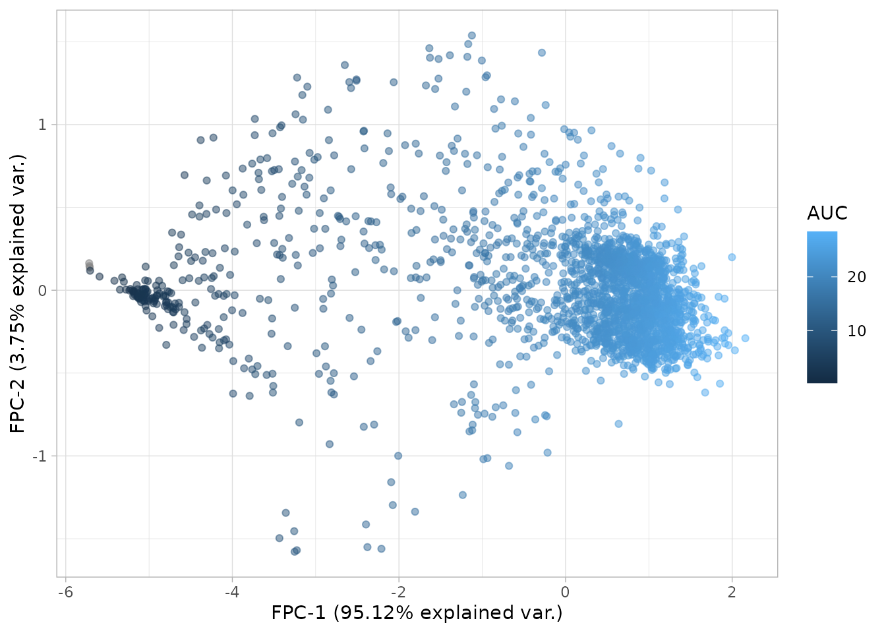

### Modelling groups of curves.

One additional advantage of using GP to model our curves is that we can
now model several growth curves at the same time! Instead of modelling
one curve at a time, we can jointly model all replicate curves that were
gathered in the same experimental conditions. For example, in
[Brenzinger 2024](https://www.nature.com/articles/s41564-023-01556-y)
they analyse the response of a $\Delta$CBASS strain against the wildtype
when confronted with different compounds. We can jointly analyse all
growth curves coming from the same genotype_compound combination.

``` r

dgobj.genotype_well <- estimate_growth_parameters(dgobj, 
                                                  model_covariate="genotype_well", # covariate in metadata to model
                                                  save_gp_data = TRUE, # Save the GP data
                                                  n_cores=3)
#> [DGrowthR::estimate_growth_parameters] >> Fitting GP models and estimating growth parameters...
#> [DGrowthR::estimate_growth_parameters] >> Modelling the genotype_well field from metadata. 768 models will be created.
#>   |                                                                              |                                                                      |   0%  |                                                                              |                                                                      |   1%  |                                                                              |=                                                                     |   1%  |                                                                              |=                                                                     |   2%  |                                                                              |==                                                                    |   2%  |                                                                              |==                                                                    |   3%  |                                                                              |==                                                                    |   4%  |                                                                              |===                                                                   |   4%  |                                                                              |===                                                                   |   5%  |                                                                              |====                                                                  |   5%  |                                                                              |====                                                                  |   6%  |                                                                              |=====                                                                 |   7%  |                                                                              |=====                                                                 |   8%  |                                                                              |======                                                                |   8%  |                                                                              |======                                                                |   9%  |                                                                              |=======                                                               |   9%  |                                                                              |=======                                                               |  10%  |                                                                              |=======                                                               |  11%  |                                                                              |========                                                              |  11%  |                                                                              |========                                                              |  12%  |                                                                              |=========                                                             |  12%  |                                                                              |=========                                                             |  13%  |                                                                              |=========                                                             |  14%  |                                                                              |==========                                                            |  14%  |                                                                              |==========                                                            |  15%  |                                                                              |===========                                                           |  15%  |                                                                              |===========                                                           |  16%  |                                                                              |============                                                          |  17%  |                                                                              |============                                                          |  18%  |                                                                              |=============                                                         |  18%  |                                                                              |=============                                                         |  19%  |                                                                              |==============                                                        |  19%  |                                                                              |==============                                                        |  20%  |                                                                              |==============                                                        |  21%  |                                                                              |===============                                                       |  21%  |                                                                              |===============                                                       |  22%  |                                                                              |================                                                      |  22%  |                                                                              |================                                                      |  23%  |                                                                              |================                                                      |  24%  |                                                                              |=================                                                     |  24%  |                                                                              |=================                                                     |  25%  |                                                                              |==================                                                    |  25%  |                                                                              |==================                                                    |  26%  |                                                                              |===================                                                   |  26%  |                                                                              |===================                                                   |  27%  |                                                                              |===================                                                   |  28%  |                                                                              |====================                                                  |  28%  |                                                                              |====================                                                  |  29%  |                                                                              |=====================                                                 |  29%  |                                                                              |=====================                                                 |  30%  |                                                                              |=====================                                                 |  31%  |                                                                              |======================                                                |  31%  |                                                                              |======================                                                |  32%  |                                                                              |=======================                                               |  32%  |                                                                              |=======================                                               |  33%  |                                                                              |========================                                              |  34%  |                                                                              |========================                                              |  35%  |                                                                              |=========================                                             |  35%  |                                                                              |=========================                                             |  36%  |                                                                              |==========================                                            |  36%  |                                                                              |==========================                                            |  37%  |                                                                              |==========================                                            |  38%  |                                                                              |===========================                                           |  38%  |                                                                              |===========================                                           |  39%  |                                                                              |============================                                          |  39%  |                                                                              |============================                                          |  40%  |                                                                              |============================                                          |  41%  |                                                                              |=============================                                         |  41%  |                                                                              |=============================                                         |  42%  |                                                                              |==============================                                        |  42%  |                                                                              |==============================                                        |  43%  |                                                                              |===============================                                       |  44%  |                                                                              |===============================                                       |  45%  |                                                                              |================================                                      |  45%  |                                                                              |================================                                      |  46%  |                                                                              |=================================                                     |  46%  |                                                                              |=================================                                     |  47%  |                                                                              |=================================                                     |  48%  |                                                                              |==================================                                    |  48%  |                                                                              |==================================                                    |  49%  |                                                                              |===================================                                   |  49%  |                                                                              |===================================                                   |  50%  |                                                                              |===================================                                   |  51%  |                                                                              |====================================                                  |  51%  |                                                                              |====================================                                  |  52%  |                                                                              |=====================================                                 |  52%  |                                                                              |=====================================                                 |  53%  |                                                                              |=====================================                                 |  54%  |                                                                              |======================================                                |  54%  |                                                                              |======================================                                |  55%  |                                                                              |=======================================                               |  55%  |                                                                              |=======================================                               |  56%  |                                                                              |========================================                              |  57%  |                                                                              |========================================                              |  58%  |                                                                              |=========================================                             |  58%  |                                                                              |=========================================                             |  59%  |                                                                              |==========================================                            |  59%  |                                                                              |==========================================                            |  60%  |                                                                              |==========================================                            |  61%  |                                                                              |===========================================                           |  61%  |                                                                              |===========================================                           |  62%  |                                                                              |============================================                          |  62%  |                                                                              |============================================                          |  63%  |                                                                              |============================================                          |  64%  |                                                                              |=============================================                         |  64%  |                                                                              |=============================================                         |  65%  |                                                                              |==============================================                        |  65%  |                                                                              |==============================================                        |  66%  |                                                                              |===============================================                       |  67%  |                                                                              |===============================================                       |  68%  |                                                                              |================================================                      |  68%  |                                                                              |================================================                      |  69%  |                                                                              |=================================================                     |  69%  |                                                                              |=================================================                     |  70%  |                                                                              |=================================================                     |  71%  |                                                                              |==================================================                    |  71%  |                                                                              |==================================================                    |  72%  |                                                                              |===================================================                   |  72%  |                                                                              |===================================================                   |  73%  |                                                                              |===================================================                   |  74%  |                                                                              |====================================================                  |  74%  |                                                                              |====================================================                  |  75%  |                                                                              |=====================================================                 |  75%  |                                                                              |=====================================================                 |  76%  |                                                                              |======================================================                |  76%  |                                                                              |======================================================                |  77%  |                                                                              |======================================================                |  78%  |                                                                              |=======================================================               |  78%  |                                                                              |=======================================================               |  79%  |                                                                              |========================================================              |  79%  |                                                                              |========================================================              |  80%  |                                                                              |========================================================              |  81%  |                                                                              |=========================================================             |  81%  |                                                                              |=========================================================             |  82%  |                                                                              |==========================================================            |  82%  |                                                                              |==========================================================            |  83%  |                                                                              |===========================================================           |  84%  |                                                                              |===========================================================           |  85%  |                                                                              |============================================================          |  85%  |                                                                              |============================================================          |  86%  |                                                                              |=============================================================         |  86%  |                                                                              |=============================================================         |  87%  |                                                                              |=============================================================         |  88%  |                                                                              |==============================================================        |  88%  |                                                                              |==============================================================        |  89%  |                                                                              |===============================================================       |  89%  |                                                                              |===============================================================       |  90%  |                                                                              |===============================================================       |  91%  |                                                                              |================================================================      |  91%  |                                                                              |================================================================      |  92%  |                                                                              |=================================================================     |  92%  |                                                                              |=================================================================     |  93%  |                                                                              |==================================================================    |  94%  |                                                                              |==================================================================    |  95%  |                                                                              |===================================================================   |  95%  |                                                                              |===================================================================   |  96%  |                                                                              |====================================================================  |  96%  |                                                                              |====================================================================  |  97%  |                                                                              |====================================================================  |  98%  |                                                                              |===================================================================== |  98%  |                                                                              |===================================================================== |  99%  |                                                                              |======================================================================|  99%  |                                                                              |======================================================================| 100%
#> [DGrowthR::estimate_growth_parameters] >> Updating growth_parameters slot...
#> [DGrowthR::estimate_growth_parameters] >> Updating gpfit_info slot...
#> [DGrowthR::estimate_growth_parameters] >> Finished!
```

Now **gpfit_id** indicates each group modelled.

``` r
dgobj.genotype_well@growth_parameters %>% 
  rmarkdown::paged_table()
```

Additionally, we also indicated that we should save the mean GP
posterior. This can now be accessed in the `@gpfit_info` field. We can
also now plot this information as below.

``` r
plot_gp(dgobj.genotype_well, gpfit_id = "dCBASS_A11", show_input_od=TRUE)
```

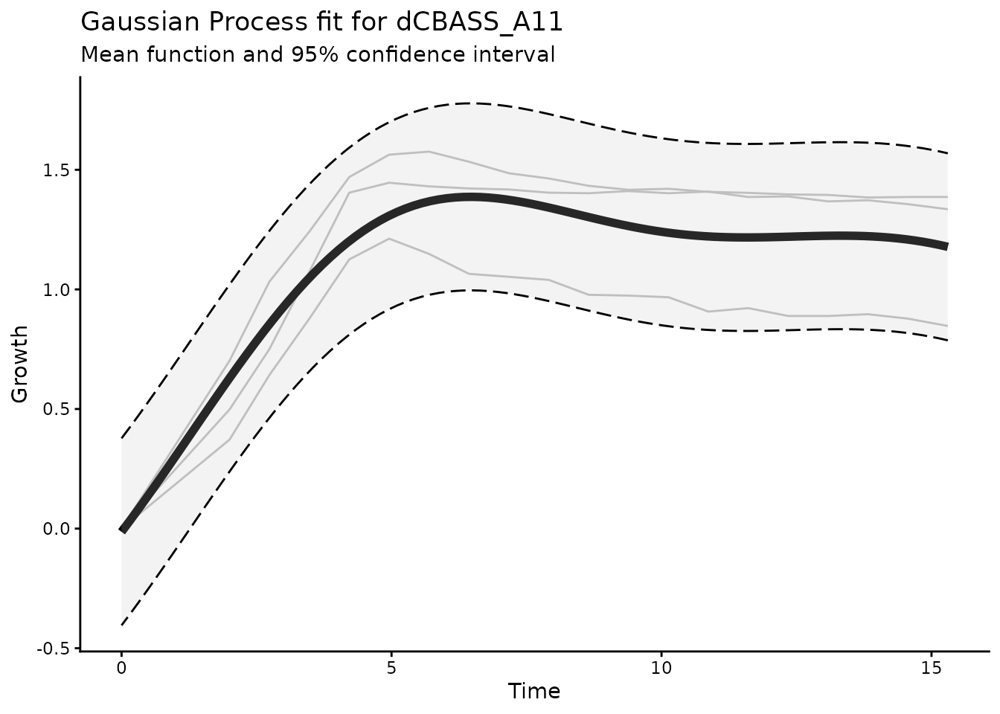

Yet another great trick we can do is sample the posterior of the GP to
gather an arbitrary number of synthetic growth curves. We can then
gather the growth statistics from these sampled curves and get the mean
and standard deviation of the growth parameters.

Keep in mind that it only makes sense to do this when the modeled
covariate contains more than one growth curve per group.

``` r
dgobj.genotype_well.posterior <- estimate_growth_parameters(dgobj, 
                                                  model_covariate="genotype_well",
                                                  
                                                  predict_n_steps = 100, # Predict a lower number of GP points to speed up
                                                  
                                                  sample_posterior_gpfit=TRUE, # Sample the posterior to get mean and sd of each parameter
                                                  
                                                  sample_n_curves=10,  # Number of curves to sample from posterior. 10 for speed.
                                                  save_gp_data = FALSE, 
                                                  n_cores=4) # Increased number of cores
```

Now we can see that our growth statistics have a mean and standard
deviation.

``` r
dgobj.genotype_well.posterior@growth_parameters %>% 
  rmarkdown::paged_table()
```

## Polyauxic growth.

In many research applications, it is important to detect and
characterize polyauxic growth. Polyauxic growth is a phenomenon where
multiple distinct growth phases are observed in a single growth curve.
This can be indicative of complex underlying biological processes, such
as diauxic shifts, where an organism switches from one energy source to
another, or the presence of subpopulations with different growth
dynamics.

In `DGrowthR` we can detect polyauxic growth when modelling growth
curves with the
[`estimate_growth_parameters()`](https://bio-datascience.github.io/DGrowthR/reference/estimate_growth_parameters.md)
function. To do this, we can set the `detect_polyauxic` parameter to
TRUE. This will trigger an additional step in the growth parameter
estimation process where the function will look for multiple growth
phases in the mean posterior of the GP fit. The detection of polyauxic
growth is based on two criteria:  
1. **polyauxic_ratio_threshold**: This is the minimum ratio between the
maximum growth of the second growth phase and the maximum growth of the
first growth phase. For example, if this is set to 0.5, the second
growth phase must have a maximum growth that is at least 50% of the
maximum growth of the first phase to be considered a valid polyauxic
phase.  
2. **polyauxic_parameter_criteria**: This is the growth parameter that
is used to determine the maximum growth of each phase. By default, this
is set to “carrying_capacity”, which means that the maximum growth of
each phase is determined by the carrying capacity of that phase.
However, other parameters such as “growth_rate” could also be used.

``` r
dgobj.polyauxic <- estimate_growth_parameters(dgobj, 
                                              model_covariate="genotype_well", # covariate in metadata to model
                                              save_gp_data = TRUE, # Save the GP data
                                              n_cores=3,
                                              
                                              # Polyauxic detection
                                              detect_polyauxic = TRUE, # Detect polyauxic growth
                                              polyauxic_ratio_threshold = 0.5,
                                              polyauxic_parameter_criteria = "carrying_capacity") 
#> [DGrowthR::estimate_growth_parameters] >> Fitting GP models and estimating growth parameters...
#> [DGrowthR::estimate_growth_parameters] >> Modelling the genotype_well field from metadata. 768 models will be created.
#>   |                                                                              |                                                                      |   0%  |                                                                              |                                                                      |   1%  |                                                                              |=                                                                     |   1%  |                                                                              |=                                                                     |   2%  |                                                                              |==                                                                    |   2%  |                                                                              |==                                                                    |   3%  |                                                                              |==                                                                    |   4%  |                                                                              |===                                                                   |   4%  |                                                                              |===                                                                   |   5%  |                                                                              |====                                                                  |   5%  |                                                                              |====                                                                  |   6%  |                                                                              |=====                                                                 |   7%  |                                                                              |=====                                                                 |   8%  |                                                                              |======                                                                |   8%  |                                                                              |======                                                                |   9%  |                                                                              |=======                                                               |   9%  |                                                                              |=======                                                               |  10%  |                                                                              |=======                                                               |  11%  |                                                                              |========                                                              |  11%  |                                                                              |========                                                              |  12%  |                                                                              |=========                                                             |  12%  |                                                                              |=========                                                             |  13%  |                                                                              |=========                                                             |  14%  |                                                                              |==========                                                            |  14%  |                                                                              |==========                                                            |  15%  |                                                                              |===========                                                           |  15%  |                                                                              |===========                                                           |  16%  |                                                                              |============                                                          |  17%  |                                                                              |============                                                          |  18%  |                                                                              |=============                                                         |  18%  |                                                                              |=============                                                         |  19%  |                                                                              |==============                                                        |  19%  |                                                                              |==============                                                        |  20%  |                                                                              |==============                                                        |  21%  |                                                                              |===============                                                       |  21%  |                                                                              |===============                                                       |  22%  |                                                                              |================                                                      |  22%  |                                                                              |================                                                      |  23%  |                                                                              |================                                                      |  24%  |                                                                              |=================                                                     |  24%  |                                                                              |=================                                                     |  25%  |                                                                              |==================                                                    |  25%  |                                                                              |==================                                                    |  26%  |                                                                              |===================                                                   |  26%  |                                                                              |===================                                                   |  27%  |                                                                              |===================                                                   |  28%  |                                                                              |====================                                                  |  28%  |                                                                              |====================                                                  |  29%  |                                                                              |=====================                                                 |  29%  |                                                                              |=====================                                                 |  30%  |                                                                              |=====================                                                 |  31%  |                                                                              |======================                                                |  31%  |                                                                              |======================                                                |  32%  |                                                                              |=======================                                               |  32%  |                                                                              |=======================                                               |  33%  |                                                                              |========================                                              |  34%  |                                                                              |========================                                              |  35%  |                                                                              |=========================                                             |  35%  |                                                                              |=========================                                             |  36%  |                                                                              |==========================                                            |  36%  |                                                                              |==========================                                            |  37%  |                                                                              |==========================                                            |  38%  |                                                                              |===========================                                           |  38%  |                                                                              |===========================                                           |  39%  |                                                                              |============================                                          |  39%  |                                                                              |============================                                          |  40%  |                                                                              |============================                                          |  41%  |                                                                              |=============================                                         |  41%  |                                                                              |=============================                                         |  42%  |                                                                              |==============================                                        |  42%  |                                                                              |==============================                                        |  43%  |                                                                              |===============================                                       |  44%  |                                                                              |===============================                                       |  45%  |                                                                              |================================                                      |  45%  |                                                                              |================================                                      |  46%  |                                                                              |=================================                                     |  46%  |                                                                              |=================================                                     |  47%  |                                                                              |=================================                                     |  48%  |                                                                              |==================================                                    |  48%  |                                                                              |==================================                                    |  49%  |                                                                              |===================================                                   |  49%  |                                                                              |===================================                                   |  50%  |                                                                              |===================================                                   |  51%  |                                                                              |====================================                                  |  51%  |                                                                              |====================================                                  |  52%  |                                                                              |=====================================                                 |  52%  |                                                                              |=====================================                                 |  53%  |                                                                              |=====================================                                 |  54%  |                                                                              |======================================                                |  54%  |                                                                              |======================================                                |  55%  |                                                                              |=======================================                               |  55%  |                                                                              |=======================================                               |  56%  |                                                                              |========================================                              |  57%  |                                                                              |========================================                              |  58%  |                                                                              |=========================================                             |  58%  |                                                                              |=========================================                             |  59%  |                                                                              |==========================================                            |  59%  |                                                                              |==========================================                            |  60%  |                                                                              |==========================================                            |  61%  |                                                                              |===========================================                           |  61%  |                                                                              |===========================================                           |  62%  |                                                                              |============================================                          |  62%  |                                                                              |============================================                          |  63%  |                                                                              |============================================                          |  64%  |                                                                              |=============================================                         |  64%  |                                                                              |=============================================                         |  65%  |                                                                              |==============================================                        |  65%  |                                                                              |==============================================                        |  66%  |                                                                              |===============================================                       |  67%  |                                                                              |===============================================                       |  68%  |                                                                              |================================================                      |  68%  |                                                                              |================================================                      |  69%  |                                                                              |=================================================                     |  69%  |                                                                              |=================================================                     |  70%  |                                                                              |=================================================                     |  71%  |                                                                              |==================================================                    |  71%  |                                                                              |==================================================                    |  72%  |                                                                              |===================================================                   |  72%  |                                                                              |===================================================                   |  73%  |                                                                              |===================================================                   |  74%  |                                                                              |====================================================                  |  74%  |                                                                              |====================================================                  |  75%  |                                                                              |=====================================================                 |  75%  |                                                                              |=====================================================                 |  76%  |                                                                              |======================================================                |  76%  |                                                                              |======================================================                |  77%  |                                                                              |======================================================                |  78%  |                                                                              |=======================================================               |  78%  |                                                                              |=======================================================               |  79%  |                                                                              |========================================================              |  79%  |                                                                              |========================================================              |  80%  |                                                                              |========================================================              |  81%  |                                                                              |=========================================================             |  81%  |                                                                              |=========================================================             |  82%  |                                                                              |==========================================================            |  82%  |                                                                              |==========================================================            |  83%  |                                                                              |===========================================================           |  84%  |                                                                              |===========================================================           |  85%  |                                                                              |============================================================          |  85%  |                                                                              |============================================================          |  86%  |                                                                              |=============================================================         |  86%  |                                                                              |=============================================================         |  87%  |                                                                              |=============================================================         |  88%  |                                                                              |==============================================================        |  88%  |                                                                              |==============================================================        |  89%  |                                                                              |===============================================================       |  89%  |                                                                              |===============================================================       |  90%  |                                                                              |===============================================================       |  91%  |                                                                              |================================================================      |  91%  |                                                                              |================================================================      |  92%  |                                                                              |=================================================================     |  92%  |                                                                              |=================================================================     |  93%  |                                                                              |==================================================================    |  94%  |                                                                              |==================================================================    |  95%  |                                                                              |===================================================================   |  95%  |                                                                              |===================================================================   |  96%  |                                                                              |====================================================================  |  96%  |                                                                              |====================================================================  |  97%  |                                                                              |====================================================================  |  98%  |                                                                              |===================================================================== |  98%  |                                                                              |===================================================================== |  99%  |                                                                              |======================================================================|  99%  |                                                                              |======================================================================| 100%
#> [DGrowthR::estimate_growth_parameters] >> Updating growth_parameters slot...
#> [DGrowthR::estimate_growth_parameters] >> Updating gpfit_info slot...
#> [DGrowthR::estimate_growth_parameters] >> Finished!
```

The results can be viewed in the `@growth_parameters` slot. The number
of growth phases detected is indicated in the **n_growth_phases** field,
and the maximum growth of each phase is indicated in the
**max_growth_phase_1**, **max_growth_phase_2**, etc. fields. Below we
can see all of the growth curves where more than one growth phase was
detected and where at least 0.2 of the maximum oeverall growth.

``` r
dgobj.polyauxic@growth_parameters %>% 
  filter(n_growth_phases > 1,
         max_growth > 0.2) %>%
  rmarkdown::paged_table()
```

Below we plot an example curve with two growth phases. The vertical
lines indicate the transition between different growth phases.

``` r
plot_gp(dgobj.polyauxic, gpfit_id = "wt_A10", show_input_od=TRUE) +
  geom_vline(xintercept = c(0, 8.037414, 14.99287))
```

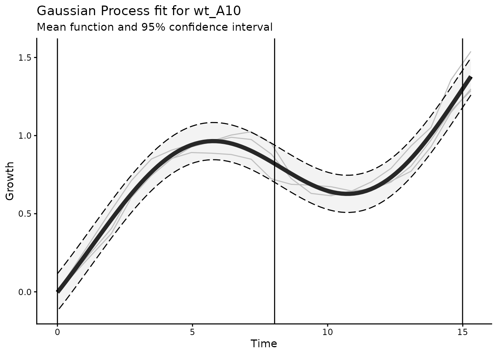

## Differential growth.

One of the other main features of `DGrowthR` is the ability to compare
growth curves gathered from different experimental conditions. This done
via a likelihood ratio test. Briefly, two GP models are fit: a null
model where all growth curves are modeled jointly, and an alternative
model where an additional covariate is added to the design matrix
indicating whether the growth curve come from the reference or treatment
condition. Then the log-likelihood of these two models is compared,
giving us the likelihood ratio test statistic.

In `DgrowthR` all of these steps can be run with the
[`growth_comparison()`](https://bio-datascience.github.io/DGrowthR/reference/growth_comparison.md)
function. Here a comparison is indicated to the **comparison_info**
parameter as a vector consisting of (metatada_field, treatment_value,
reference_value). The metadata field should be a field in the metadata,
and the treatment and reference values should be found in said field.
These groups of growth curves are compared to eachother as described
above.

Following our example, we can compare how genotype affects the response
to the same compound.

``` r
object.comparison <- growth_comparison(object = dgobj, 
                                       
                                       # A comparison is indicated as metadata_field, treatment, reference.
                                       comparison_info = c("genotype_well", "dCBASS_O1" ,"wt_O1"),
                                       save_gp_data = TRUE)
#> [DGrowthR::growth_comparison] >> Comparing dCBASS_O1 to wt_O1 from the genotype_well field.
#> [DGrowthR::growth_comparison] >> Finished!


# View result of comparison
growth_comparison_result(object.comparison) %>% 
  rmarkdown::paged_table()
```

Here we see the result of our comparison.

1.  **likelihood_ratio**: Indicates the test statistic for the
    likelihood ratio test. It is equal to **llik.alternative_model** -
    **llik.null_model**.  
2.  **llik.alternative_model**: The log-likelihood of the GP fit with
    the alternative model.  
3.  **llik.null_model**: The log-likelihood of the GP fit with the null
    model.  
4.  **AUC.treatment**: The AUC of the alternative model fit for the
    treatment growth curves.  
5.  **AUC.reference**: The AUC of the alternative model fit for the
    reference growth curves.
6.  **AUC.FoldChange**: Equal to
    $\frac{\text{AUC.treatment}}{\text{AUC.reference}}$.  
7.  **max_growth.treatment**: Maximum growth determined for the
    alternative model fit for the treatment growth curves.  
8.  **max_growth.reference**: Maximum growth determined for the
    alternative model fit for the reference growth curves.  
9.  **max_growth.FoldChange**: Equal to
    $\frac{\text{max\_growth.treatment}}{\text{max\_growth.reference}}$.  
10. **euclidean.distance**: The euclidean distance between the model fit
    for the treatment and alternative curves.

We can get a better intuition by looking at a visual representation of
our model. Below we see the fit of the null model, where all growth
curves are modelled jointly, independent of the genotype. We can clearly
see that the fit is poor.

``` r

model_plots <- plot_growth_comparison(object.comparison)

model_plots$null
```

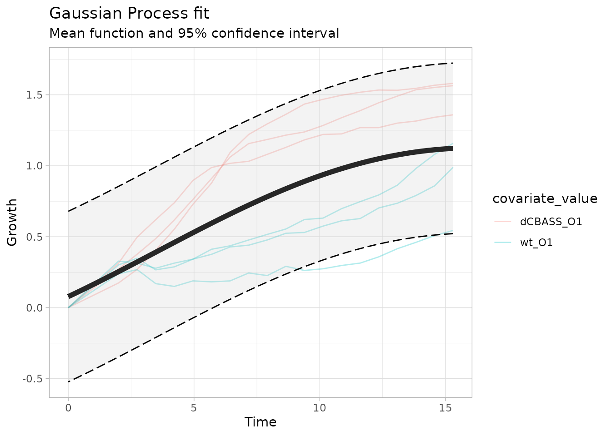

The alternative model fits the original growth curves much better,
indicating that these two groups might be significantly different.

``` r
model_plots$alternative
```

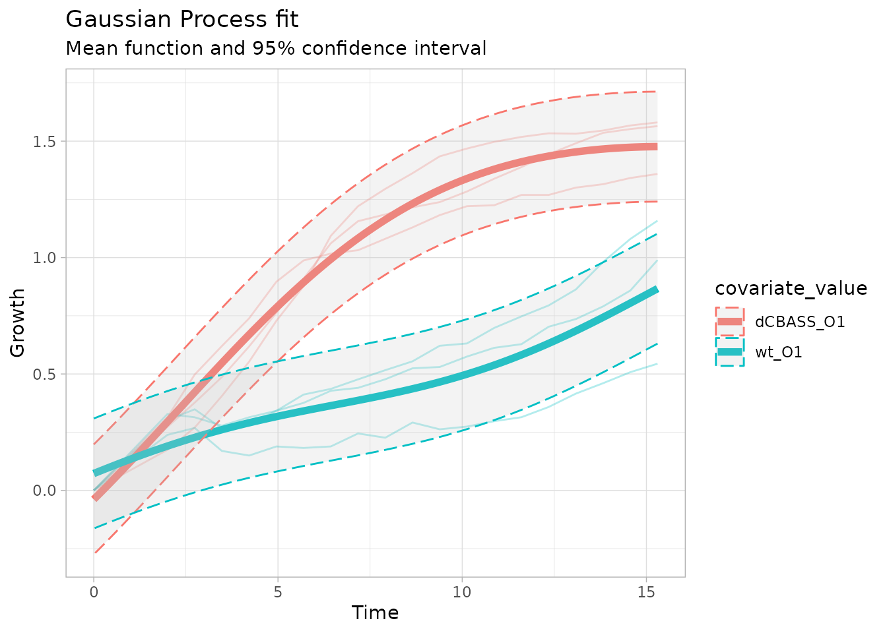

Of course, up until this point we only have visual evidence for this
significant difference. We can get some statistical significance by
performing a permutation test. In `DGrowthR` the permutation test
consists of randomly shuffling the label of each growth curve and
computing the log-likelihood of the alternative GP model when these
curves are shuffled. Doing this several times can give us an idea of the
the distribution of the likelihood ratio test statistic when curves are
randomly assigned. In this case we can set the **permutation_test**
parameter and indicate the number of permutations we would like to
perform.

``` r
object.comparison.permutation <- growth_comparison(object = dgobj, 
                                       comparison_info = c("genotype_well", "dCBASS_O1" ,"wt_O1"),
                                       permutation_test=TRUE,
                                       n_permutations = 100, # Here we use 100 for speed but should probably be more
                                       n_cores = 1,
                                       save_gp_data = FALSE)
#> [DGrowthR::growth_comparison] >> Comparing dCBASS_O1 to wt_O1 from the genotype_well field.
#> [DGrowthR::perm_test] >> Perform permutation test with 100 permutations
#>   |                                                                              |                                                                      |   0%  |                                                                              |=                                                                     |   1%  |                                                                              |=                                                                     |   2%  |                                                                              |==                                                                    |   3%  |                                                                              |===                                                                   |   4%  |                                                                              |====                                                                  |   5%  |                                                                              |====                                                                  |   6%  |                                                                              |=====                                                                 |   7%  |                                                                              |======                                                                |   8%  |                                                                              |======                                                                |   9%  |                                                                              |=======                                                               |  10%  |                                                                              |========                                                              |  11%  |                                                                              |========                                                              |  12%  |                                                                              |=========                                                             |  13%  |                                                                              |==========                                                            |  14%  |                                                                              |==========                                                            |  15%  |                                                                              |===========                                                           |  16%  |                                                                              |============                                                          |  17%  |                                                                              |=============                                                         |  18%  |                                                                              |=============                                                         |  19%  |                                                                              |==============                                                        |  20%  |                                                                              |===============                                                       |  21%  |                                                                              |===============                                                       |  22%  |                                                                              |================                                                      |  23%  |                                                                              |=================                                                     |  24%  |                                                                              |==================                                                    |  25%  |                                                                              |==================                                                    |  26%  |                                                                              |===================                                                   |  27%  |                                                                              |====================                                                  |  28%  |                                                                              |====================                                                  |  29%  |                                                                              |=====================                                                 |  30%  |                                                                              |======================                                                |  31%  |                                                                              |======================                                                |  32%  |                                                                              |=======================                                               |  33%  |                                                                              |========================                                              |  34%  |                                                                              |========================                                              |  35%  |                                                                              |=========================                                             |  36%  |                                                                              |==========================                                            |  37%  |                                                                              |===========================                                           |  38%  |                                                                              |===========================                                           |  39%  |                                                                              |============================                                          |  40%  |                                                                              |=============================                                         |  41%  |                                                                              |=============================                                         |  42%  |                                                                              |==============================                                        |  43%  |                                                                              |===============================                                       |  44%  |                                                                              |================================                                      |  45%  |                                                                              |================================                                      |  46%  |                                                                              |=================================                                     |  47%  |                                                                              |==================================                                    |  48%  |                                                                              |==================================                                    |  49%  |                                                                              |===================================                                   |  50%  |                                                                              |====================================                                  |  51%  |                                                                              |====================================                                  |  52%  |                                                                              |=====================================                                 |  53%  |                                                                              |======================================                                |  54%  |                                                                              |======================================                                |  55%  |                                                                              |=======================================                               |  56%  |                                                                              |========================================                              |  57%  |                                                                              |=========================================                             |  58%  |                                                                              |=========================================                             |  59%  |                                                                              |==========================================                            |  60%  |                                                                              |===========================================                           |  61%  |                                                                              |===========================================                           |  62%  |                                                                              |============================================                          |  63%  |                                                                              |=============================================                         |  64%  |                                                                              |==============================================                        |  65%  |                                                                              |==============================================                        |  66%  |                                                                              |===============================================                       |  67%  |                                                                              |================================================                      |  68%  |                                                                              |================================================                      |  69%  |                                                                              |=================================================                     |  70%  |                                                                              |==================================================                    |  71%  |                                                                              |==================================================                    |  72%  |                                                                              |===================================================                   |  73%  |                                                                              |====================================================                  |  74%  |                                                                              |====================================================                  |  75%  |                                                                              |=====================================================                 |  76%  |                                                                              |======================================================                |  77%  |                                                                              |=======================================================               |  78%  |                                                                              |=======================================================               |  79%  |                                                                              |========================================================              |  80%  |                                                                              |=========================================================             |  81%  |                                                                              |=========================================================             |  82%  |                                                                              |==========================================================            |  83%  |                                                                              |===========================================================           |  84%  |                                                                              |============================================================          |  85%  |                                                                              |============================================================          |  86%  |                                                                              |=============================================================         |  87%  |                                                                              |==============================================================        |  88%  |                                                                              |==============================================================        |  89%  |                                                                              |===============================================================       |  90%  |                                                                              |================================================================      |  91%  |                                                                              |================================================================      |  92%  |                                                                              |=================================================================     |  93%  |                                                                              |==================================================================    |  94%  |                                                                              |==================================================================    |  95%  |                                                                              |===================================================================   |  96%  |                                                                              |====================================================================  |  97%  |                                                                              |===================================================================== |  98%  |                                                                              |===================================================================== |  99%  |                                                                              |======================================================================| 100%
#> [DGrowthR::perm_test] >> Time taken to perform permutation test: 5 second(s)
#> [DGrowthR::growth_comparison] >> Finished!
```

As we can see below, a new field is added to the results
**empirical_p.value**. This empirical p-value is calculated as the
fraction of premuted test statistics that are larger than the observed
test statistic. We can see below that the empirical_p.value is 0.009,
which is quite good considering this is the lowest possible p-value in
our setup.

``` r
growth_comparison_result(object.comparison.permutation)
#>                            comparison likelihood_ratio llik.alternative_model
#> 1 genotype_well: dCBASS_O1 v.s. wt_O1         107.5764              -18.80289
#>   llik.null_model AUC.treatment AUC.reference AUC.FoldChange
#> 1       -126.3793      14.97957      6.555202       2.285142
#>   max_growth.treatment max_growth.reference max_growth.FoldChange
#> 1             1.476493            0.8666307              1.703716
#>   euclidean.distance empirical_p.value
#> 1           6.224746         0.1287129
```

We can get a visual inspection of the null vs observed test statistic
below

``` r
plot_likelihood_ratio(object.comparison.permutation, num_bins = 50)
#> Warning: Using `size` aesthetic for lines was deprecated in ggplot2 3.4.0.
#> ℹ Please use `linewidth` instead.
#> ℹ The deprecated feature was likely used in the DGrowthR package.
#>   Please report the issue at
#>   <https://github.com/bio-datascience/DGrowthR/issues>.
#> This warning is displayed once per session.
#> Call `lifecycle::last_lifecycle_warnings()` to see where this warning was
#> generated.
#> Ignoring unknown labels:
#> • colour : "Line Type"
#> • linetype : "Line Type"
```

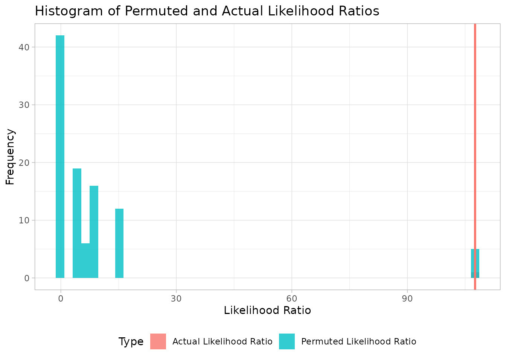

We can also plot the difference between the reference and treatment
condition over time

``` r
plot_od_difference(object.comparison)
```

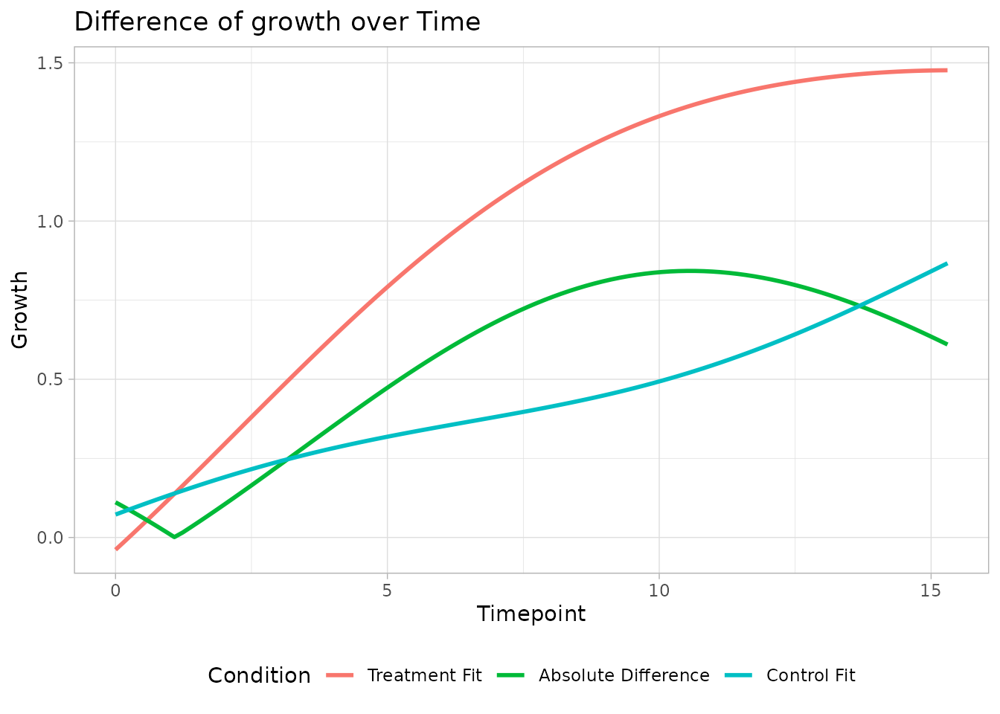

## Multiple comparisons.

Now let’s imagine that we actually want to make several comparisons in
one go. For that we can use the **multiple_comparisons** function. It is
actually quite similar to the function above only that now we provide a
list that contains all of the comparisons we want to make

``` r
contrast_list <- list(c("genotype_well", "dCBASS_O1" ,"wt_O1"),
                      c("genotype_well", "dCBASS_A1" ,"wt_A1"),
                      c("genotype_well", "dCBASS_B1" ,"wt_B1"))

# Returns a dataframe
result_list <- multiple_comparisons(dgobj,contrast_list, 
                                    permutation_test = TRUE, 
                                    n_permutations = 100,
                                    save_perm_stats = TRUE) # This is important to make use of the gamma-approximated p-values
#> [DGrowthR::multiple_comparisons] >> Computing genotype_well: dCBASS_O1 vs wt_O1 at step 1 of 3
#> [DGrowthR::growth_comparison] >> Comparing dCBASS_O1 to wt_O1 from the genotype_well field.
#> [DGrowthR::perm_test] >> Perform permutation test with 100 permutations
#>   |                                                                              |                                                                      |   0%  |                                                                              |=                                                                     |   1%  |                                                                              |=                                                                     |   2%  |                                                                              |==                                                                    |   3%  |                                                                              |===                                                                   |   4%  |                                                                              |====                                                                  |   5%  |                                                                              |====                                                                  |   6%  |                                                                              |=====                                                                 |   7%  |                                                                              |======                                                                |   8%  |                                                                              |======                                                                |   9%  |                                                                              |=======                                                               |  10%  |                                                                              |========                                                              |  11%  |                                                                              |========                                                              |  12%  |                                                                              |=========                                                             |  13%  |                                                                              |==========                                                            |  14%  |                                                                              |==========                                                            |  15%  |                                                                              |===========                                                           |  16%  |                                                                              |============                                                          |  17%  |                                                                              |=============                                                         |  18%  |                                                                              |=============                                                         |  19%  |                                                                              |==============                                                        |  20%  |                                                                              |===============                                                       |  21%  |                                                                              |===============                                                       |  22%  |                                                                              |================                                                      |  23%  |                                                                              |=================                                                     |  24%  |                                                                              |==================                                                    |  25%  |                                                                              |==================                                                    |  26%  |                                                                              |===================                                                   |  27%  |                                                                              |====================                                                  |  28%  |                                                                              |====================                                                  |  29%  |                                                                              |=====================                                                 |  30%  |                                                                              |======================                                                |  31%  |                                                                              |======================                                                |  32%  |                                                                              |=======================                                               |  33%  |                                                                              |========================                                              |  34%  |                                                                              |========================                                              |  35%  |                                                                              |=========================                                             |  36%  |                                                                              |==========================                                            |  37%  |                                                                              |===========================                                           |  38%  |                                                                              |===========================                                           |  39%  |                                                                              |============================                                          |  40%  |                                                                              |=============================                                         |  41%  |                                                                              |=============================                                         |  42%  |                                                                              |==============================                                        |  43%  |                                                                              |===============================                                       |  44%  |                                                                              |================================                                      |  45%  |                                                                              |================================                                      |  46%  |                                                                              |=================================                                     |  47%  |                                                                              |==================================                                    |  48%  |                                                                              |==================================                                    |  49%  |                                                                              |===================================                                   |  50%  |                                                                              |====================================                                  |  51%  |                                                                              |====================================                                  |  52%  |                                                                              |=====================================                                 |  53%  |                                                                              |======================================                                |  54%  |                                                                              |======================================                                |  55%  |                                                                              |=======================================                               |  56%  |                                                                              |========================================                              |  57%  |                                                                              |=========================================                             |  58%  |                                                                              |=========================================                             |  59%  |                                                                              |==========================================                            |  60%  |                                                                              |===========================================                           |  61%  |                                                                              |===========================================                           |  62%  |                                                                              |============================================                          |  63%  |                                                                              |=============================================                         |  64%  |                                                                              |==============================================                        |  65%  |                                                                              |==============================================                        |  66%  |                                                                              |===============================================                       |  67%  |                                                                              |================================================                      |  68%  |                                                                              |================================================                      |  69%  |                                                                              |=================================================                     |  70%  |                                                                              |==================================================                    |  71%  |                                                                              |==================================================                    |  72%  |                                                                              |===================================================                   |  73%  |                                                                              |====================================================                  |  74%  |                                                                              |====================================================                  |  75%  |                                                                              |=====================================================                 |  76%  |                                                                              |======================================================                |  77%  |                                                                              |=======================================================               |  78%  |                                                                              |=======================================================               |  79%  |                                                                              |========================================================              |  80%  |                                                                              |=========================================================             |  81%  |                                                                              |=========================================================             |  82%  |                                                                              |==========================================================            |  83%  |                                                                              |===========================================================           |  84%  |                                                                              |============================================================          |  85%  |                                                                              |============================================================          |  86%  |                                                                              |=============================================================         |  87%  |                                                                              |==============================================================        |  88%  |                                                                              |==============================================================        |  89%  |                                                                              |===============================================================       |  90%  |                                                                              |================================================================      |  91%  |                                                                              |================================================================      |  92%  |                                                                              |=================================================================     |  93%  |                                                                              |==================================================================    |  94%  |                                                                              |==================================================================    |  95%  |                                                                              |===================================================================   |  96%  |                                                                              |====================================================================  |  97%  |                                                                              |===================================================================== |  98%  |                                                                              |===================================================================== |  99%  |                                                                              |======================================================================| 100%
#> [DGrowthR::perm_test] >> Time taken to perform permutation test: 5 second(s)
#> [DGrowthR::growth_comparison] >> Finished!
#> [DGrowthR::multiple_comparisons] >> Computing genotype_well: dCBASS_A1 vs wt_A1 at step 2 of 3
#> [DGrowthR::growth_comparison] >> Comparing dCBASS_A1 to wt_A1 from the genotype_well field.
#> [DGrowthR::perm_test] >> Perform permutation test with 100 permutations
#>   |                                                                              |                                                                      |   0%  |                                                                              |=                                                                     |   1%  |                                                                              |=                                                                     |   2%  |                                                                              |==                                                                    |   3%  |                                                                              |===                                                                   |   4%  |                                                                              |====                                                                  |   5%  |                                                                              |====                                                                  |   6%  |                                                                              |=====                                                                 |   7%  |                                                                              |======                                                                |   8%  |                                                                              |======                                                                |   9%  |                                                                              |=======                                                               |  10%  |                                                                              |========                                                              |  11%  |                                                                              |========                                                              |  12%  |                                                                              |=========                                                             |  13%  |                                                                              |==========                                                            |  14%  |                                                                              |==========                                                            |  15%  |                                                                              |===========                                                           |  16%  |                                                                              |============                                                          |  17%  |                                                                              |=============                                                         |  18%  |                                                                              |=============                                                         |  19%  |                                                                              |==============                                                        |  20%  |                                                                              |===============                                                       |  21%  |                                                                              |===============                                                       |  22%  |                                                                              |================                                                      |  23%  |                                                                              |=================                                                     |  24%  |                                                                              |==================                                                    |  25%  |                                                                              |==================                                                    |  26%  |                                                                              |===================                                                   |  27%  |                                                                              |====================                                                  |  28%  |                                                                              |====================                                                  |  29%  |                                                                              |=====================                                                 |  30%  |                                                                              |======================                                                |  31%  |                                                                              |======================                                                |  32%  |                                                                              |=======================                                               |  33%  |                                                                              |========================                                              |  34%  |                                                                              |========================                                              |  35%  |                                                                              |=========================                                             |  36%  |                                                                              |==========================                                            |  37%  |                                                                              |===========================                                           |  38%  |                                                                              |===========================                                           |  39%  |                                                                              |============================                                          |  40%  |                                                                              |=============================                                         |  41%  |                                                                              |=============================                                         |  42%  |                                                                              |==============================                                        |  43%  |                                                                              |===============================                                       |  44%  |                                                                              |================================                                      |  45%  |                                                                              |================================                                      |  46%  |                                                                              |=================================                                     |  47%  |                                                                              |==================================                                    |  48%  |                                                                              |==================================                                    |  49%  |                                                                              |===================================                                   |  50%  |                                                                              |====================================                                  |  51%  |                                                                              |====================================                                  |  52%  |                                                                              |=====================================                                 |  53%  |                                                                              |======================================                                |  54%  |                                                                              |======================================                                |  55%  |                                                                              |=======================================                               |  56%  |                                                                              |========================================                              |  57%  |                                                                              |=========================================                             |  58%  |                                                                              |=========================================                             |  59%  |                                                                              |==========================================                            |  60%  |                                                                              |===========================================                           |  61%  |                                                                              |===========================================                           |  62%  |                                                                              |============================================                          |  63%  |                                                                              |=============================================                         |  64%  |                                                                              |==============================================                        |  65%  |                                                                              |==============================================                        |  66%  |                                                                              |===============================================                       |  67%  |                                                                              |================================================                      |  68%  |                                                                              |================================================                      |  69%  |                                                                              |=================================================                     |  70%  |                                                                              |==================================================                    |  71%  |                                                                              |==================================================                    |  72%  |                                                                              |===================================================                   |  73%  |                                                                              |====================================================                  |  74%  |                                                                              |====================================================                  |  75%  |                                                                              |=====================================================                 |  76%  |                                                                              |======================================================                |  77%  |                                                                              |=======================================================               |  78%  |                                                                              |=======================================================               |  79%  |                                                                              |========================================================              |  80%  |                                                                              |=========================================================             |  81%  |                                                                              |=========================================================             |  82%  |                                                                              |==========================================================            |  83%  |                                                                              |===========================================================           |  84%  |                                                                              |============================================================          |  85%  |                                                                              |============================================================          |  86%  |                                                                              |=============================================================         |  87%  |                                                                              |==============================================================        |  88%  |                                                                              |==============================================================        |  89%  |                                                                              |===============================================================       |  90%  |                                                                              |================================================================      |  91%  |                                                                              |================================================================      |  92%  |                                                                              |=================================================================     |  93%  |                                                                              |==================================================================    |  94%  |                                                                              |==================================================================    |  95%  |                                                                              |===================================================================   |  96%  |                                                                              |====================================================================  |  97%  |                                                                              |===================================================================== |  98%  |                                                                              |===================================================================== |  99%  |                                                                              |======================================================================| 100%
#> [DGrowthR::perm_test] >> Time taken to perform permutation test: 6 second(s)
#> [DGrowthR::growth_comparison] >> Finished!
#> [DGrowthR::multiple_comparisons] >> Computing genotype_well: dCBASS_B1 vs wt_B1 at step 3 of 3
#> [DGrowthR::growth_comparison] >> Comparing dCBASS_B1 to wt_B1 from the genotype_well field.
#> [DGrowthR::perm_test] >> Perform permutation test with 100 permutations
#>   |                                                                              |                                                                      |   0%  |                                                                              |=                                                                     |   1%  |                                                                              |=                                                                     |   2%  |                                                                              |==                                                                    |   3%  |                                                                              |===                                                                   |   4%  |                                                                              |====                                                                  |   5%  |                                                                              |====                                                                  |   6%  |                                                                              |=====                                                                 |   7%  |                                                                              |======                                                                |   8%  |                                                                              |======                                                                |   9%  |                                                                              |=======                                                               |  10%  |                                                                              |========                                                              |  11%  |                                                                              |========                                                              |  12%  |                                                                              |=========                                                             |  13%  |                                                                              |==========                                                            |  14%  |                                                                              |==========                                                            |  15%  |                                                                              |===========                                                           |  16%  |                                                                              |============                                                          |  17%  |                                                                              |=============                                                         |  18%  |                                                                              |=============                                                         |  19%  |                                                                              |==============                                                        |  20%  |                                                                              |===============                                                       |  21%  |                                                                              |===============                                                       |  22%  |                                                                              |================                                                      |  23%  |                                                                              |=================                                                     |  24%  |                                                                              |==================                                                    |  25%  |                                                                              |==================                                                    |  26%  |                                                                              |===================                                                   |  27%  |                                                                              |====================                                                  |  28%  |                                                                              |====================                                                  |  29%  |                                                                              |=====================                                                 |  30%  |                                                                              |======================                                                |  31%  |                                                                              |======================                                                |  32%  |                                                                              |=======================                                               |  33%  |                                                                              |========================                                              |  34%  |                                                                              |========================                                              |  35%  |                                                                              |=========================                                             |  36%  |                                                                              |==========================                                            |  37%  |                                                                              |===========================                                           |  38%  |                                                                              |===========================                                           |  39%  |                                                                              |============================                                          |  40%  |                                                                              |=============================                                         |  41%  |                                                                              |=============================                                         |  42%  |                                                                              |==============================                                        |  43%  |                                                                              |===============================                                       |  44%  |                                                                              |================================                                      |  45%  |                                                                              |================================                                      |  46%  |                                                                              |=================================                                     |  47%  |                                                                              |==================================                                    |  48%  |                                                                              |==================================                                    |  49%  |                                                                              |===================================                                   |  50%  |                                                                              |====================================                                  |  51%  |                                                                              |====================================                                  |  52%  |                                                                              |=====================================                                 |  53%  |                                                                              |======================================                                |  54%  |                                                                              |======================================                                |  55%  |                                                                              |=======================================                               |  56%  |                                                                              |========================================                              |  57%  |                                                                              |=========================================                             |  58%  |                                                                              |=========================================                             |  59%  |                                                                              |==========================================                            |  60%  |                                                                              |===========================================                           |  61%  |                                                                              |===========================================                           |  62%  |                                                                              |============================================                          |  63%  |                                                                              |=============================================                         |  64%  |                                                                              |==============================================                        |  65%  |                                                                              |==============================================                        |  66%  |                                                                              |===============================================                       |  67%  |                                                                              |================================================                      |  68%  |                                                                              |================================================                      |  69%  |                                                                              |=================================================                     |  70%  |                                                                              |==================================================                    |  71%  |                                                                              |==================================================                    |  72%  |                                                                              |===================================================                   |  73%  |                                                                              |====================================================                  |  74%  |                                                                              |====================================================                  |  75%  |                                                                              |=====================================================                 |  76%  |                                                                              |======================================================                |  77%  |                                                                              |=======================================================               |  78%  |                                                                              |=======================================================               |  79%  |                                                                              |========================================================              |  80%  |                                                                              |=========================================================             |  81%  |                                                                              |=========================================================             |  82%  |                                                                              |==========================================================            |  83%  |                                                                              |===========================================================           |  84%  |                                                                              |============================================================          |  85%  |                                                                              |============================================================          |  86%  |                                                                              |=============================================================         |  87%  |                                                                              |==============================================================        |  88%  |                                                                              |==============================================================        |  89%  |                                                                              |===============================================================       |  90%  |                                                                              |================================================================      |  91%  |                                                                              |================================================================      |  92%  |                                                                              |=================================================================     |  93%  |                                                                              |==================================================================    |  94%  |                                                                              |==================================================================    |  95%  |                                                                              |===================================================================   |  96%  |                                                                              |====================================================================  |  97%  |                                                                              |===================================================================== |  98%  |                                                                              |===================================================================== |  99%  |                                                                              |======================================================================| 100%
#> [DGrowthR::perm_test] >> Time taken to perform permutation test: 6 second(s)
#> [DGrowthR::growth_comparison] >> Finished!
```

Now we can view the results in one data.frame as shown below. There is
also now an **pvalue.adjust** field which performs BH correction to the
empirical_p.value field after all tests are done.

``` r
result_list$result_df %>% 
  rmarkdown::paged_table()
```

Additionally, you can obtain gamma-approximated p-values.

``` r
gamma_pvalues(result_list) %>% 
  rmarkdown::paged_table()
#> Fitting Gamma (tail > 0) for 2 tests (sequential) ...
#> Done.
```

That should be good to get you started!
