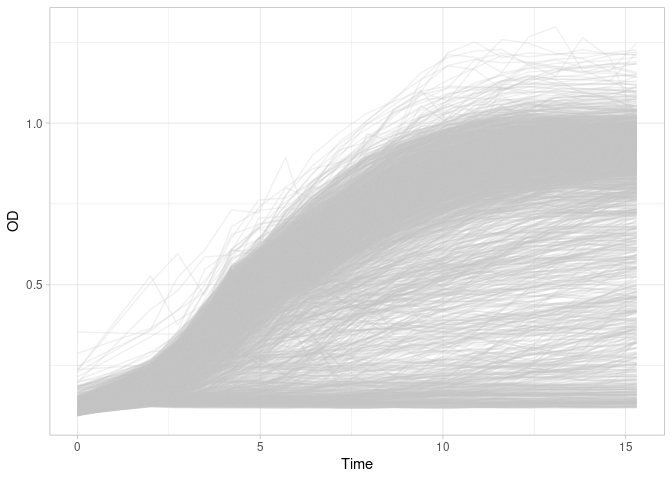
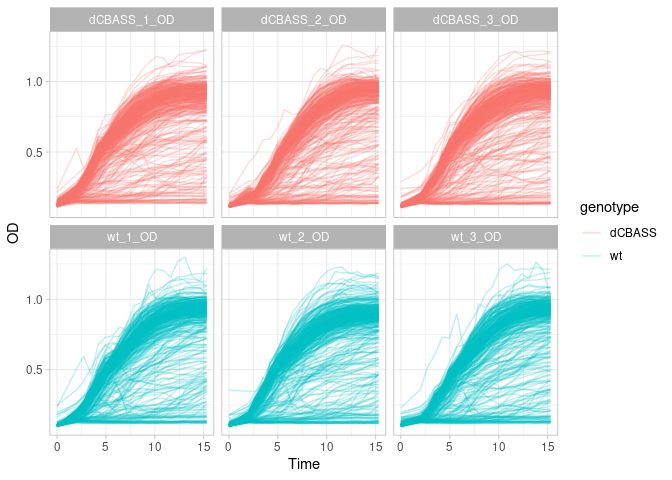
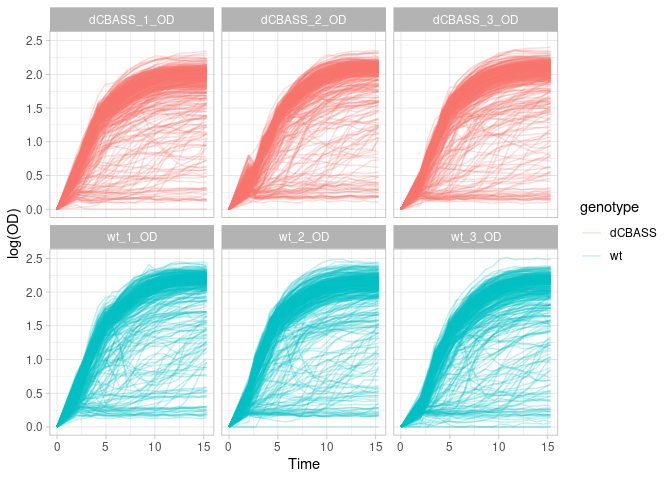
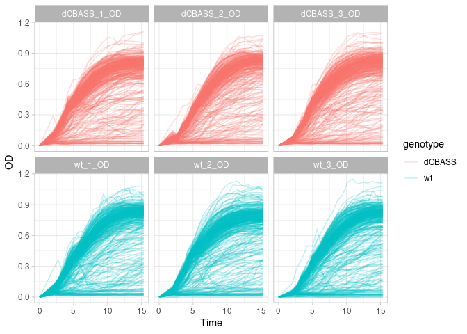

brenz24-01-preprocess_data
================
Compiled at 2025-03-21 16:26:42 UTC

``` r
here::i_am(paste0(params$name, ".Rmd"), uuid = "fa90ac82-1d2c-4061-8665-de79490e0832")
```

The purpose of this document is …

``` r
library("tidyverse")
```

    ## ── Attaching core tidyverse packages ──────────────────────── tidyverse 2.0.0 ──
    ## ✔ dplyr     1.1.4     ✔ readr     2.1.5
    ## ✔ forcats   1.0.0     ✔ stringr   1.5.1
    ## ✔ ggplot2   3.5.1     ✔ tibble    3.2.1
    ## ✔ lubridate 1.9.3     ✔ tidyr     1.3.1
    ## ✔ purrr     1.0.2     
    ## ── Conflicts ────────────────────────────────────────── tidyverse_conflicts() ──
    ## ✖ dplyr::filter() masks stats::filter()
    ## ✖ dplyr::lag()    masks stats::lag()
    ## ℹ Use the conflicted package (<http://conflicted.r-lib.org/>) to force all conflicts to become errors

``` r
library("DGrowthR")
```

``` r
# create or *empty* the target directory, used to write this file's data: 
projthis::proj_create_dir_target(params$name, clean = TRUE)

# function to get path to target directory: path_target("sample.csv")
path_target <- projthis::proj_path_target(params$name)

# function to get path to previous data: path_source("00-import", "sample.csv")
path_source <- projthis::proj_path_source(params$name)
```

## Prepare OD data

Prepare a common time vector for analysis and read all data from plates

``` r
# Create common time vector
common_time_vector <- c(0, 2, seq(from=2.739, by=0.739, length.out=18))
 
# Read all OD data
brenzinger_data <- read_multiple_plates(path_target = path_source("brenz24-00-import_data/od_data"),
                                        time_vector = common_time_vector)
```

    ## The following OD data was found: dCBASS_1_OD.txt, dCBASS_2_OD.txt, dCBASS_3_OD.txt, wt_1_OD.txt, wt_2_OD.txt, wt_3_OD.txt

``` r
brenzinger_od <- brenzinger_data[["od_data"]]
```

The metadata contains all of the information relevant to the
experimental setup. The information contained here can be quite
arbitrary and suit the needs of the researcher. For example, it can
contain information about the conditions under which each growth curve
was measured, replicate number, batch number, etc. Importantly, there
must be a column named **curve_id**, that contains the names of all of
the growth curves present in the data frame with the optical density
information.

In our case, we will use the information about genotype, compound and
concentration provided by the original study.

``` r
# Information about each plate

database.df <- read_tsv(path_source("brenz24-00-import_data", "Database.txt"), 
                        show_col_types = FALSE) %>% 
  separate(Strain, into = c("genotype", NA)) %>% 
  select(file_id, genotype, Rep_Nr) %>% 
  mutate(plate_name = tools::file_path_sans_ext(file_id))

# Information about each well
mapper.df <- read_tsv(path_source("brenz24-00-import_data", "Map.txt"),
                       show_col_types = FALSE) %>% 
  rename("well" = "Well")


# Add this information to the metadata data frame
brenzinger_metadata <- brenzinger_data[["metadata"]] %>% 
  left_join(database.df, by="plate_name") %>% 
  left_join(mapper.df, by="well") %>% 
  unite("genotype_well", c(genotype, well), sep="_", remove=FALSE)

brenzinger_metadata %>% 
  head()
```

    ##         curve_id genotype_well well  plate_name         file_id genotype Rep_Nr
    ## 1 dCBASS_1_OD_A1     dCBASS_A1   A1 dCBASS_1_OD dCBASS_1_OD.txt   dCBASS      1
    ## 2 dCBASS_1_OD_A2     dCBASS_A2   A2 dCBASS_1_OD dCBASS_1_OD.txt   dCBASS      1
    ## 3 dCBASS_1_OD_A3     dCBASS_A3   A3 dCBASS_1_OD dCBASS_1_OD.txt   dCBASS      1
    ## 4 dCBASS_1_OD_A4     dCBASS_A4   A4 dCBASS_1_OD dCBASS_1_OD.txt   dCBASS      1
    ## 5 dCBASS_1_OD_A5     dCBASS_A5   A5 dCBASS_1_OD dCBASS_1_OD.txt   dCBASS      1
    ## 6 dCBASS_1_OD_A6     dCBASS_A6   A6 dCBASS_1_OD dCBASS_1_OD.txt   dCBASS      1
    ##                    Drug ConcMock
    ## 1              2,3-DHBA        1
    ## 2              2,3-DHBA        2
    ## 3 4-aminosalicylic acid        1
    ## 4 4-aminosalicylic acid        2
    ## 5  Acetylsalicylic acid        1
    ## 6  Acetylsalicylic acid        2

## Prepare DGrowthR object

Once we are satisfied with our growth data and metadata data frames, we
can instantiate a `DgrowthR()` object with the `DgrowthRFromData()`
function.

``` r
# Instantiate a DGrowthR object
dgobj <- DGrowthRFromData(od_data = brenzinger_od,
                          metadata = brenzinger_metadata)
```

    ## Creating a DGrowthR object...

    ## 2304 growth curves.

    ## 20 timepoints.

    ## 8 covariates (including well).

We now have a DGrowthR object. This is the heart of our package. All
functions require a `DGrowthR` object as input. For example, we can
quickly visually inspect our data using the `plot_growth_curves()`
function.

``` r
plot_growth_curves(dgobj)
```

<!-- -->

We can inspect our growth curves using variables of the metadata with
the `facet` and `color` parameters.

``` r
plot_growth_curves(dgobj, facet="plate_name", color="genotype")
```

<!-- -->

## Pre-process.

``` r
dgobj.logged <-  preprocess_data(dgobj)
```

    ## Log-transforming the growth measurements...

    ## Using OD from timepoint 1 as baseline.

``` r
dgobj.linear <- preprocess_data(dgobj, log_transform = FALSE)
```

    ## Using linear growth measurements...

    ## WARNING: Not log-transforming growth mesaurements might result in inaccurate estimation of growth parameters...

    ## Using OD from timepoint 1 as baseline.

``` r
plot_growth_curves(dgobj.logged, facet="plate_name", color="genotype")
```

<!-- -->

``` r
plot_growth_curves(dgobj.linear, facet="plate_name", color="genotype")
```

<!-- -->

## Write Objects

``` r
saveRDS(dgobj, path_target("dgobj_raw.rds"))
saveRDS(dgobj.linear, path_target("dgobj_linear.rds"))
saveRDS(dgobj.logged, path_target("dgobj_logged.rds"))
```

## Files written

These files have been written to the target directory,
`data/brenz24-01-preprocess_data`:

``` r
projthis::proj_dir_info(path_target())
```

    ## # A tibble: 3 × 4
    ##   path             type         size modification_time  
    ##   <fs::path>       <fct> <fs::bytes> <dttm>             
    ## 1 dgobj_linear.rds file         423K 2025-03-21 16:26:53
    ## 2 dgobj_logged.rds file         593K 2025-03-21 16:26:53
    ## 3 dgobj_raw.rds    file         421K 2025-03-21 16:26:53

## Session Info

``` r
sessionInfo()
```

    ## R version 4.2.0 (2022-04-22)
    ## Platform: x86_64-pc-linux-gnu (64-bit)
    ## Running under: Ubuntu 22.04.5 LTS
    ## 
    ## Matrix products: default
    ## BLAS:   /opt/bayresq.net/R/R-4.2.0/lib/R/lib/libRblas.so
    ## LAPACK: /opt/bayresq.net/R/R-4.2.0/lib/R/lib/libRlapack.so
    ## 
    ## locale:
    ##  [1] LC_CTYPE=C.UTF-8       LC_NUMERIC=C           LC_TIME=C.UTF-8       
    ##  [4] LC_COLLATE=C.UTF-8     LC_MONETARY=C.UTF-8    LC_MESSAGES=C.UTF-8   
    ##  [7] LC_PAPER=C.UTF-8       LC_NAME=C              LC_ADDRESS=C          
    ## [10] LC_TELEPHONE=C         LC_MEASUREMENT=C.UTF-8 LC_IDENTIFICATION=C   
    ## 
    ## attached base packages:
    ## [1] stats     graphics  grDevices utils     datasets  methods   base     
    ## 
    ## other attached packages:
    ##  [1] DGrowthR_1.0    lubridate_1.9.3 forcats_1.0.0   stringr_1.5.1  
    ##  [5] dplyr_1.1.4     purrr_1.0.2     readr_2.1.5     tidyr_1.3.1    
    ##  [9] tibble_3.2.1    ggplot2_3.5.1   tidyverse_2.0.0
    ## 
    ## loaded via a namespace (and not attached):
    ##  [1] mclust_6.1.1        Rcpp_1.0.12         mvtnorm_1.2-4      
    ##  [4] here_1.0.1          fdapace_0.5.9       lattice_0.20-45    
    ##  [7] rprojroot_2.0.4     digest_0.6.35       foreach_1.5.2      
    ## [10] utf8_1.2.4          R6_2.5.1            backports_1.4.1    
    ## [13] evaluate_0.23       pracma_2.4.4        highr_0.10         
    ## [16] pillar_1.9.0        rlang_1.1.4         rstudioapi_0.16.0  
    ## [19] data.table_1.15.4   rpart_4.1.16        Matrix_1.6-5       
    ## [22] checkmate_2.3.1     rmarkdown_2.27      labeling_0.4.3     
    ## [25] foreign_0.8-82      htmlwidgets_1.6.4   bit_4.0.5          
    ## [28] uwot_0.2.2          munsell_0.5.1       compiler_4.2.0     
    ## [31] numDeriv_2016.8-1.1 xfun_0.44           pkgconfig_2.0.3    
    ## [34] base64enc_0.1-3     htmltools_0.5.8.1   nnet_7.3-17        
    ## [37] tidyselect_1.2.1    gridExtra_2.3       htmlTable_2.4.2    
    ## [40] Hmisc_5.1-2         codetools_0.2-18    fansi_1.0.6        
    ## [43] crayon_1.5.2        tzdb_0.4.0          withr_3.0.1        
    ## [46] MASS_7.3-56         grid_4.2.0          jsonlite_1.8.8     
    ## [49] gtable_0.3.5        lifecycle_1.0.4     magrittr_2.0.3     
    ## [52] scales_1.3.0        vroom_1.6.1         cli_3.6.3          
    ## [55] stringi_1.8.4       farver_2.1.2        fs_1.6.4           
    ## [58] projthis_0.0.0.9025 ellipsis_0.3.2      generics_0.1.3     
    ## [61] vctrs_0.6.5         Formula_1.2-5       iterators_1.0.14   
    ## [64] tools_4.2.0         bit64_4.0.5         glue_1.7.0         
    ## [67] hms_1.1.2           parallel_4.2.0      fastmap_1.2.0      
    ## [70] yaml_2.3.8          timechange_0.2.0    colorspace_2.1-1   
    ## [73] cluster_2.1.3       knitr_1.46
