brenz24-03-growth_analysis
================
Compiled at 2025-11-25 15:25:55 UTC

``` r
here::i_am(paste0(params$name, ".Rmd"), uuid = "3d5f015f-5bf7-42d2-991b-3568bbd18592")
```

The purpose of this document is …

``` r
library("tidyverse")
```

    ## ── Attaching core tidyverse packages ──────────────────────── tidyverse 2.0.0 ──
    ## ✔ dplyr     1.1.4     ✔ readr     2.1.5
    ## ✔ forcats   1.0.0     ✔ stringr   1.5.1
    ## ✔ ggplot2   3.5.1     ✔ tibble    3.2.1
    ## ✔ lubridate 1.9.3     ✔ tidyr     1.3.1
    ## ✔ purrr     1.0.2     
    ## ── Conflicts ────────────────────────────────────────── tidyverse_conflicts() ──
    ## ✖ dplyr::filter() masks stats::filter()
    ## ✖ dplyr::lag()    masks stats::lag()
    ## ℹ Use the conflicted package (<http://conflicted.r-lib.org/>) to force all conflicts to become errors

``` r
library("DGrowthR")
```

``` r
# create or *empty* the target directory, used to write this file's data: 
projthis::proj_create_dir_target(params$name, clean = TRUE)

# function to get path to target directory: path_target("sample.csv")
path_target <- projthis::proj_path_target(params$name)

# function to get path to previous data: path_source("00-import", "sample.csv")
path_source <- projthis::proj_path_source(params$name)
```

## Read pre-processed DGrowthR objects

``` r
dg.logged <- readRDS(path_source("brenz24-01-preprocess_data", "dgobj_logged.rds"))
```

## Low-dimensional representation.

``` r
# FPCA
dg.logged <- estimate_fpca(dg.logged)
```

    ## [DGrowthR::estimate_fpca] >> Estimating functional Principal Components

    ## [DGrowthR::estimate_fpca] >> Embedding optical density data

    ## Warning in CheckData(Ly, Lt): There is a time gap of at least 10% of the
    ## observed range across subjects

``` r
# UMAP
set.seed(123)
dg.logged <- estimate_umap(dg.logged)
```

    ## [DGrowthR::estimate_umap] >> Estimating functional UMAP

    ## [DGrowthR::estimate_umap] >> Embedding optical density data

``` r
plot_fpca(dg.logged) +
  labs(title = "Logged")
```

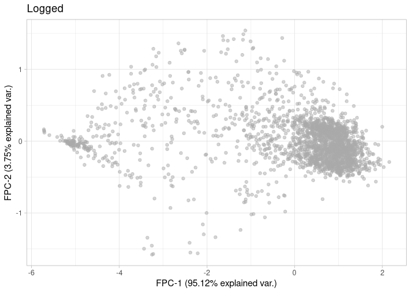<!-- -->

``` r
plot_umap(dg.logged) +
  labs(title = "Logged")
```

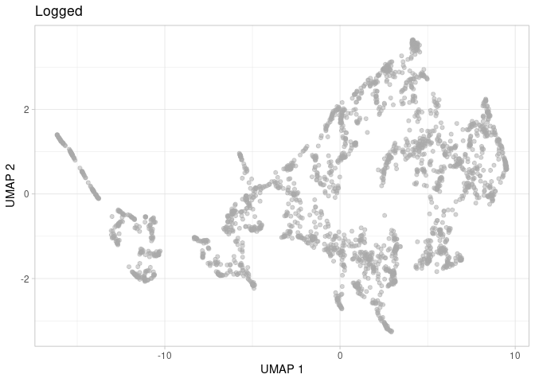<!-- -->

## Clustering.

``` r
dg.logged <- clustering(dg.logged, k=0.015)
```

    ## [DGrowthR::clustering] >> Using UMAP coordinates

    ## [DGrowthR::clustering] >> Density based clustering with DBSCAN

    ## [DGrowthR::clustering] >> Using K-nearest neighbors: 35

    ## [DGrowthR::clustering] >> Automatic determination of optimal eps...

    ## [DGrowthR::clustering] >> Using eps value: 0.743413331721192

    ## [DGrowthR::clustering] >> Updating cluster_assignment slot..

    ## [DGrowthR::clustering] >> Finished

``` r
plot_fpca(dg.logged, color="cluster_assignment") +
  labs(title = "Logged")
```

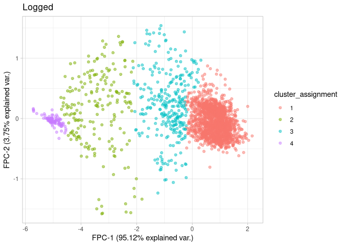<!-- -->

``` r
plot_umap(dg.logged, color="cluster_assignment") +
  labs(title = "Logged")
```

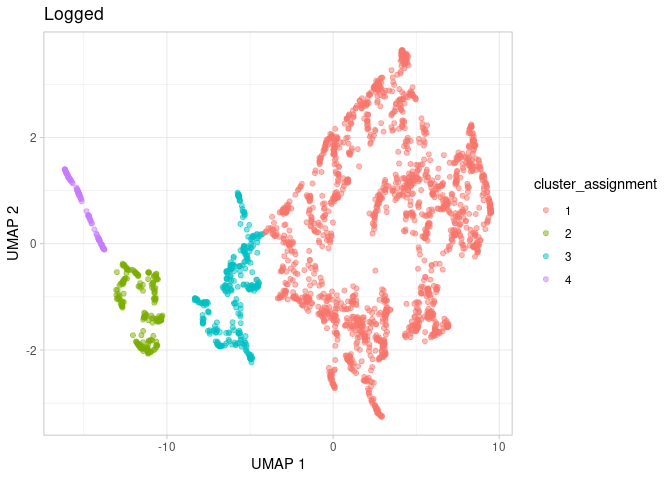<!-- -->

``` r
plot_growth_curves(dg.logged, color = "cluster_assignment", facet="cluster_assignment")
```

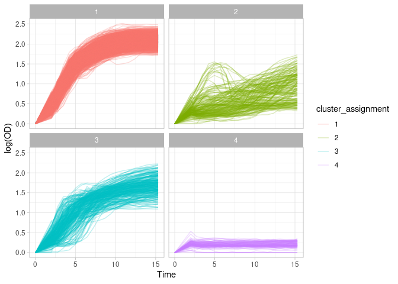<!-- -->

## Growth parameters.

Estimate growth parameters for each genotype-compound-concentration
combination

``` r
dg.logged.gparams <- estimate_growth_parameters(dg.logged, 
                                        model_covariate = "genotype_well",
                                        save_gp_data = TRUE,
                                        n_cores=4)
```

    ## [DGrowthR::estimate_growth_parameters] >> Fitting GP models and estimating growth parameters...

    ## [DGrowthR::estimate_growth_parameters] >> Modelling the genotype_well field from metadata. 768 models will be created.

    ##   |                                                                              |                                                                      |   0%  |                                                                              |                                                                      |   1%  |                                                                              |=                                                                     |   1%  |                                                                              |=                                                                     |   2%  |                                                                              |==                                                                    |   2%  |                                                                              |==                                                                    |   3%  |                                                                              |==                                                                    |   4%  |                                                                              |===                                                                   |   4%  |                                                                              |===                                                                   |   5%  |                                                                              |====                                                                  |   5%  |                                                                              |====                                                                  |   6%  |                                                                              |=====                                                                 |   7%  |                                                                              |=====                                                                 |   8%  |                                                                              |======                                                                |   8%  |                                                                              |======                                                                |   9%  |                                                                              |=======                                                               |   9%  |                                                                              |=======                                                               |  10%  |                                                                              |=======                                                               |  11%  |                                                                              |========                                                              |  11%  |                                                                              |========                                                              |  12%  |                                                                              |=========                                                             |  12%  |                                                                              |=========                                                             |  13%  |                                                                              |=========                                                             |  14%  |                                                                              |==========                                                            |  14%  |                                                                              |==========                                                            |  15%  |                                                                              |===========                                                           |  15%  |                                                                              |===========                                                           |  16%  |                                                                              |============                                                          |  17%  |                                                                              |============                                                          |  18%  |                                                                              |=============                                                         |  18%  |                                                                              |=============                                                         |  19%  |                                                                              |==============                                                        |  19%  |                                                                              |==============                                                        |  20%  |                                                                              |==============                                                        |  21%  |                                                                              |===============                                                       |  21%  |                                                                              |===============                                                       |  22%  |                                                                              |================                                                      |  22%  |                                                                              |================                                                      |  23%  |                                                                              |================                                                      |  24%  |                                                                              |=================                                                     |  24%  |                                                                              |=================                                                     |  25%  |                                                                              |==================                                                    |  25%  |                                                                              |==================                                                    |  26%  |                                                                              |===================                                                   |  26%  |                                                                              |===================                                                   |  27%  |                                                                              |===================                                                   |  28%  |                                                                              |====================                                                  |  28%  |                                                                              |====================                                                  |  29%  |                                                                              |=====================                                                 |  29%  |                                                                              |=====================                                                 |  30%  |                                                                              |=====================                                                 |  31%  |                                                                              |======================                                                |  31%  |                                                                              |======================                                                |  32%  |                                                                              |=======================                                               |  32%  |                                                                              |=======================                                               |  33%  |                                                                              |========================                                              |  34%  |                                                                              |========================                                              |  35%  |                                                                              |=========================                                             |  35%  |                                                                              |=========================                                             |  36%  |                                                                              |==========================                                            |  36%  |                                                                              |==========================                                            |  37%  |                                                                              |==========================                                            |  38%  |                                                                              |===========================                                           |  38%  |                                                                              |===========================                                           |  39%  |                                                                              |============================                                          |  39%  |                                                                              |============================                                          |  40%  |                                                                              |============================                                          |  41%  |                                                                              |=============================                                         |  41%  |                                                                              |=============================                                         |  42%  |                                                                              |==============================                                        |  42%  |                                                                              |==============================                                        |  43%  |                                                                              |===============================                                       |  44%  |                                                                              |===============================                                       |  45%  |                                                                              |================================                                      |  45%  |                                                                              |================================                                      |  46%  |                                                                              |=================================                                     |  46%  |                                                                              |=================================                                     |  47%  |                                                                              |=================================                                     |  48%  |                                                                              |==================================                                    |  48%  |                                                                              |==================================                                    |  49%  |                                                                              |===================================                                   |  49%  |                                                                              |===================================                                   |  50%  |                                                                              |===================================                                   |  51%  |                                                                              |====================================                                  |  51%  |                                                                              |====================================                                  |  52%  |                                                                              |=====================================                                 |  52%  |                                                                              |=====================================                                 |  53%  |                                                                              |=====================================                                 |  54%  |                                                                              |======================================                                |  54%  |                                                                              |======================================                                |  55%  |                                                                              |=======================================                               |  55%  |                                                                              |=======================================                               |  56%  |                                                                              |========================================                              |  57%  |                                                                              |========================================                              |  58%  |                                                                              |=========================================                             |  58%  |                                                                              |=========================================                             |  59%  |                                                                              |==========================================                            |  59%  |                                                                              |==========================================                            |  60%  |                                                                              |==========================================                            |  61%  |                                                                              |===========================================                           |  61%  |                                                                              |===========================================                           |  62%  |                                                                              |============================================                          |  62%  |                                                                              |============================================                          |  63%  |                                                                              |============================================                          |  64%  |                                                                              |=============================================                         |  64%  |                                                                              |=============================================                         |  65%  |                                                                              |==============================================                        |  65%  |                                                                              |==============================================                        |  66%  |                                                                              |===============================================                       |  67%  |                                                                              |===============================================                       |  68%  |                                                                              |================================================                      |  68%  |                                                                              |================================================                      |  69%  |                                                                              |=================================================                     |  69%  |                                                                              |=================================================                     |  70%  |                                                                              |=================================================                     |  71%  |                                                                              |==================================================                    |  71%  |                                                                              |==================================================                    |  72%  |                                                                              |===================================================                   |  72%  |                                                                              |===================================================                   |  73%  |                                                                              |===================================================                   |  74%  |                                                                              |====================================================                  |  74%  |                                                                              |====================================================                  |  75%  |                                                                              |=====================================================                 |  75%  |                                                                              |=====================================================                 |  76%  |                                                                              |======================================================                |  76%  |                                                                              |======================================================                |  77%  |                                                                              |======================================================                |  78%  |                                                                              |=======================================================               |  78%  |                                                                              |=======================================================               |  79%  |                                                                              |========================================================              |  79%  |                                                                              |========================================================              |  80%  |                                                                              |========================================================              |  81%  |                                                                              |=========================================================             |  81%  |                                                                              |=========================================================             |  82%  |                                                                              |==========================================================            |  82%  |                                                                              |==========================================================            |  83%  |                                                                              |===========================================================           |  84%  |                                                                              |===========================================================           |  85%  |                                                                              |============================================================          |  85%  |                                                                              |============================================================          |  86%  |                                                                              |=============================================================         |  86%  |                                                                              |=============================================================         |  87%  |                                                                              |=============================================================         |  88%  |                                                                              |==============================================================        |  88%  |                                                                              |==============================================================        |  89%  |                                                                              |===============================================================       |  89%  |                                                                              |===============================================================       |  90%  |                                                                              |===============================================================       |  91%  |                                                                              |================================================================      |  91%  |                                                                              |================================================================      |  92%  |                                                                              |=================================================================     |  92%  |                                                                              |=================================================================     |  93%  |                                                                              |==================================================================    |  94%  |                                                                              |==================================================================    |  95%  |                                                                              |===================================================================   |  95%  |                                                                              |===================================================================   |  96%  |                                                                              |====================================================================  |  96%  |                                                                              |====================================================================  |  97%  |                                                                              |====================================================================  |  98%  |                                                                              |===================================================================== |  98%  |                                                                              |===================================================================== |  99%  |                                                                              |======================================================================|  99%  |                                                                              |======================================================================| 100%

    ## [DGrowthR::estimate_growth_parameters] >> Updating growth_parameters slot...

    ## [DGrowthR::estimate_growth_parameters] >> Updating gpfit_info slot...

    ## [DGrowthR::estimate_growth_parameters] >> Finished!

``` r
treatment.cluster <- dg.logged@metadata %>% 
  left_join(dg.logged@cluster_assignment, by="curve_id") %>% 
  
  group_by(genotype_well) %>% 
  count(cluster) %>% 
  filter(n == max(n)) %>% 
  ungroup() %>% 
  
  distinct(genotype_well, .keep_all = TRUE) %>% 
  select(genotype_well, cluster)
```

``` r
dg.logged.gparams@growth_parameters %>% 
  rename("genotype_well" = "gpfit_id") %>% 
  
  left_join(treatment.cluster, by="genotype_well") %>% 
  filter(!is.na(AUC) & !is.na(max_growth_rate)) %>% 
  mutate(normalized_max_growth_rate = (max_growth_rate - min(max_growth_rate)) / (max(max_growth_rate) - min(max_growth_rate)),
         normalized_AUC = (AUC - min(AUC)) / (max(AUC) - min(AUC))) %>% 
  
  
  ggplot(aes(x=normalized_AUC, y=normalized_max_growth_rate, color=cluster)) +
  geom_point() +
  theme_bw()
```

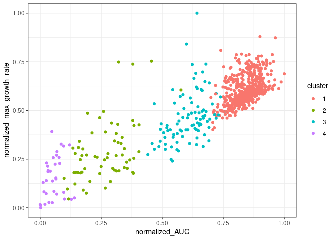<!-- -->

## Multiple comparisons dCBASS vs WT

``` r
drug.metadata <- dg.logged.gparams@metadata %>% 
  select(well, Drug, ConcMock) %>% 
  distinct() %>% 
  
  unite("drug_conc", c(Drug, ConcMock), sep="-")
```

Multiple growth testing.

``` r
# Results
dg.results <- readRDS("permutation_results/brenzinger_500p.rds")

# Read first 500 permutation
dg.permutations.p1 <- readRDS("permutation_results/brenzinger_dgresults.rds")

# Read second 500 permutations
dg.permutations.p2 <- readRDS("permutation_results/brenzinger_dgresults_1000p.rds")

# Join permutations
dg.permutations <- dg.permutations.p1 %>% 
  left_join(dg.permutations.p2, by="comparison")


# Create results list
result_list <- list("result_df" = dg.results,
                    "permutation_df" = dg.permutations)

# Gamma approximated pvalues
dg.results.brenz <- gamma_pvalues(result_list, nullValue = "median", alternative = "two_sided") %>% 
  
  mutate(log2AUC.FC = log2(AUC.FoldChange))
```

    ## Fitting Gamma (tail > 0) for 187 tests (sequential) ...
    ## Done.

## Pvalue distribution

``` r
dg.results.brenz %>% 
  
  ggplot(aes(x=pvalue_gamma)) +
  geom_histogram(binwidth = 0.05) +
  
  theme_bw()
```

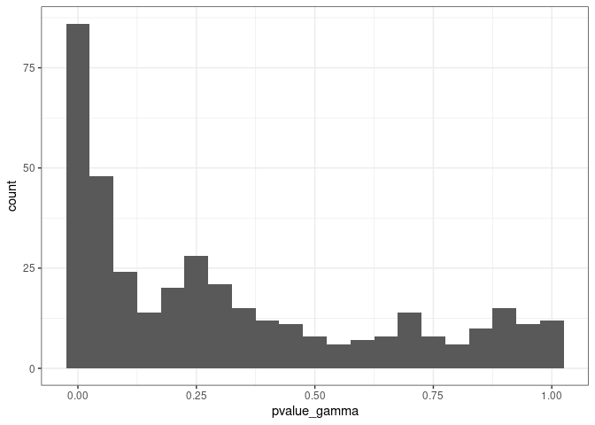<!-- -->

## Number differential treatmeants

``` r
diff.growers <- dg.results.brenz %>% 
  filter(pvalue_gamma.adj <= 0.1) %>% 
  
  mutate(well = str_extract(comparison, "genotype_well: dCBASS_(.*?) v.s. wt_.*?", group = 1)) %>% 
  left_join(drug.metadata, by="well") %>% 
  
  select(comparison, drug_conc, log2AUC.FC, empirical_p.value, pvalue.adjust, pvalue_gamma, pvalue_gamma.adj) %>% 
  arrange(desc(log2AUC.FC))
  
diff.growers %>% 
  knitr::kable()
```

    ## Warning: 'xfun::attr()' is deprecated.
    ## Use 'xfun::attr2()' instead.
    ## See help("Deprecated")
    ## Warning: 'xfun::attr()' is deprecated.
    ## Use 'xfun::attr2()' instead.
    ## See help("Deprecated")

| comparison                            | drug_conc                   | log2AUC.FC | empirical_p.value | pvalue.adjust | pvalue_gamma | pvalue_gamma.adj |
|:--------------------------------------|:----------------------------|-----------:|------------------:|--------------:|-------------:|-----------------:|
| genotype_well: dCBASS_O13 v.s. wt_O13 | Trimethoprim-1              |  1.9229080 |         0.1157685 |     0.6214598 |    0.0035059 |        0.0714413 |
| genotype_well: dCBASS_O9 v.s. wt_O9   | Tetracycline-1              |  1.2744487 |         0.1736527 |     0.6251327 |    0.0160825 |        0.0882242 |
| genotype_well: dCBASS_O1 v.s. wt_O1   | Sulfamethoxazol-1           |  1.1922838 |         0.0938124 |     0.6214598 |    0.0014711 |        0.0600203 |
| genotype_well: dCBASS_O2 v.s. wt_O2   | Sulfamethoxazol-2           |  1.0401945 |         0.1017964 |     0.6214598 |    0.0027713 |        0.0714413 |
| genotype_well: dCBASS_A11 v.s. wt_A11 | Amoxicillin-1               |  0.7279720 |         0.0878244 |     0.6214598 |    0.0062759 |        0.0718089 |
| genotype_well: dCBASS_I16 v.s. wt_I16 | Meropenem-2                 |  0.4977306 |         0.0978044 |     0.6214598 |    0.0182175 |        0.0954964 |
| genotype_well: dCBASS_A9 v.s. wt_A9   | Amikacin-1                  |  0.4691270 |         0.1077844 |     0.6214598 |    0.0065057 |        0.0718089 |
| genotype_well: dCBASS_K13 v.s. wt_K13 | Penicillin G-1              |  0.1730566 |         0.1217565 |     0.6233932 |    0.0016199 |        0.0600203 |
| genotype_well: dCBASS_M21 v.s. wt_M21 | Spectinomycin-1             |  0.1362287 |         0.1157685 |     0.6214598 |    0.0043831 |        0.0714413 |
| genotype_well: dCBASS_A10 v.s. wt_A10 | Amikacin-2                  |  0.0808624 |         0.1077844 |     0.6214598 |    0.0045912 |        0.0714413 |
| genotype_well: dCBASS_D1 v.s. wt_D1   | Bleomycin-3                 | -0.0618513 |         0.0758483 |     0.6214598 |    0.0055219 |        0.0718089 |
| genotype_well: dCBASS_E22 v.s. wt_E22 | Dopamine-2                  | -0.0680313 |         0.2095808 |     0.6251327 |    0.0157220 |        0.0874966 |
| genotype_well: dCBASS_B9 v.s. wt_B9   | Amikacin-3                  | -0.0694083 |         0.0978044 |     0.6214598 |    0.0150466 |        0.0860700 |
| genotype_well: dCBASS_O6 v.s. wt_O6   | Taurocholic acid-2          | -0.0697008 |         0.1057884 |     0.6214598 |    0.0074576 |        0.0734960 |
| genotype_well: dCBASS_D18 v.s. wt_D18 | Cefotaxime-4                | -0.0705044 |         0.1197605 |     0.6214598 |    0.0089596 |        0.0747932 |
| genotype_well: dCBASS_B5 v.s. wt_B5   | Acetylsalicylic acid-3      | -0.0719092 |         0.0938124 |     0.6214598 |    0.0046656 |        0.0714413 |
| genotype_well: dCBASS_D17 v.s. wt_D17 | Cefotaxime-3                | -0.0721796 |         0.1097804 |     0.6214598 |    0.0120489 |        0.0789375 |
| genotype_well: dCBASS_K22 v.s. wt_K22 | Polymyxin B-2               | -0.0731284 |         0.0758483 |     0.6214598 |    0.0011400 |        0.0600203 |
| genotype_well: dCBASS_A14 v.s. wt_A14 | Ascorbic acid (vitamin C)-2 | -0.0736956 |         0.0918164 |     0.6214598 |    0.0067005 |        0.0718089 |
| genotype_well: dCBASS_B2 v.s. wt_B2   | 2,3-DHBA-4                  | -0.0739775 |         0.1117764 |     0.6214598 |    0.0097495 |        0.0748302 |
| genotype_well: dCBASS_E4 v.s. wt_E4   | Ciprofloxacin-2             | -0.0768587 |         0.0838323 |     0.6214598 |    0.0118712 |        0.0789375 |
| genotype_well: dCBASS_B6 v.s. wt_B6   | Acetylsalicylic acid-4      | -0.0807348 |         0.0978044 |     0.6214598 |    0.0053967 |        0.0718089 |
| genotype_well: dCBASS_E15 v.s. wt_E15 | Curcumin-1                  | -0.0807373 |         0.1177645 |     0.6214598 |    0.0099456 |        0.0748302 |
| genotype_well: dCBASS_F15 v.s. wt_F15 | Curcumin-3                  | -0.0811241 |         0.2035928 |     0.6251327 |    0.0136337 |        0.0844411 |
| genotype_well: dCBASS_F2 v.s. wt_F2   | Cinnamaldehyde-4            | -0.0822427 |         0.1097804 |     0.6214598 |    0.0091882 |        0.0748302 |
| genotype_well: dCBASS_I17 v.s. wt_I17 | Metformin-1                 | -0.0823540 |         0.1017964 |     0.6214598 |    0.0084720 |        0.0747932 |
| genotype_well: dCBASS_G23 v.s. wt_G23 | Imipenem-1                  | -0.0843898 |         0.1157685 |     0.6214598 |    0.0076099 |        0.0734960 |
| genotype_well: dCBASS_E13 v.s. wt_E13 | Colistin-1                  | -0.0846693 |         0.1037924 |     0.6214598 |    0.0081124 |        0.0747932 |
| genotype_well: dCBASS_B17 v.s. wt_B17 | Aztreonam-3                 | -0.0854617 |         0.0958084 |     0.6214598 |    0.0120101 |        0.0789375 |
| genotype_well: dCBASS_B11 v.s. wt_B11 | Amoxicillin-3               | -0.0877024 |         0.1037924 |     0.6214598 |    0.0121284 |        0.0789375 |
| genotype_well: dCBASS_A4 v.s. wt_A4   | 4-aminosalicylic acid-2     | -0.0891727 |         0.1077844 |     0.6214598 |    0.0070824 |        0.0734960 |
| genotype_well: dCBASS_P6 v.s. wt_P6   | Taurocholic acid-4          | -0.0916428 |         0.0938124 |     0.6214598 |    0.0114869 |        0.0789375 |
| genotype_well: dCBASS_E23 v.s. wt_E23 | Doxorubicin-1               | -0.0924720 |         0.0938124 |     0.6214598 |    0.0013296 |        0.0600203 |
| genotype_well: dCBASS_H5 v.s. wt_H5   | Erythromycin-3              | -0.0927864 |         0.1337325 |     0.6251327 |    0.0083192 |        0.0747932 |
| genotype_well: dCBASS_G11 v.s. wt_G11 | Eugenol-1                   | -0.0934587 |         0.0878244 |     0.6214598 |    0.0184030 |        0.0954964 |
| genotype_well: dCBASS_E12 v.s. wt_E12 | Clindamycin-2               | -0.0947952 |         0.0858283 |     0.6214598 |    0.0152173 |        0.0860700 |
| genotype_well: dCBASS_F19 v.s. wt_F19 | Deoxycholic acid-3          | -0.0949347 |         0.1057884 |     0.6214598 |    0.0050232 |        0.0714413 |
| genotype_well: dCBASS_A13 v.s. wt_A13 | Ascorbic acid (vitamin C)-1 | -0.0955924 |         0.1317365 |     0.6245287 |    0.0046809 |        0.0714413 |
| genotype_well: dCBASS_B19 v.s. wt_B19 | Bacitracin-3                | -0.0962809 |         0.1197605 |     0.6214598 |    0.0101579 |        0.0748302 |
| genotype_well: dCBASS_L20 v.s. wt_L20 | PMS-4                       | -0.0974780 |         0.1077844 |     0.6214598 |    0.0041288 |        0.0714413 |
| genotype_well: dCBASS_I2 v.s. wt_I2   | Indole-2                    | -0.0982217 |         0.0878244 |     0.6214598 |    0.0019728 |        0.0600203 |
| genotype_well: dCBASS_D14 v.s. wt_D14 | CCCP-4                      | -0.0982688 |         0.1057884 |     0.6214598 |    0.0017404 |        0.0600203 |
| genotype_well: dCBASS_L11 v.s. wt_L11 | Paraquat-3                  | -0.1009424 |         0.0958084 |     0.6214598 |    0.0057195 |        0.0718089 |
| genotype_well: dCBASS_E8 v.s. wt_E8   | Chlorhexidine-2             | -0.1012240 |         0.2115768 |     0.6251327 |    0.0152416 |        0.0860700 |
| genotype_well: dCBASS_H11 v.s. wt_H11 | Eugenol-3                   | -0.1028785 |         0.1137725 |     0.6214598 |    0.0128373 |        0.0808117 |
| genotype_well: dCBASS_D15 v.s. wt_D15 | Cefaclor-3                  | -0.1052838 |         0.0658683 |     0.6214598 |    0.0038590 |        0.0714413 |
| genotype_well: dCBASS_F10 v.s. wt_F10 | Clarithromycin-4            | -0.1151279 |         0.0938124 |     0.6214598 |    0.0150004 |        0.0860700 |
| genotype_well: dCBASS_F16 v.s. wt_F16 | Curcumin-4                  | -0.1153796 |         0.0938124 |     0.6214598 |    0.0015118 |        0.0600203 |
| genotype_well: dCBASS_B22 v.s. wt_B22 | Benzalkonium-4              | -0.1202439 |         0.1137725 |     0.6214598 |    0.0144132 |        0.0860700 |
| genotype_well: dCBASS_F22 v.s. wt_F22 | Dopamine-4                  | -0.1219948 |         0.1017964 |     0.6214598 |    0.0061286 |        0.0718089 |
| genotype_well: dCBASS_P24 v.s. wt_P24 | Water-8                     | -0.1220677 |         0.1197605 |     0.6214598 |    0.0103281 |        0.0748302 |
| genotype_well: dCBASS_G24 v.s. wt_G24 | Imipenem-2                  | -0.1234899 |         0.0978044 |     0.6214598 |    0.0020319 |        0.0600203 |
| genotype_well: dCBASS_D22 v.s. wt_D22 | Cerulenin-4                 | -0.1238747 |         0.1177645 |     0.6214598 |    0.0101359 |        0.0748302 |
| genotype_well: dCBASS_N16 v.s. wt_N16 | Serotonine-4                | -0.1241045 |         0.1017964 |     0.6214598 |    0.0010620 |        0.0600203 |
| genotype_well: dCBASS_J10 v.s. wt_J10 | Mecillinam-4                | -0.1258075 |         0.0698603 |     0.6214598 |    0.0039199 |        0.0714413 |
| genotype_well: dCBASS_G3 v.s. wt_G3   | EGCG-1                      | -0.1326629 |         0.0938124 |     0.6214598 |    0.0030255 |        0.0714413 |
| genotype_well: dCBASS_E24 v.s. wt_E24 | Doxorubicin-2               | -0.1339959 |         0.0978044 |     0.6214598 |    0.0015456 |        0.0600203 |
| genotype_well: dCBASS_A22 v.s. wt_A22 | Benzalkonium-2              | -0.1408148 |         0.1137725 |     0.6214598 |    0.0088328 |        0.0747932 |
| genotype_well: dCBASS_D8 v.s. wt_D8   | Capsaicin-4                 | -0.1408722 |         0.1357285 |     0.6251327 |    0.0067321 |        0.0718089 |
| genotype_well: dCBASS_P18 v.s. wt_P18 | Vanillic acid-4             | -0.1451690 |         0.1057884 |     0.6214598 |    0.0007942 |        0.0600203 |
| genotype_well: dCBASS_H23 v.s. wt_H23 | Imipenem-3                  | -0.1466250 |         0.0898204 |     0.6214598 |    0.0044134 |        0.0714413 |
| genotype_well: dCBASS_J24 v.s. wt_J24 | Moxifloxacin-4              | -0.1474766 |         0.1157685 |     0.6214598 |    0.0114568 |        0.0789375 |
| genotype_well: dCBASS_N24 v.s. wt_N24 | Spiramycin-4                | -0.1615785 |         0.1037924 |     0.6214598 |    0.0049741 |        0.0714413 |
| genotype_well: dCBASS_H19 v.s. wt_H19 | Hydrocortisone-3            | -0.1658468 |         0.1197605 |     0.6214598 |    0.0045173 |        0.0714413 |
| genotype_well: dCBASS_L2 v.s. wt_L2   | Nitrofurantoin-4            | -0.1676087 |         0.1077844 |     0.6214598 |    0.0088999 |        0.0747932 |
| genotype_well: dCBASS_H24 v.s. wt_H24 | Imipenem-4                  | -0.1733370 |         0.1017964 |     0.6214598 |    0.0147256 |        0.0860700 |
| genotype_well: dCBASS_I24 v.s. wt_I24 | Moxifloxacin-2              | -0.1818506 |         0.1297405 |     0.6245287 |    0.0059304 |        0.0718089 |
| genotype_well: dCBASS_C23 v.s. wt_C23 | Chloramphenicol-1           | -0.1864663 |         0.1057884 |     0.6214598 |    0.0076558 |        0.0734960 |
| genotype_well: dCBASS_P12 v.s. wt_P12 | Thymol-4                    | -0.1919088 |         0.0898204 |     0.6214598 |    0.0013411 |        0.0600203 |
| genotype_well: dCBASS_D24 v.s. wt_D24 | Chloramphenicol-4           | -0.2454881 |         0.1157685 |     0.6214598 |    0.0096448 |        0.0748302 |
| genotype_well: dCBASS_C21 v.s. wt_C21 | Cerulenin-1                 | -0.4032353 |         0.1077844 |     0.6214598 |    0.0167186 |        0.0904220 |
| genotype_well: dCBASS_A21 v.s. wt_A21 | Benzalkonium-1              | -0.4937274 |         0.1097804 |     0.6214598 |    0.0182833 |        0.0954964 |
| genotype_well: dCBASS_A23 v.s. wt_A23 | Berberine-1                 | -0.5232235 |         0.0918164 |     0.6214598 |    0.0012295 |        0.0600203 |
| genotype_well: dCBASS_C22 v.s. wt_C22 | Cerulenin-2                 | -0.5871747 |         0.0798403 |     0.6214598 |    0.0126896 |        0.0808117 |

## Volcano plot

``` r
ggplot(dg.results.brenz, aes(y=-log10(pvalue_gamma.adj), x=log2AUC.FC, fill=log2AUC.FC)) + 
  geom_point(alpha=0.85, shape=21, color="black") +  # The alpha parameter controls the transparency of the points
  
  
  scale_fill_gradient2(low = "blue", # Here we tell ggplot to use a diverging color scale",
                        mid = "#f7f7f7",
                        high = "red") +
  
  #geom_text_repel(data = diff.growers, aes(label=drug_conc), 
  #                max.overlaps = Inf, size=2.75, min.segment.length = 0, color="black", 
  #                box.padding = 0.7, point.padding = 0.2, fontface="plain") +
  
  geom_vline(xintercept = 0, color="black", linetype="longdash") +
  geom_vline(xintercept = 0.25, color="black", linetype="longdash") +
  geom_vline(xintercept = -0.25, color="black", linetype="longdash") +
  
  geom_hline(yintercept = -log10(0.1), color="black", linetype="longdash") +
  theme_bw()
```

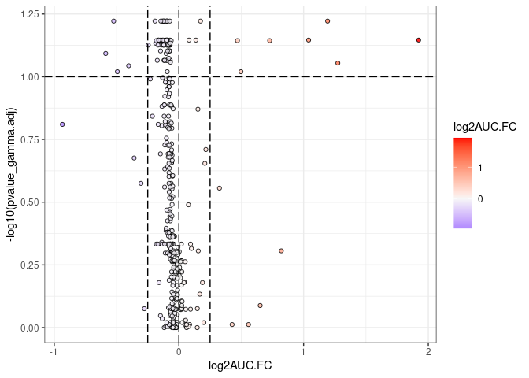<!-- -->

## Comparing the effect of dCBASS to wild-type

Comparing the AUC.

``` r
library(ggrepel)
```

``` r
# Gather relevant data
auc.comparison.df <- dg.logged.gparams@growth_parameters %>% 
  select(gpfit_id, AUC) %>% 
  separate(gpfit_id, into=c("genotype", "well")) %>% 
  
  pivot_wider(id_cols = well, names_from = genotype, values_from = AUC) %>% 
  mutate(auc.diff = dCBASS - wt) %>% 
  
  left_join(drug.metadata, by="well")


# Gather top hits
top.auc.diff <- auc.comparison.df %>% 
  slice_max(order_by = auc.diff, n=4)


# Plot
ggplot(auc.comparison.df, aes(x=wt, y=dCBASS, fill=auc.diff)) +
  
  geom_abline() +
  geom_point(shape=21, color="black") +
  
   scale_fill_gradient2(low = "#1065ab",
                        mid = "#f9f9f9",
                        high = "#b31529",
                        midpoint = 0) +
  
  
  geom_text_repel(data = top.auc.diff, aes(label=drug_conc), 
                  max.overlaps = Inf, size=3, min.segment.length = 0, color="black", box.padding = 0.7, point.padding = 0.2, fontface="plain") +
  
  theme_bw() +
  labs(x="Wild-type AUC",
       y=latex2exp::TeX("$\\Delta$CBASS\\ AUC"),
       fill="Diff. AUC")
```

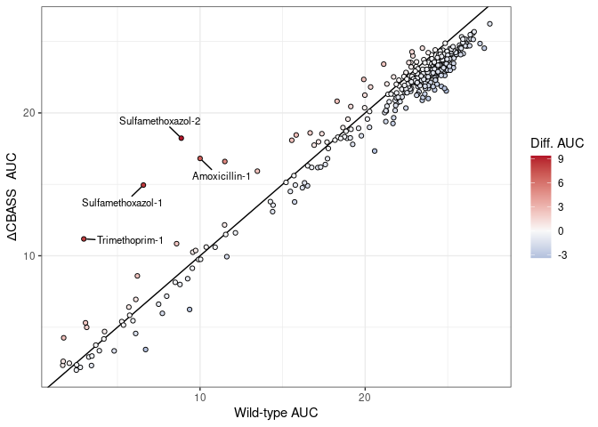<!-- -->

``` r
gc.amoxi <- growth_comparison(dg.logged, 
                              comparison_info = c("genotype_well", "dCBASS_A11" ,"wt_A11"),
                              save_gp_data = TRUE,
                              permutation_test = FALSE)
```

    ## [DGrowthR::growth_comparison] >> Comparing dCBASS_A11 to wt_A11 from the genotype_well field.

    ## [DGrowthR::growth_comparison] >> Finished!

``` r
gc.amoxi.plots <- plot_growth_comparison(gc.amoxi)
gc.amoxi.plots$alternative
```

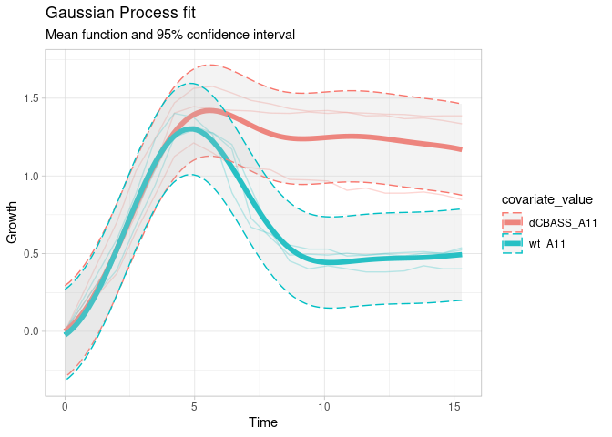<!-- -->

``` r
gc.amoxi@growth_comparison$result
```

    ##                              comparison likelihood_ratio llik.alternative_model
    ## 1 genotype_well: dCBASS_A11 v.s. wt_A11         75.57425              -49.43281
    ##   llik.null_model AUC.treatment AUC.reference AUC.FoldChange
    ## 1       -125.0071      16.64846      10.05154       1.656309
    ##   max_growth.treatment max_growth.reference max_growth.FoldChange
    ## 1             1.420803             1.302059              1.091197
    ##   euclidean.distance
    ## 1           5.461978

``` r
gc.sulfa <- growth_comparison(dg.logged, 
                              comparison_info = c("genotype_well", "dCBASS_O1" ,"wt_O1"),
                              save_gp_data = TRUE,
                              permutation_test = FALSE)
```

    ## [DGrowthR::growth_comparison] >> Comparing dCBASS_O1 to wt_O1 from the genotype_well field.

    ## [DGrowthR::growth_comparison] >> Finished!

``` r
gc.sulfa.plots <- plot_growth_comparison(gc.sulfa)
gc.sulfa@growth_comparison$result
```

    ##                            comparison likelihood_ratio llik.alternative_model
    ## 1 genotype_well: dCBASS_O1 v.s. wt_O1         107.5764              -18.80289
    ##   llik.null_model AUC.treatment AUC.reference AUC.FoldChange
    ## 1       -126.3793      14.97957      6.555202       2.285142
    ##   max_growth.treatment max_growth.reference max_growth.FoldChange
    ## 1             1.476493            0.8666306              1.703716
    ##   euclidean.distance
    ## 1           6.224746

``` r
gc.sulfa.plots$alternative
```

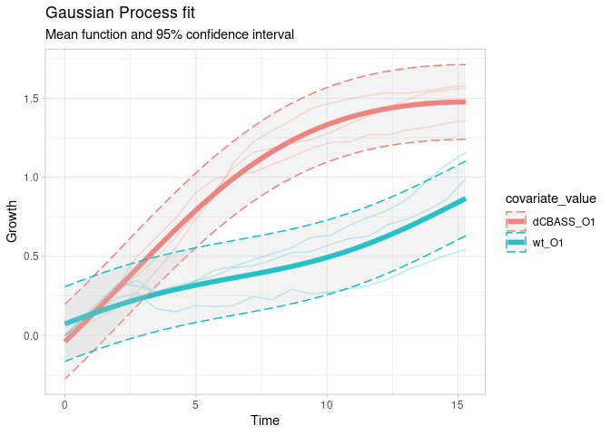<!-- -->

``` r
# Gather relevant data
dr.comparison.df <- dg.logged.gparams@growth_parameters %>% 
  
  mutate(max_death_rate = if_else(is.na(max_death_rate), 0, max_death_rate)) %>% 
  select(gpfit_id, max_death_rate) %>% 
  separate(gpfit_id, into=c("genotype", "well")) %>% 
  
  pivot_wider(id_cols = well, names_from = genotype, values_from = max_death_rate) %>% 
  mutate(dr.diff = dCBASS - wt) %>% 
  
  left_join(drug.metadata, by="well")


# Gather top hits
top.dr.diff <- dr.comparison.df %>% 
  slice_max(order_by = abs(dr.diff), n=4)


# Plot
ggplot(dr.comparison.df, aes(x=wt, y=dCBASS, fill=dr.diff)) +
  
  geom_abline() +
  geom_point(shape=21, color="black") +
  
   scale_fill_gradient2(low = "#1065ab",
                        mid = "#f9f9f9",
                        high = "#b31529",
                        midpoint = 0) +
  
  
  geom_text_repel(data = top.dr.diff, aes(label=drug_conc), 
                  max.overlaps = Inf, size=3, min.segment.length = 0, color="black", box.padding = 0.7, point.padding = 0.2, fontface="plain") +
  
  theme_bw() +
  labs(x="Wild-type Death rate",
       y=latex2exp::TeX("$\\Delta$CBASS\\ Death\\ rate"),
       fill="Diff. Death rate")
```

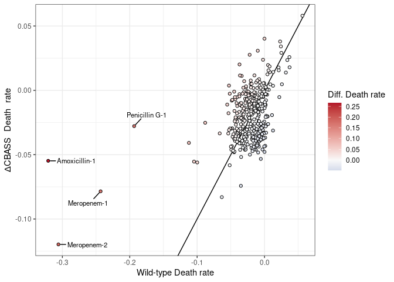<!-- -->

## Files written

These files have been written to the target directory,
`data/brenz24-03-growth_analysis`:

``` r
projthis::proj_dir_info(path_target())
```

    ## # A tibble: 0 × 4
    ## # ℹ 4 variables: path <fs::path>, type <fct>, size <fs::bytes>,
    ## #   modification_time <dttm>
