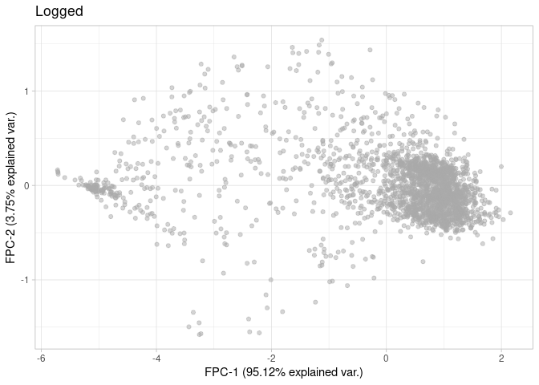

brenz24-03-growth_analysis
================
Compiled at 2025-03-21 17:44:38 UTC

``` r
here::i_am(paste0(params$name, ".Rmd"), uuid = "3d5f015f-5bf7-42d2-991b-3568bbd18592")
```

The purpose of this document is …

``` r
library("tidyverse")
```

    ## ── Attaching core tidyverse packages ──────────────────────── tidyverse 2.0.0 ──
    ## ✔ dplyr     1.1.4     ✔ readr     2.1.5
    ## ✔ forcats   1.0.0     ✔ stringr   1.5.1
    ## ✔ ggplot2   3.5.1     ✔ tibble    3.2.1
    ## ✔ lubridate 1.9.3     ✔ tidyr     1.3.1
    ## ✔ purrr     1.0.2     
    ## ── Conflicts ────────────────────────────────────────── tidyverse_conflicts() ──
    ## ✖ dplyr::filter() masks stats::filter()
    ## ✖ dplyr::lag()    masks stats::lag()
    ## ℹ Use the conflicted package (<http://conflicted.r-lib.org/>) to force all conflicts to become errors

``` r
library("DGrowthR")
```

``` r
# create or *empty* the target directory, used to write this file's data: 
projthis::proj_create_dir_target(params$name, clean = TRUE)

# function to get path to target directory: path_target("sample.csv")
path_target <- projthis::proj_path_target(params$name)

# function to get path to previous data: path_source("00-import", "sample.csv")
path_source <- projthis::proj_path_source(params$name)
```

## Read pre-processed DGrowthR objects

``` r
dg.logged <- readRDS(path_source("brenz24-01-preprocess_data", "dgobj_logged.rds"))
```

## Low-dimensional representation.

``` r
# FPCA
dg.logged <- estimate_fpca(dg.logged)
```

    ## [DGrowthR::estimate_fpca] >> Estimating functional Principal Components

    ## [DGrowthR::estimate_fpca] >> Embedding optical density data

    ## Warning in CheckData(Ly, Lt): There is a time gap of at least 10% of the
    ## observed range across subjects

``` r
# UMAP
set.seed(123)
dg.logged <- estimate_umap(dg.logged)
```

    ## [DGrowthR::estimate_umap] >> Estimating functional UMAP

    ## [DGrowthR::estimate_umap] >> Embedding optical density data

``` r
plot_fpca(dg.logged) +
  labs(title = "Logged")
```

<!-- -->

``` r
plot_umap(dg.logged) +
  labs(title = "Logged")
```

<!-- -->

## Clustering.

``` r
dg.logged <- clustering(dg.logged, k=0.015)
```

    ## [DGrowthR::clustering] >> Using UMAP coordinates

    ## [DGrowthR::clustering] >> Density based clustering with DBSCAN

    ## [DGrowthR::clustering] >> Using K-nearest neighbors: 35

    ## [DGrowthR::clustering] >> Automatic determination of optimal eps...

    ## [DGrowthR::clustering] >> Using eps value: 0.743413331721192

    ## [DGrowthR::clustering] >> Updating cluster_assignment slot..

    ## [DGrowthR::clustering] >> Finished

``` r
plot_fpca(dg.logged, color="cluster_assignment") +
  labs(title = "Logged")
```

<!-- -->

``` r
plot_umap(dg.logged, color="cluster_assignment") +
  labs(title = "Logged")
```

<!-- -->

``` r
plot_growth_curves(dg.logged, color = "cluster_assignment", facet="cluster_assignment")
```

<!-- -->

## Growth parameters.

Estimate growth parameters for each genotype-compound-concentration
combination

``` r
dg.logged.gparams <- estimate_growth_parameters(dg.logged, 
                                        model_covariate = "genotype_well",
                                        save_gp_data = TRUE,
                                        n_cores=4)
```

    ## [DGrowthR::estimate_growth_parameters] >> Fitting GP models and estimating growth parameters...

    ## [DGrowthR::estimate_growth_parameters] >> Modelling the genotype_well field from metadata. 768 models will be created.

    ##   |                                                                              |                                                                      |   0%  |                                                                              |                                                                      |   1%  |                                                                              |=                                                                     |   1%  |                                                                              |=                                                                     |   2%  |                                                                              |==                                                                    |   2%  |                                                                              |==                                                                    |   3%  |                                                                              |==                                                                    |   4%  |                                                                              |===                                                                   |   4%  |                                                                              |===                                                                   |   5%  |                                                                              |====                                                                  |   5%  |                                                                              |====                                                                  |   6%  |                                                                              |=====                                                                 |   7%  |                                                                              |=====                                                                 |   8%  |                                                                              |======                                                                |   8%  |                                                                              |======                                                                |   9%  |                                                                              |=======                                                               |   9%  |                                                                              |=======                                                               |  10%  |                                                                              |=======                                                               |  11%  |                                                                              |========                                                              |  11%  |                                                                              |========                                                              |  12%  |                                                                              |=========                                                             |  12%  |                                                                              |=========                                                             |  13%  |                                                                              |=========                                                             |  14%  |                                                                              |==========                                                            |  14%  |                                                                              |==========                                                            |  15%  |                                                                              |===========                                                           |  15%  |                                                                              |===========                                                           |  16%  |                                                                              |============                                                          |  17%  |                                                                              |============                                                          |  18%  |                                                                              |=============                                                         |  18%  |                                                                              |=============                                                         |  19%  |                                                                              |==============                                                        |  19%  |                                                                              |==============                                                        |  20%  |                                                                              |==============                                                        |  21%  |                                                                              |===============                                                       |  21%  |                                                                              |===============                                                       |  22%  |                                                                              |================                                                      |  22%  |                                                                              |================                                                      |  23%  |                                                                              |================                                                      |  24%  |                                                                              |=================                                                     |  24%  |                                                                              |=================                                                     |  25%  |                                                                              |==================                                                    |  25%  |                                                                              |==================                                                    |  26%  |                                                                              |===================                                                   |  26%  |                                                                              |===================                                                   |  27%  |                                                                              |===================                                                   |  28%  |                                                                              |====================                                                  |  28%  |                                                                              |====================                                                  |  29%  |                                                                              |=====================                                                 |  29%  |                                                                              |=====================                                                 |  30%  |                                                                              |=====================                                                 |  31%  |                                                                              |======================                                                |  31%  |                                                                              |======================                                                |  32%  |                                                                              |=======================                                               |  32%  |                                                                              |=======================                                               |  33%  |                                                                              |========================                                              |  34%  |                                                                              |========================                                              |  35%  |                                                                              |=========================                                             |  35%  |                                                                              |=========================                                             |  36%  |                                                                              |==========================                                            |  36%  |                                                                              |==========================                                            |  37%  |                                                                              |==========================                                            |  38%  |                                                                              |===========================                                           |  38%  |                                                                              |===========================                                           |  39%  |                                                                              |============================                                          |  39%  |                                                                              |============================                                          |  40%  |                                                                              |============================                                          |  41%  |                                                                              |=============================                                         |  41%  |                                                                              |=============================                                         |  42%  |                                                                              |==============================                                        |  42%  |                                                                              |==============================                                        |  43%  |                                                                              |===============================                                       |  44%  |                                                                              |===============================                                       |  45%  |                                                                              |================================                                      |  45%  |                                                                              |================================                                      |  46%  |                                                                              |=================================                                     |  46%  |                                                                              |=================================                                     |  47%  |                                                                              |=================================                                     |  48%  |                                                                              |==================================                                    |  48%  |                                                                              |==================================                                    |  49%  |                                                                              |===================================                                   |  49%  |                                                                              |===================================                                   |  50%  |                                                                              |===================================                                   |  51%  |                                                                              |====================================                                  |  51%  |                                                                              |====================================                                  |  52%  |                                                                              |=====================================                                 |  52%  |                                                                              |=====================================                                 |  53%  |                                                                              |=====================================                                 |  54%  |                                                                              |======================================                                |  54%  |                                                                              |======================================                                |  55%  |                                                                              |=======================================                               |  55%  |                                                                              |=======================================                               |  56%  |                                                                              |========================================                              |  57%  |                                                                              |========================================                              |  58%  |                                                                              |=========================================                             |  58%  |                                                                              |=========================================                             |  59%  |                                                                              |==========================================                            |  59%  |                                                                              |==========================================                            |  60%  |                                                                              |==========================================                            |  61%  |                                                                              |===========================================                           |  61%  |                                                                              |===========================================                           |  62%  |                                                                              |============================================                          |  62%  |                                                                              |============================================                          |  63%  |                                                                              |============================================                          |  64%  |                                                                              |=============================================                         |  64%  |                                                                              |=============================================                         |  65%  |                                                                              |==============================================                        |  65%  |                                                                              |==============================================                        |  66%  |                                                                              |===============================================                       |  67%  |                                                                              |===============================================                       |  68%  |                                                                              |================================================                      |  68%  |                                                                              |================================================                      |  69%  |                                                                              |=================================================                     |  69%  |                                                                              |=================================================                     |  70%  |                                                                              |=================================================                     |  71%  |                                                                              |==================================================                    |  71%  |                                                                              |==================================================                    |  72%  |                                                                              |===================================================                   |  72%  |                                                                              |===================================================                   |  73%  |                                                                              |===================================================                   |  74%  |                                                                              |====================================================                  |  74%  |                                                                              |====================================================                  |  75%  |                                                                              |=====================================================                 |  75%  |                                                                              |=====================================================                 |  76%  |                                                                              |======================================================                |  76%  |                                                                              |======================================================                |  77%  |                                                                              |======================================================                |  78%  |                                                                              |=======================================================               |  78%  |                                                                              |=======================================================               |  79%  |                                                                              |========================================================              |  79%  |                                                                              |========================================================              |  80%  |                                                                              |========================================================              |  81%  |                                                                              |=========================================================             |  81%  |                                                                              |=========================================================             |  82%  |                                                                              |==========================================================            |  82%  |                                                                              |==========================================================            |  83%  |                                                                              |===========================================================           |  84%  |                                                                              |===========================================================           |  85%  |                                                                              |============================================================          |  85%  |                                                                              |============================================================          |  86%  |                                                                              |=============================================================         |  86%  |                                                                              |=============================================================         |  87%  |                                                                              |=============================================================         |  88%  |                                                                              |==============================================================        |  88%  |                                                                              |==============================================================        |  89%  |                                                                              |===============================================================       |  89%  |                                                                              |===============================================================       |  90%  |                                                                              |===============================================================       |  91%  |                                                                              |================================================================      |  91%  |                                                                              |================================================================      |  92%  |                                                                              |=================================================================     |  92%  |                                                                              |=================================================================     |  93%  |                                                                              |==================================================================    |  94%  |                                                                              |==================================================================    |  95%  |                                                                              |===================================================================   |  95%  |                                                                              |===================================================================   |  96%  |                                                                              |====================================================================  |  96%  |                                                                              |====================================================================  |  97%  |                                                                              |====================================================================  |  98%  |                                                                              |===================================================================== |  98%  |                                                                              |===================================================================== |  99%  |                                                                              |======================================================================|  99%  |                                                                              |======================================================================| 100%

    ## [DGrowthR::estimate_growth_parameters] >> Updating growth_parameters slot...

    ## [DGrowthR::estimate_growth_parameters] >> Updating gpfit_info slot...

    ## [DGrowthR::estimate_growth_parameters] >> Finished!

``` r
treatment.cluster <- dg.logged@metadata %>% 
  left_join(dg.logged@cluster_assignment, by="curve_id") %>% 
  
  group_by(genotype_well) %>% 
  count(cluster) %>% 
  filter(n == max(n)) %>% 
  ungroup() %>% 
  
  distinct(genotype_well, .keep_all = TRUE) %>% 
  select(genotype_well, cluster)
```

``` r
dg.logged.gparams@growth_parameters %>% 
  rename("genotype_well" = "gpfit_id") %>% 
  
  left_join(treatment.cluster, by="genotype_well") %>% 
  filter(!is.na(AUC) & !is.na(max_growth_rate)) %>% 
  mutate(normalized_max_growth_rate = (max_growth_rate - min(max_growth_rate)) / (max(max_growth_rate) - min(max_growth_rate)),
         normalized_AUC = (AUC - min(AUC)) / (max(AUC) - min(AUC))) %>% 
  
  
  ggplot(aes(x=normalized_AUC, y=normalized_max_growth_rate, color=cluster)) +
  geom_point() +
  theme_bw()
```

<!-- -->

## Multiple comparisons dCBASS vs WT

``` r
drug.metadata <- dg.logged.gparams@metadata %>% 
  select(well, Drug, ConcMock) %>% 
  distinct() %>% 
  
  unite("drug_conc", c(Drug, ConcMock), sep="-")
```

Multiple growth testing.

``` r
# Results
dg.results.p1 <- readRDS("permutation_results/brenzinger_500p.rds")
#dg.results.p2 <- readRDS("tmp_permutations/brenzinger_1000p.rds")


# Read first 500 permutation
dg.permutations.p1 <- readRDS("permutation_results/brenzinger_dgresults.rds")

# Read second 500 permutations
dg.permutations.p2 <- readRDS("permutation_results/brenzinger_dgresults_1000p.rds")

# Join permutations
dg.permutations <- dg.permutations.p1 %>% 
  left_join(dg.permutations.p2, by="comparison")

# Summary stats for permutations
perm.sumstats.p1 <- dg.permutations.p1 %>% 
  pivot_longer(cols = -comparison, names_to = "nPerm", values_to = "BF_value") %>% 
  
  group_by(comparison) %>%
  summarise(median_BF = median(BF_value),
            mean_BF = mean(BF_value))

dg.results.p1 <- dg.results.p1 %>% 
  left_join(perm.sumstats.p1, by="comparison")
```

``` r
# Make sure everything is in the same order
dg.joined <- dg.permutations %>% 
  left_join(dg.results.p1 %>% select(comparison, likelihood_ratio), by="comparison") 

# Calculate the gamma approximation
BF_obs <- dg.joined$likelihood_ratio
BF_perm <- dg.joined %>% 
  select(-c(comparison, likelihood_ratio)) %>%
  as.matrix()

papprox_gamma <- permAprox::permaprox(
    alternative = "twoSided",
    nullValue = "median",
    tPerm = BF_perm,
    tObs = BF_obs,
    method = "gamma",
    fitThresh = 0.2,
    gofTestGamma = FALSE,
    includeObs = FALSE,
    multAdj = "BH",
    cores = 6
  )

dg.permutations <- dg.permutations %>% 
  mutate("gamma_pval" = papprox_gamma$p,
         
         "emp_pval" = papprox_gamma$pEmp)
```

``` r
dg.results.gpval <- dg.results.p1 %>%
  select(comparison, AUC.FoldChange, likelihood_ratio, median_BF, mean_BF) %>% 
  
  left_join(dg.permutations %>% select(comparison, emp_pval, gamma_pval), by="comparison") %>% 
  filter(likelihood_ratio > median_BF) %>%
  mutate(logAUC.FC = log2(AUC.FoldChange),
         gamma_adj_pval = p.adjust(gamma_pval, method="BH"),
         emp_adj_pval = p.adjust(emp_pval, method="BH"))

dg.results.gpval %>% 
  ggplot(aes(x=gamma_pval)) +
  geom_histogram(binwidth = 0.01)
```

<!-- -->

``` r
diff.growers <- dg.results.gpval %>% 
  filter(gamma_adj_pval <= 0.1,
         logAUC.FC > 0 | logAUC.FC <= -0.25) %>% 
  
  mutate(well = str_extract(comparison, "genotype_well: dCBASS_(.*?) v.s. wt_.*?", group = 1)) %>% 
  left_join(drug.metadata, by="well") %>% 
  
  select(comparison, drug_conc, logAUC.FC, emp_pval, emp_adj_pval, gamma_pval, gamma_adj_pval) %>% 
  arrange(desc(logAUC.FC))
  
diff.growers
```

    ##                               comparison         drug_conc  logAUC.FC
    ## 1  genotype_well: dCBASS_O13 v.s. wt_O13    Trimethoprim-1  1.9229080
    ## 2    genotype_well: dCBASS_O9 v.s. wt_O9    Tetracycline-1  1.2744487
    ## 3    genotype_well: dCBASS_O1 v.s. wt_O1 Sulfamethoxazol-1  1.1922838
    ## 4    genotype_well: dCBASS_O2 v.s. wt_O2 Sulfamethoxazol-2  1.0401945
    ## 5  genotype_well: dCBASS_A11 v.s. wt_A11     Amoxicillin-1  0.7279720
    ## 6  genotype_well: dCBASS_I16 v.s. wt_I16       Meropenem-2  0.4977306
    ## 7    genotype_well: dCBASS_A9 v.s. wt_A9        Amikacin-1  0.4691270
    ## 8  genotype_well: dCBASS_K13 v.s. wt_K13    Penicillin G-1  0.1730566
    ## 9    genotype_well: dCBASS_M7 v.s. wt_M7       Quercetin-1  0.1525752
    ## 10 genotype_well: dCBASS_M21 v.s. wt_M21   Spectinomycin-1  0.1362287
    ## 11 genotype_well: dCBASS_A10 v.s. wt_A10        Amikacin-2  0.0808624
    ## 12 genotype_well: dCBASS_C21 v.s. wt_C21       Cerulenin-1 -0.4032353
    ## 13 genotype_well: dCBASS_A21 v.s. wt_A21    Benzalkonium-1 -0.4937274
    ## 14 genotype_well: dCBASS_A23 v.s. wt_A23       Berberine-1 -0.5232235
    ## 15 genotype_well: dCBASS_C22 v.s. wt_C22       Cerulenin-2 -0.5871747
    ##      emp_pval emp_adj_pval  gamma_pval gamma_adj_pval
    ## 1  0.05794206    0.2049302 0.003505912     0.04706939
    ## 2  0.08691309    0.2213988 0.016082544     0.05812691
    ## 3  0.04695305    0.2049302 0.001471134     0.03954465
    ## 4  0.05094905    0.2049302 0.002771301     0.04706939
    ## 5  0.04395604    0.2049302 0.006275857     0.04731159
    ## 6  0.04895105    0.2049302 0.018217468     0.06291823
    ## 7  0.05394605    0.2049302 0.006505736     0.04731159
    ## 8  0.06093906    0.2055678 0.001619899     0.03954465
    ## 9  0.11288711    0.2213988 0.034751869     0.08792223
    ## 10 0.05794206    0.2049302 0.004383061     0.04706939
    ## 11 0.05394605    0.2049302 0.004591170     0.04706939
    ## 12 0.05394605    0.2049302 0.016718649     0.05957490
    ## 13 0.05494505    0.2049302 0.018283343     0.06291823
    ## 14 0.04595405    0.2049302 0.001229460     0.03954465
    ## 15 0.03996004    0.2049302 0.012689635     0.05324310

``` r
ggplot(dg.results.gpval, aes(y=-log10(gamma_adj_pval), x=logAUC.FC, fill=logAUC.FC)) + 
  geom_point(alpha=0.85, shape=21, color="black") +  # The alpha parameter controls the transparency of the points
  
  
  scale_fill_gradient2(low = "blue", # Here we tell ggplot to use a diverging color scale",
                        mid = "#f7f7f7",
                        high = "red") +
  
  #geom_text_repel(data = diff.growers, aes(label=drug_conc), 
  #                max.overlaps = Inf, size=2.75, min.segment.length = 0, color="black", 
  #                box.padding = 0.7, point.padding = 0.2, fontface="plain") +
  
  geom_vline(xintercept = 0, color="black", linetype="longdash") +
  geom_vline(xintercept = 0.25, color="black", linetype="longdash") +
  geom_vline(xintercept = -0.25, color="black", linetype="longdash") +
  
  geom_hline(yintercept = -log10(0.05), color="black", linetype="longdash") +
  theme_bw()
```

<!-- -->

## Comparing the effect of dCBASS to wild-type

Comparing the AUC.

``` r
library(ggrepel)
```

``` r
# Gather relevant data
auc.comparison.df <- dg.logged.gparams@growth_parameters %>% 
  select(gpfit_id, AUC) %>% 
  separate(gpfit_id, into=c("genotype", "well")) %>% 
  
  pivot_wider(id_cols = well, names_from = genotype, values_from = AUC) %>% 
  mutate(auc.diff = dCBASS - wt) %>% 
  
  left_join(drug.metadata, by="well")


# Gather top hits
top.auc.diff <- auc.comparison.df %>% 
  slice_max(order_by = auc.diff, n=4)


# Plot
ggplot(auc.comparison.df, aes(x=wt, y=dCBASS, fill=auc.diff)) +
  
  geom_abline() +
  geom_point(shape=21, color="black") +
  
   scale_fill_gradient2(low = "#1065ab",
                        mid = "#f9f9f9",
                        high = "#b31529",
                        midpoint = 0) +
  
  
  geom_text_repel(data = top.auc.diff, aes(label=drug_conc), 
                  max.overlaps = Inf, size=3, min.segment.length = 0, color="black", box.padding = 0.7, point.padding = 0.2, fontface="plain") +
  
  theme_bw() +
  labs(x="Wild-type AUC",
       y=latex2exp::TeX("$\\Delta$CBASS\\ AUC"),
       fill="Diff. AUC")
```

<!-- -->

``` r
gc.amoxi <- growth_comparison(dg.logged, 
                              comparison_info = c("genotype_well", "dCBASS_A11" ,"wt_A11"),
                              save_gp_data = TRUE,
                              permutation_test = FALSE)
```

    ## [DGrowthR::growth_comparison] >> Comparing dCBASS_A11 to wt_A11 from the genotype_well field.

    ## [DGrowthR::growth_comparison] >> Finished!

``` r
gc.amoxi.plots <- plot_growth_comparison(gc.amoxi)
gc.amoxi.plots$alternative
```

<!-- -->

``` r
gc.amoxi@growth_comparison$result
```

    ##                              comparison likelihood_ratio llik.alternative_model
    ## 1 genotype_well: dCBASS_A11 v.s. wt_A11         75.57425              -49.43281
    ##   llik.null_model AUC.treatment AUC.reference AUC.FoldChange
    ## 1       -125.0071      16.64846      10.05154       1.656309
    ##   max_growth.treatment max_growth.reference max_growth.FoldChange
    ## 1             1.420803             1.302059              1.091197
    ##   euclidean.distance
    ## 1           5.461978

``` r
gc.sulfa <- growth_comparison(dg.logged, 
                              comparison_info = c("genotype_well", "dCBASS_O1" ,"wt_O1"),
                              save_gp_data = TRUE,
                              permutation_test = FALSE)
```

    ## [DGrowthR::growth_comparison] >> Comparing dCBASS_O1 to wt_O1 from the genotype_well field.

    ## [DGrowthR::growth_comparison] >> Finished!

``` r
gc.sulfa.plots <- plot_growth_comparison(gc.sulfa)
gc.sulfa@growth_comparison$result
```

    ##                            comparison likelihood_ratio llik.alternative_model
    ## 1 genotype_well: dCBASS_O1 v.s. wt_O1         107.5764              -18.80289
    ##   llik.null_model AUC.treatment AUC.reference AUC.FoldChange
    ## 1       -126.3793      14.97957      6.555202       2.285142
    ##   max_growth.treatment max_growth.reference max_growth.FoldChange
    ## 1             1.476493            0.8666306              1.703716
    ##   euclidean.distance
    ## 1           6.224746

``` r
gc.sulfa.plots$alternative
```

<!-- -->

``` r
# Gather relevant data
dr.comparison.df <- dg.logged.gparams@growth_parameters %>% 
  
  mutate(max_death_rate = if_else(is.na(max_death_rate), 0, max_death_rate)) %>% 
  select(gpfit_id, max_death_rate) %>% 
  separate(gpfit_id, into=c("genotype", "well")) %>% 
  
  pivot_wider(id_cols = well, names_from = genotype, values_from = max_death_rate) %>% 
  mutate(dr.diff = dCBASS - wt) %>% 
  
  left_join(drug.metadata, by="well")


# Gather top hits
top.dr.diff <- dr.comparison.df %>% 
  slice_max(order_by = abs(dr.diff), n=3)


# Plot
ggplot(dr.comparison.df, aes(x=wt, y=dCBASS, fill=dr.diff)) +
  
  geom_abline() +
  geom_point(shape=21, color="black") +
  
   scale_fill_gradient2(low = "#1065ab",
                        mid = "#f9f9f9",
                        high = "#b31529",
                        midpoint = 0) +
  
  
  geom_text_repel(data = top.dr.diff, aes(label=drug_conc), 
                  max.overlaps = Inf, size=3, min.segment.length = 0, color="black", box.padding = 0.7, point.padding = 0.2, fontface="plain") +
  
  theme_bw() +
  labs(x="Wild-type Death rate",
       y=latex2exp::TeX("$\\Delta$CBASS\\ Death\\ rate"),
       fill="Diff. Death rate")
```

<!-- -->

## Files written

These files have been written to the target directory,
`data/brenz24-03-growth_analysis`:

``` r
projthis::proj_dir_info(path_target())
```

    ## # A tibble: 0 × 4
    ## # ℹ 4 variables: path <fs::path>, type <fct>, size <fs::bytes>,
    ## #   modification_time <dttm>
