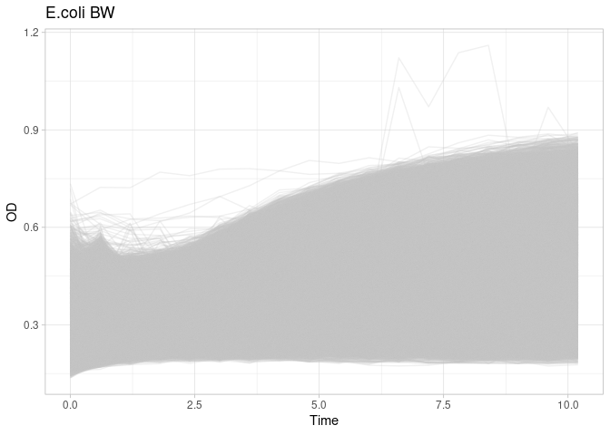
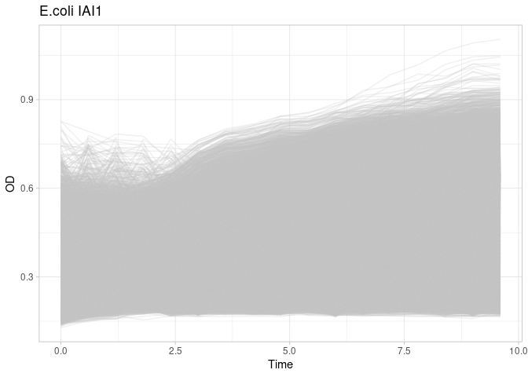
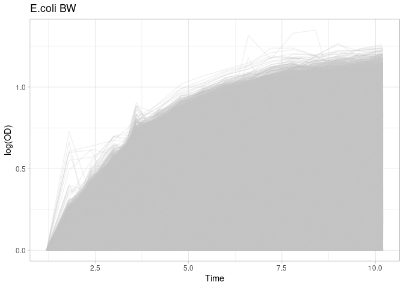
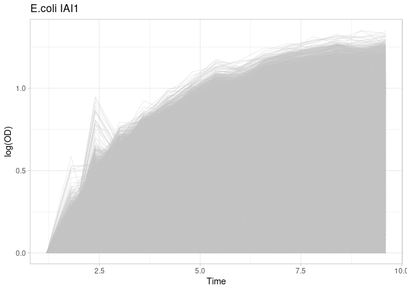
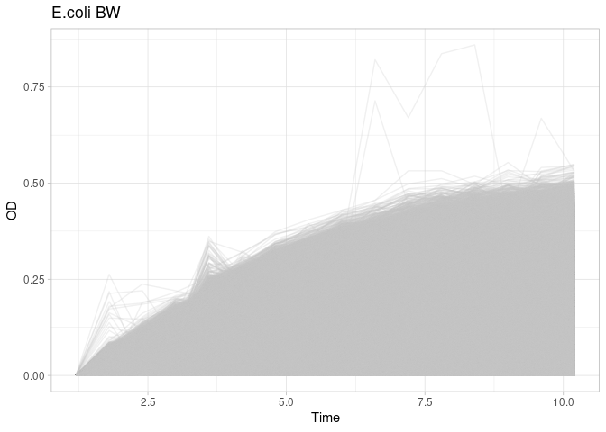
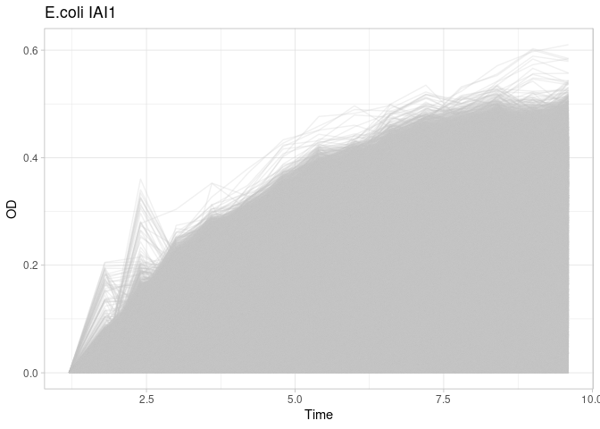

broch18-01-preprocess_data
================
Compiled at 2025-03-21 18:02:08 UTC

``` r
here::i_am(paste0(params$name, ".Rmd"), uuid = "6972c0f1-021c-4d3e-aa4d-2d9ea032c76e")
```

The purpose of this document is …

``` r
library("tidyverse")
```

    ## ── Attaching core tidyverse packages ──────────────────────── tidyverse 2.0.0 ──
    ## ✔ dplyr     1.1.4     ✔ readr     2.1.5
    ## ✔ forcats   1.0.0     ✔ stringr   1.5.1
    ## ✔ ggplot2   3.5.1     ✔ tibble    3.2.1
    ## ✔ lubridate 1.9.3     ✔ tidyr     1.3.1
    ## ✔ purrr     1.0.2     
    ## ── Conflicts ────────────────────────────────────────── tidyverse_conflicts() ──
    ## ✖ dplyr::filter() masks stats::filter()
    ## ✖ dplyr::lag()    masks stats::lag()
    ## ℹ Use the conflicted package (<http://conflicted.r-lib.org/>) to force all conflicts to become errors

``` r
library("DGrowthR")
```

``` r
# create or *empty* the target directory, used to write this file's data: 
projthis::proj_create_dir_target(params$name, clean = TRUE)

# function to get path to target directory: path_target("sample.csv")
path_target <- projthis::proj_path_target(params$name)

# function to get path to previous data: path_source("00-import", "sample.csv")
path_source <- projthis::proj_path_source(params$name)
```

## Read Data.

``` r
ecbw_od <- read_tsv(path_source("broch18-00-import_data", "ecoli_od_BW.tsv.gz"), show_col_types = FALSE)
ecbw_metadata <- read_tsv(path_source("broch18-00-import_data", "ecoli_metadata_BW.tsv.gz"), show_col_types = FALSE)

eciai_od <- read_tsv(path_source("broch18-00-import_data", "ecoli_od_iAi.tsv.gz"), show_col_types = FALSE)
eciai_metadata <- read_tsv(path_source("broch18-00-import_data", "ecoli_metadata_iAi.tsv.gz"), show_col_types = FALSE)
```

18 is the smallest number of timepoints, consider only the first 18
timepoints

``` r
ecbw_od <- ecbw_od %>% 
  filter(timepoint_n <= 18)


eciai_od <- eciai_od %>% 
  filter(timepoint_n <= 17)
```

## Create DGrowthR objects

``` r
dgobj.ecbw <-  new("DGrowthR", 
                od_data = ecbw_od, 
                metadata = ecbw_metadata,
                raw_od = ecbw_od,
                verbose=TRUE)


dgobj.eciai <-  new("DGrowthR", 
                od_data = eciai_od, 
                metadata = eciai_metadata,
                raw_od = eciai_od,
                verbose=TRUE)
```

## View raw growth curves.

``` r
plot_growth_curves(dgobj.ecbw) +
  labs(title = "E.coli BW")
```

<!-- -->

``` r
plot_growth_curves(dgobj.eciai) +
  labs(title = "E.coli IAI1")
```

<!-- -->

## Standard pre-processing.

``` r
dgobj.ecbw.logged <-  preprocess_data(dgobj.ecbw, 
                                      skip_first_n_timepoints = 2,
                                      baseline = 3)
```

    ## Ignoring first 2 for analysis.

    ## Log-transforming the growth measurements...

    ## Using OD from timepoint 3 as baseline.

``` r
dgobj.eciai.logged <-  preprocess_data(dgobj.eciai, 
                                       skip_first_n_timepoints = 2,
                                       baseline = 3)
```

    ## Ignoring first 2 for analysis.

    ## Log-transforming the growth measurements...

    ## Using OD from timepoint 3 as baseline.

``` r
dgobj.ecbw.linear <-  preprocess_data(dgobj.ecbw, 
                                      skip_first_n_timepoints = 2,
                                      baseline = 3,
                                      log_transform = FALSE) 
```

    ## Ignoring first 2 for analysis.

    ## Using linear growth measurements...

    ## WARNING: Not log-transforming growth mesaurements might result in inaccurate estimation of growth parameters...

    ## Using OD from timepoint 3 as baseline.

``` r
dgobj.eciai.linear <-  preprocess_data(dgobj.eciai, 
                                       skip_first_n_timepoints = 2,
                                       baseline = 3,
                                      log_transform = FALSE)
```

    ## Ignoring first 2 for analysis.

    ## Using linear growth measurements...

    ## WARNING: Not log-transforming growth mesaurements might result in inaccurate estimation of growth parameters...

    ## Using OD from timepoint 3 as baseline.

``` r
plot_growth_curves(dgobj.ecbw.logged) +
  labs(title = "E.coli BW")
```

<!-- -->

``` r
plot_growth_curves(dgobj.eciai.logged) +
  labs(title = "E.coli IAI1")
```

<!-- -->

``` r
plot_growth_curves(dgobj.ecbw.linear) +
  labs(title = "E.coli BW")
```

<!-- -->

``` r
plot_growth_curves(dgobj.eciai.linear) +
  labs(title = "E.coli IAI1")
```

<!-- -->
## Write objects

``` r
saveRDS(dgobj.ecbw, path_target("dgobj_ecbw.rds"))
saveRDS(dgobj.ecbw.logged, path_target("dgobj_ecbw_logged.rds"))
saveRDS(dgobj.ecbw.linear, path_target("dgobj_ecbw_linear.rds"))


saveRDS(dgobj.eciai, path_target("dgobj_iai.rds"))
saveRDS(dgobj.eciai.logged, path_target("dgobj_iai_logged.rds"))
saveRDS(dgobj.eciai.linear, path_target("dgobj_iai_linear.rds"))
```

## Files written

These files have been written to the target directory,
`data/broch18-01-preprocess_data`:

``` r
projthis::proj_dir_info(path_target())
```

    ## # A tibble: 6 × 4
    ##   path                  type         size modification_time  
    ##   <fs::path>            <fct> <fs::bytes> <dttm>             
    ## 1 dgobj_ecbw.rds        file        12.2M 2025-03-21 18:08:06
    ## 2 dgobj_ecbw_linear.rds file        16.5M 2025-03-21 18:08:16
    ## 3 dgobj_ecbw_logged.rds file        23.6M 2025-03-21 18:08:11
    ## 4 dgobj_iai.rds         file        12.4M 2025-03-21 18:08:20
    ## 5 dgobj_iai_linear.rds  file        16.5M 2025-03-21 18:08:30
    ## 6 dgobj_iai_logged.rds  file        23.2M 2025-03-21 18:08:25

## Session Info

``` r
sessionInfo()
```

    ## R version 4.2.0 (2022-04-22)
    ## Platform: x86_64-pc-linux-gnu (64-bit)
    ## Running under: Ubuntu 22.04.5 LTS
    ## 
    ## Matrix products: default
    ## BLAS:   /opt/bayresq.net/R/R-4.2.0/lib/R/lib/libRblas.so
    ## LAPACK: /opt/bayresq.net/R/R-4.2.0/lib/R/lib/libRlapack.so
    ## 
    ## locale:
    ##  [1] LC_CTYPE=C.UTF-8       LC_NUMERIC=C           LC_TIME=C.UTF-8       
    ##  [4] LC_COLLATE=C.UTF-8     LC_MONETARY=C.UTF-8    LC_MESSAGES=C.UTF-8   
    ##  [7] LC_PAPER=C.UTF-8       LC_NAME=C              LC_ADDRESS=C          
    ## [10] LC_TELEPHONE=C         LC_MEASUREMENT=C.UTF-8 LC_IDENTIFICATION=C   
    ## 
    ## attached base packages:
    ## [1] stats     graphics  grDevices utils     datasets  methods   base     
    ## 
    ## other attached packages:
    ##  [1] DGrowthR_1.0    lubridate_1.9.3 forcats_1.0.0   stringr_1.5.1  
    ##  [5] dplyr_1.1.4     purrr_1.0.2     readr_2.1.5     tidyr_1.3.1    
    ##  [9] tibble_3.2.1    ggplot2_3.5.1   tidyverse_2.0.0
    ## 
    ## loaded via a namespace (and not attached):
    ##  [1] mclust_6.1.1        Rcpp_1.0.12         mvtnorm_1.2-4      
    ##  [4] here_1.0.1          fdapace_0.5.9       lattice_0.20-45    
    ##  [7] rprojroot_2.0.4     digest_0.6.35       foreach_1.5.2      
    ## [10] utf8_1.2.4          R6_2.5.1            backports_1.4.1    
    ## [13] evaluate_0.23       pracma_2.4.4        highr_0.10         
    ## [16] pillar_1.9.0        rlang_1.1.4         rstudioapi_0.16.0  
    ## [19] data.table_1.15.4   rpart_4.1.16        Matrix_1.6-5       
    ## [22] checkmate_2.3.1     rmarkdown_2.27      labeling_0.4.3     
    ## [25] foreign_0.8-82      htmlwidgets_1.6.4   bit_4.0.5          
    ## [28] uwot_0.2.2          munsell_0.5.1       compiler_4.2.0     
    ## [31] numDeriv_2016.8-1.1 xfun_0.44           pkgconfig_2.0.3    
    ## [34] base64enc_0.1-3     htmltools_0.5.8.1   nnet_7.3-17        
    ## [37] tidyselect_1.2.1    gridExtra_2.3       htmlTable_2.4.2    
    ## [40] Hmisc_5.1-2         codetools_0.2-18    fansi_1.0.6        
    ## [43] crayon_1.5.2        tzdb_0.4.0          withr_3.0.1        
    ## [46] MASS_7.3-56         grid_4.2.0          jsonlite_1.8.8     
    ## [49] gtable_0.3.5        lifecycle_1.0.4     magrittr_2.0.3     
    ## [52] scales_1.3.0        vroom_1.6.1         cli_3.6.3          
    ## [55] stringi_1.8.4       farver_2.1.2        fs_1.6.4           
    ## [58] projthis_0.0.0.9025 ellipsis_0.3.2      generics_0.1.3     
    ## [61] vctrs_0.6.5         Formula_1.2-5       iterators_1.0.14   
    ## [64] tools_4.2.0         bit64_4.0.5         glue_1.7.0         
    ## [67] hms_1.1.2           parallel_4.2.0      fastmap_1.2.0      
    ## [70] yaml_2.3.8          timechange_0.2.0    colorspace_2.1-1   
    ## [73] cluster_2.1.3       knitr_1.46
