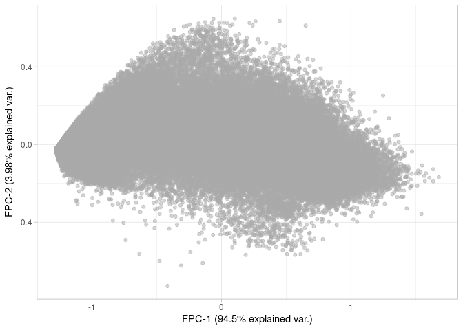
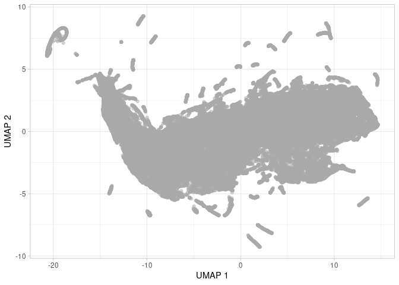
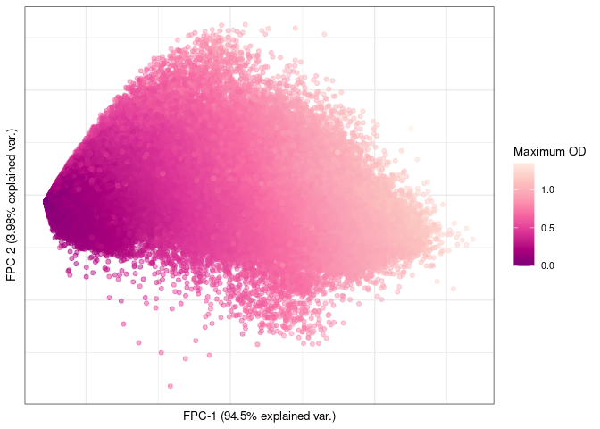
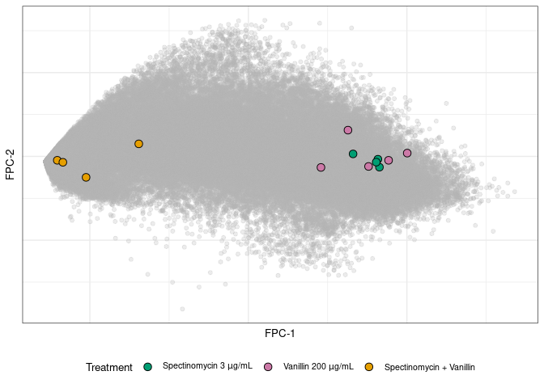
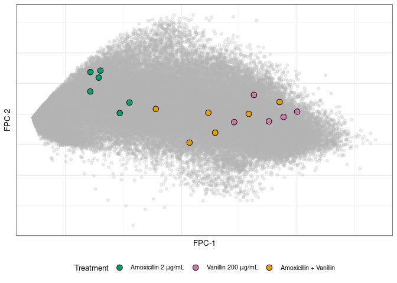
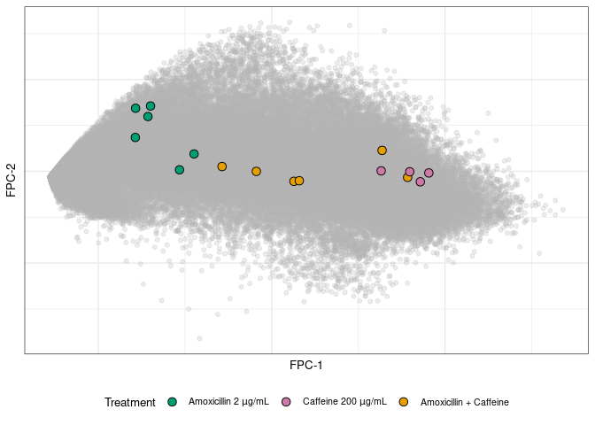
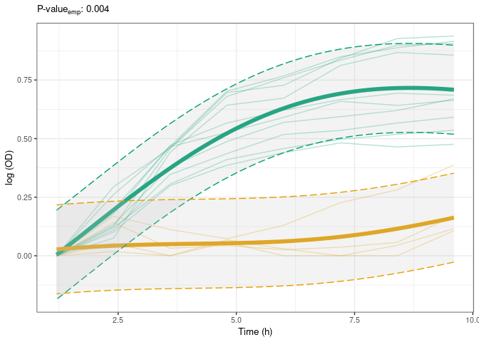
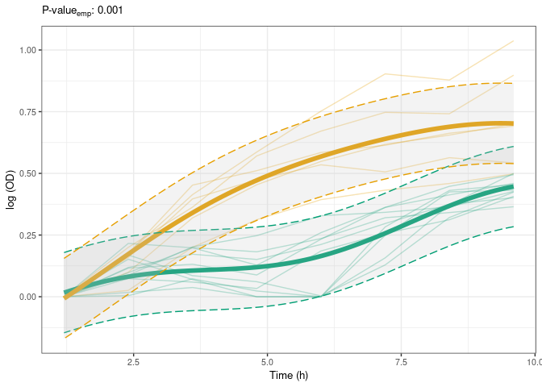
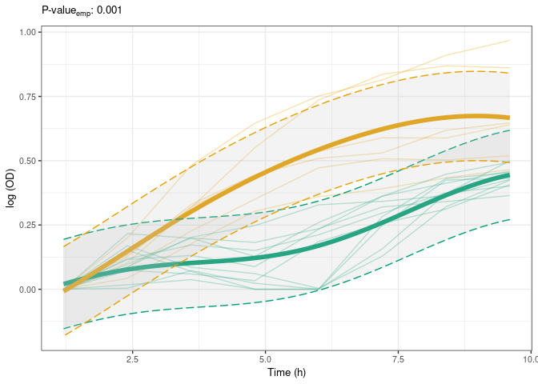

broch18-02-growth_analysis
================
Compiled at 2025-03-21 18:22:13 UTC

``` r
here::i_am(paste0(params$name, ".Rmd"), uuid = "bb69b453-2d3d-4d97-9c47-66b7a13a22cb")
```

The purpose of this document is …

``` r
library("tidyverse")
```

    ## ── Attaching core tidyverse packages ──────────────────────── tidyverse 2.0.0 ──
    ## ✔ dplyr     1.1.4     ✔ readr     2.1.5
    ## ✔ forcats   1.0.0     ✔ stringr   1.5.1
    ## ✔ ggplot2   3.5.1     ✔ tibble    3.2.1
    ## ✔ lubridate 1.9.3     ✔ tidyr     1.3.1
    ## ✔ purrr     1.0.2     
    ## ── Conflicts ────────────────────────────────────────── tidyverse_conflicts() ──
    ## ✖ dplyr::filter() masks stats::filter()
    ## ✖ dplyr::lag()    masks stats::lag()
    ## ℹ Use the conflicted package (<http://conflicted.r-lib.org/>) to force all conflicts to become errors

``` r
library("DGrowthR")
```

``` r
# create or *empty* the target directory, used to write this file's data: 
projthis::proj_create_dir_target(params$name, clean = TRUE)

# function to get path to target directory: path_target("sample.csv")
path_target <- projthis::proj_path_target(params$name)

# function to get path to previous data: path_source("00-import", "sample.csv")
path_source <- projthis::proj_path_source(params$name)
```

## Read data

``` r
# DGrowthR 
dgobj.ecbw.logged <- readRDS(path_source("broch18-01-preprocess_data", "dgobj_ecbw_logged.rds"))
```

## Gather maxOD

``` r
ecbw.max <- dgobj.ecbw.logged@od_data %>% 
  group_by(curve_id) %>% 
  summarise(maxOD = max(od)) %>% 
  ungroup()

# Add to metadata
dgobj.ecbw.logged@metadata <- dgobj.ecbw.logged@metadata %>% 
  left_join(ecbw.max, by="curve_id")
```

## Low dimensinoal representations

``` r
# BW
dgobj.ecbw.logged <- estimate_fpca(dgobj.ecbw.logged)
```

    ## [DGrowthR::estimate_fpca] >> Estimating functional Principal Components

    ## [DGrowthR::estimate_fpca] >> Embedding optical density data

``` r
set.seed(42)
dgobj.ecbw.logged <- estimate_umap(dgobj.ecbw.logged)
```

    ## [DGrowthR::estimate_umap] >> Estimating functional UMAP

    ## [DGrowthR::estimate_umap] >> Embedding optical density data

``` r
plot_fpca(dgobj.ecbw.logged)
```

<!-- -->

``` r
plot_umap(dgobj.ecbw.logged)
```

<!-- -->

## Plot max OD

``` r
bw.fpca <- plot_fpca(dgobj.ecbw.logged, color="maxOD") +
  scale_color_distiller(palette="RdPu", direction=-1) +
  labs(color="Maximum OD") +
  theme_bw() +
  theme(text = element_text(size=10),
        axis.ticks.x = element_blank(),
        axis.text.x = element_blank(),
        axis.ticks.y = element_blank(),
        axis.text.y = element_blank())
        
        #legend.title = element_text(size = 8),
        #legend.key.size = unit(0.15, "cm"),
      #legend.position = "inside",
      #legend.position.inside = c(0.8, 0.85))
  
bw.umap <- plot_umap(dgobj.ecbw.logged, color="maxOD") +
  scale_color_distiller(palette="RdPu", direction=-1) +
  labs(color="Maximum OD") +
  theme_bw() +
  theme(text = element_text(size=10),
        axis.ticks.x = element_blank(),
        axis.text.x = element_blank(),
        axis.ticks.y = element_blank(),
        axis.text.y = element_blank(),
        
        #legend.title = element_text(size = 8),
        #legend.key.size = unit(0.35, "cm"),
        #text = element_text(size=10),
        
      legend.position = "inside",
      legend.position.inside = c(0.07, 0.3))
```

``` r
bw.fpca
```

<!-- -->

## Vanillin + Spectinomycin

``` r
fpcaX <- dgobj.ecbw.logged@fpca$fdapace_obj$xiEst
colnames(fpcaX) <- paste0("fpc", 1:ncol(fpcaX))

fpca_df <- data.frame(fpcaX)
fpca_df$curve_id <- names(dgobj.ecbw.logged@fpca$fdapace_obj$inputData$Lt)
```

``` r
curve.labels <- dgobj.ecbw.logged@metadata %>% 
  filter(#combination.id == "Spectinomycin.2:NoDurg.NA" |
          (combination.id == "Control.NA:Spectinomycin.2" & query %in% c("Control.rep.1", "Control.rep.2")) |
           
           combination.id == "Vanillin.1:NoDurg.NA" | 
           (combination.id == "Control.NA:Vanillin.1" & query == "Control.rep.1") | 
           
           
         combination.id == "Vanillin.1:Spectinomycin.2" |
           combination.id == "Spectinomycin.2:Vanillin.1") %>% 
  
  mutate(combination.label = case_when(combination.id %in% c("Spectinomycin.2:NoDurg.NA", "Control.NA:Spectinomycin.2") ~ "Spectinomycin",
                               combination.id %in% c("Vanillin.1:NoDurg.NA", "Control.NA:Vanillin.1") ~ "Vanillin",
                               combination.id %in% c("Vanillin.1:Spectinomycin.2", "Spectinomycin.2:Vanillin.1") ~ "Spectinomycin + Vanillin")) %>% 
  
  select(curve_id, combination.label)


umap.spec <- dgobj.ecbw.logged@umap_coord %>% 
  left_join(curve.labels, by="curve_id") %>% 
  filter(!is.na(combination.label)) %>% 
  
  mutate(combination.label = factor(combination.label, levels = c("Spectinomycin", "Vanillin", "Spectinomycin + Vanillin")))

spec.vanill.umap <- ggplot() +
  
  geom_point(data=fpca_df, aes(x=V1, y=V2), color="#b3b3b3", alpha=0.25) +
  geom_point(data=umap.spec, aes(x=V1, y=V2, fill=combination.label), size=3, shape=21, color="black") +
  
  scale_fill_manual(values = c("#009E73", "#CC79A7", "#E69F00"),
                    labels=c(latex2exp::TeX("Spectinomycin 3 $\\mu$g/mL"),
                             latex2exp::TeX("Vanillin 200 $\\mu$g/mL"),
                             "Spectinomycin + Vanillin"))+
  
  theme_bw() +
  theme(legend.position = "bottom",
        text=element_text(size=10),
         axis.ticks.x = element_blank(),
        axis.text.x = element_blank(),
        axis.ticks.y = element_blank(),
        axis.text.y = element_blank()) +
  
  labs(x="UMAP 1",
       y="UMAP 2",
       fill = "Treatment")


###
fpca.spec <- fpca_df %>% 
  left_join(curve.labels, by="curve_id") %>% 
  filter(!is.na(combination.label)) %>% 
  
  mutate(combination.label = factor(combination.label, levels = c("Spectinomycin", "Vanillin", "Spectinomycin + Vanillin")))


spec.vanill.fpca <- ggplot() +
  
  geom_point(data=fpca_df, aes(x=fpc1, y=fpc2), color="#b3b3b3", alpha=0.25) +
  geom_point(data=fpca.spec, aes(x=fpc1, y=fpc2, fill=combination.label), size=3, shape=21, color="black") +
  
  scale_fill_manual(values = c("#009E73", "#CC79A7", "#E69F00"),
                    labels=c(latex2exp::TeX("Spectinomycin 3 $\\mu$g/mL"),
                             latex2exp::TeX("Vanillin 200 $\\mu$g/mL"),
                             "Spectinomycin + Vanillin"))+
  
  theme_bw() +
  theme(legend.position = "bottom",
        text=element_text(size=10),
         axis.ticks.x = element_blank(),
        axis.text.x = element_blank(),
        axis.ticks.y = element_blank(),
        axis.text.y = element_blank()) +
  
  labs(x="FPC-1",
       y="FPC-2",
       fill = "Treatment")
spec.vanill.fpca
```

<!-- -->

``` r
#spec.vanill.umap.raster <- ggrastr::rasterise(spec.vanill.umap)
```

## Amoxi + Vanillin

``` r
curve.labels <- dgobj.ecbw.logged@metadata %>% 
  filter(#combination.id == "Amoxicillin.1:NoDurg.NA" |
          (combination.id == "Control.NA:Amoxicillin.1" & query %in% c("Control.rep.1", "Control.rep.2", "Control.rep.9")) |
           
           combination.id == "Vanillin.1:NoDurg.NA" | 
           (combination.id == "Control.NA:Vanillin.1" & query == "Control.rep.1") | 
           
           
         combination.id == "Vanillin.1:Amoxicillin.1" |
           combination.id == "Amoxicillin.1:Vanillin.1") %>% 
  
  mutate(combination.label = case_when(combination.id %in% c("Amoxicillin.1:NoDurg.NA", "Control.NA:Amoxicillin.1") ~ "Amoxicillin",
                               combination.id %in% c("Vanillin.1:NoDurg.NA", "Control.NA:Vanillin.1") ~ "Vanillin",
                               combination.id %in% c("Vanillin.1:Amoxicillin.1", "Amoxicillin.1:Vanillin.1") ~ "Amoxicillin + Vanillin")) %>% 
  
  select(curve_id, combination.label)


umap.spec <- dgobj.ecbw.logged@umap_coord %>% 
  left_join(curve.labels, by="curve_id") %>% 
  filter(!is.na(combination.label)) %>% 
  
  mutate(combination.label = factor(combination.label, levels = c("Amoxicillin", "Vanillin", "Amoxicillin + Vanillin")))

amoxi.vanill.umap <- ggplot() +
  
  geom_point(data=dgobj.ecbw.logged@umap_coord, aes(x=V1, y=V2), color="#b3b3b3", alpha=0.25) +
  geom_point(data=umap.spec, aes(x=V1, y=V2, fill=combination.label), size=3, shape=21, color="black") +
  
  scale_fill_manual(values = c("#009E73", "#CC79A7", "#E69F00"),
                    labels=c(latex2exp::TeX("Amoxicillin 2 $\\mu$g/mL"),
                             latex2exp::TeX("Vanillin 200 $\\mu$g/mL"),
                             "Amoxicillin + Vanillin")) +
  
  theme_bw() +
  theme(legend.position = "bottom",
        text = element_text(size=10),
         axis.ticks.x = element_blank(),
        axis.text.x = element_blank(),
        axis.ticks.y = element_blank(),
        axis.text.y = element_blank()) +
  
  labs(x="UMAP 1",
       y="UMAP 2",
       fill = "Treatment")


###
fpca.spec <- fpca_df %>% 
  left_join(curve.labels, by="curve_id") %>% 
  filter(!is.na(combination.label)) %>% 
  
  mutate(combination.label = factor(combination.label, levels = c("Amoxicillin", "Vanillin", "Amoxicillin + Vanillin")))


amoxi.vanill.fpca <- ggplot() +
  
  geom_point(data=fpca_df, aes(x=fpc1, y=fpc2), color="#b3b3b3", alpha=0.25) +
  geom_point(data=fpca.spec, aes(x=fpc1, y=fpc2, fill=combination.label), size=3, shape=21, color="black") +
  
  scale_fill_manual(values = c("#009E73", "#CC79A7", "#E69F00"),
                    labels=c(latex2exp::TeX("Amoxicillin 2 $\\mu$g/mL"),
                             latex2exp::TeX("Vanillin 200 $\\mu$g/mL"),
                             "Amoxicillin + Vanillin")) +
  
  theme_bw() +
  theme(legend.position = "bottom",
        text=element_text(size=10),
         axis.ticks.x = element_blank(),
        axis.text.x = element_blank(),
        axis.ticks.y = element_blank(),
        axis.text.y = element_blank()) +
  
  labs(x="FPC-1",
       y="FPC-2",
       fill = "Treatment")

amoxi.vanill.fpca
```

<!-- -->

## Caffeine + Amoxi

``` r
curve.labels <- dgobj.ecbw.logged@metadata %>% 
  filter(#combination.id == "Amoxicillin.1:NoDurg.NA" |
          (combination.id == "Control.NA:Amoxicillin.1" & query %in% c("Control.rep.1", "Control.rep.2", "Control.rep.9")) |
           
           #combination.id == "Caffeine.1:NoDurg.NA" | 
           (combination.id == "Control.NA:Caffeine.1" & query == "Control.rep.1") | 
            (combination.id == "Control.NA:Caffeine.1" & query == "Control.rep.2") |
           
           
         combination.id == "Caffeine.1:Amoxicillin.1" |
           combination.id == "Amoxicillin.1:Caffeine.1") %>% 
  
  mutate(combination.label = case_when(combination.id %in% c("Amoxicillin.1:NoDurg.NA", "Control.NA:Amoxicillin.1") ~ "Amoxicillin",
                               combination.id %in% c("Caffeine.1:NoDurg.NA", "Control.NA:Caffeine.1") ~ "Caffeine",
                               combination.id %in% c("Caffeine.1:Amoxicillin.1", "Amoxicillin.1:Caffeine.1") ~ "Amoxicillin + Caffeine")) %>% 
  
  select(curve_id, combination.label)


umap.spec <- dgobj.ecbw.logged@umap_coord %>% 
  left_join(curve.labels, by="curve_id") %>% 
  filter(!is.na(combination.label)) %>% 
  
  mutate(combination.label = factor(combination.label, levels = c("Amoxicillin", "Caffeine", "Amoxicillin + Caffeine")))

amoxi.caff.umap <- ggplot() +
  
  geom_point(data=dgobj.ecbw.logged@umap_coord, aes(x=V1, y=V2), color="#b3b3b3", alpha=0.25) +
  geom_point(data=umap.spec, aes(x=V1, y=V2, fill=combination.label), size=3, shape=21, color="black") +
  
  scale_fill_manual(values = c("#009E73", "#CC79A7", "#E69F00"),
                    labels=c(latex2exp::TeX("Amoxicillin 2 $\\mu$g/mL"),
                             latex2exp::TeX("Caffeine 200 $\\mu$g/mL"),
                             "Amoxicillin + Caffeine"))+
  
  theme_bw() +
  theme(legend.position = "bottom",
        text = element_text(size=10),
         axis.ticks.x = element_blank(),
        axis.text.x = element_blank(),
        axis.ticks.y = element_blank(),
        axis.text.y = element_blank()) +
  
  labs(x="UMAP 1",
       y="UMAP 2",
       fill = "Treatment")


###
fpca.spec <- fpca_df %>% 
  left_join(curve.labels, by="curve_id") %>% 
  filter(!is.na(combination.label)) %>% 
  
  mutate(combination.label = factor(combination.label, levels = c("Amoxicillin", "Caffeine", "Amoxicillin + Caffeine")))


amoxi.caff.fpca <- ggplot() +
  
  geom_point(data=fpca_df, aes(x=fpc1, y=fpc2), color="#b3b3b3", alpha=0.25) +
  geom_point(data=fpca.spec, aes(x=fpc1, y=fpc2, fill=combination.label), size=3, shape=21, color="black") +
  
  scale_fill_manual(values = c("#009E73", "#CC79A7", "#E69F00"),
                    labels=c(latex2exp::TeX("Amoxicillin 2 $\\mu$g/mL"),
                             latex2exp::TeX("Caffeine 200 $\\mu$g/mL"),
                             "Amoxicillin + Caffeine"))+
  
  theme_bw() +
  theme(legend.position = "bottom",
        text=element_text(size=10),
         axis.ticks.x = element_blank(),
        axis.text.x = element_blank(),
        axis.ticks.y = element_blank(),
        axis.text.y = element_blank()) +
  
  labs(x="FPC-1",
       y="FPC-2",
       fill = "Treatment")

amoxi.caff.fpca
```

<!-- -->

## Growth comparison.

Update metadata

``` r
dgobj.ecbw.logged@metadata <- dgobj.ecbw.logged@metadata %>% 
  mutate(combination.label = case_when(combination.id %in% c("Control.NA:Spectinomycin.2") & query %in% c("Control.rep.1", "Control.rep.2", "Control.rep.9","Control.rep.10", "Control.rep.11") ~ "Spectinomycin",
                                       combination.id %in% c("Control.NA:Amoxicillin.1") & query %in% c("Control.rep.1", "Control.rep.2", "Control.rep.9","Control.rep.10", "Control.rep.11")  ~ "Amoxicillin",
                                       
                                       combination.id %in% c("Caffeine.1:NoDurg.NA", "Control.NA:Caffeine.1") ~ "Caffeine",
                                       combination.id %in% c("Caffeine.1:Amoxicillin.1", "Amoxicillin.1:Caffeine.1") ~ "Amoxicillin + Caffeine",
                                       
                                       combination.id %in% c("Vanillin.1:NoDurg.NA", "Control.NA:Vanillin.1") ~ "Vanillin",
                                       combination.id %in% c("Vanillin.1:Amoxicillin.1", "Amoxicillin.1:Vanillin.1") ~ "Amoxicillin + Vanillin",
                                       
                                       combination.id %in% c("Vanillin.1:Spectinomycin.2", "Spectinomycin.2:Vanillin.1") ~ "Spectinomycin + Vanillin",
                                       
                                       TRUE ~ "Other"))
```

``` r
gc.spec.vanill <- growth_comparison(dgobj.ecbw.logged, 
                                    comparison_info = c("combination.label", "Spectinomycin + Vanillin", "Spectinomycin"),
                                    downsample_every_n_timepoints = 2,
                                    save_gp_data = TRUE,
                                    permutation_test = TRUE,
                                    n_permutations = 1000)
```

    ## [DGrowthR::growth_comparison] >> Comparing Spectinomycin + Vanillin to Spectinomycin from the combination.label field.

    ## [DGrowthR::perm_test] >> Perform permutation test with 1000 permutations

    ##   |                                                                              |                                                                      |   0%  |                                                                              |                                                                      |   1%  |                                                                              |=                                                                     |   1%  |                                                                              |=                                                                     |   2%  |                                                                              |==                                                                    |   2%  |                                                                              |==                                                                    |   3%  |                                                                              |==                                                                    |   4%  |                                                                              |===                                                                   |   4%  |                                                                              |===                                                                   |   5%  |                                                                              |====                                                                  |   5%  |                                                                              |====                                                                  |   6%  |                                                                              |=====                                                                 |   6%  |                                                                              |=====                                                                 |   7%  |                                                                              |=====                                                                 |   8%  |                                                                              |======                                                                |   8%  |                                                                              |======                                                                |   9%  |                                                                              |=======                                                               |   9%  |                                                                              |=======                                                               |  10%  |                                                                              |=======                                                               |  11%  |                                                                              |========                                                              |  11%  |                                                                              |========                                                              |  12%  |                                                                              |=========                                                             |  12%  |                                                                              |=========                                                             |  13%  |                                                                              |=========                                                             |  14%  |                                                                              |==========                                                            |  14%  |                                                                              |==========                                                            |  15%  |                                                                              |===========                                                           |  15%  |                                                                              |===========                                                           |  16%  |                                                                              |============                                                          |  16%  |                                                                              |============                                                          |  17%  |                                                                              |============                                                          |  18%  |                                                                              |=============                                                         |  18%  |                                                                              |=============                                                         |  19%  |                                                                              |==============                                                        |  19%  |                                                                              |==============                                                        |  20%  |                                                                              |==============                                                        |  21%  |                                                                              |===============                                                       |  21%  |                                                                              |===============                                                       |  22%  |                                                                              |================                                                      |  22%  |                                                                              |================                                                      |  23%  |                                                                              |================                                                      |  24%  |                                                                              |=================                                                     |  24%  |                                                                              |=================                                                     |  25%  |                                                                              |==================                                                    |  25%  |                                                                              |==================                                                    |  26%  |                                                                              |===================                                                   |  26%  |                                                                              |===================                                                   |  27%  |                                                                              |===================                                                   |  28%  |                                                                              |====================                                                  |  28%  |                                                                              |====================                                                  |  29%  |                                                                              |=====================                                                 |  29%  |                                                                              |=====================                                                 |  30%  |                                                                              |=====================                                                 |  31%  |                                                                              |======================                                                |  31%  |                                                                              |======================                                                |  32%  |                                                                              |=======================                                               |  32%  |                                                                              |=======================                                               |  33%  |                                                                              |=======================                                               |  34%  |                                                                              |========================                                              |  34%  |                                                                              |========================                                              |  35%  |                                                                              |=========================                                             |  35%  |                                                                              |=========================                                             |  36%  |                                                                              |==========================                                            |  36%  |                                                                              |==========================                                            |  37%  |                                                                              |==========================                                            |  38%  |                                                                              |===========================                                           |  38%  |                                                                              |===========================                                           |  39%  |                                                                              |============================                                          |  39%  |                                                                              |============================                                          |  40%  |                                                                              |============================                                          |  41%  |                                                                              |=============================                                         |  41%  |                                                                              |=============================                                         |  42%  |                                                                              |==============================                                        |  42%  |                                                                              |==============================                                        |  43%  |                                                                              |==============================                                        |  44%  |                                                                              |===============================                                       |  44%  |                                                                              |===============================                                       |  45%  |                                                                              |================================                                      |  45%  |                                                                              |================================                                      |  46%  |                                                                              |=================================                                     |  46%  |                                                                              |=================================                                     |  47%  |                                                                              |=================================                                     |  48%  |                                                                              |==================================                                    |  48%  |                                                                              |==================================                                    |  49%  |                                                                              |===================================                                   |  49%  |                                                                              |===================================                                   |  50%  |                                                                              |===================================                                   |  51%  |                                                                              |====================================                                  |  51%  |                                                                              |====================================                                  |  52%  |                                                                              |=====================================                                 |  52%  |                                                                              |=====================================                                 |  53%  |                                                                              |=====================================                                 |  54%  |                                                                              |======================================                                |  54%  |                                                                              |======================================                                |  55%  |                                                                              |=======================================                               |  55%  |                                                                              |=======================================                               |  56%  |                                                                              |========================================                              |  56%  |                                                                              |========================================                              |  57%  |                                                                              |========================================                              |  58%  |                                                                              |=========================================                             |  58%  |                                                                              |=========================================                             |  59%  |                                                                              |==========================================                            |  59%  |                                                                              |==========================================                            |  60%  |                                                                              |==========================================                            |  61%  |                                                                              |===========================================                           |  61%  |                                                                              |===========================================                           |  62%  |                                                                              |============================================                          |  62%  |                                                                              |============================================                          |  63%  |                                                                              |============================================                          |  64%  |                                                                              |=============================================                         |  64%  |                                                                              |=============================================                         |  65%  |                                                                              |==============================================                        |  65%  |                                                                              |==============================================                        |  66%  |                                                                              |===============================================                       |  66%  |                                                                              |===============================================                       |  67%  |                                                                              |===============================================                       |  68%  |                                                                              |================================================                      |  68%  |                                                                              |================================================                      |  69%  |                                                                              |=================================================                     |  69%  |                                                                              |=================================================                     |  70%  |                                                                              |=================================================                     |  71%  |                                                                              |==================================================                    |  71%  |                                                                              |==================================================                    |  72%  |                                                                              |===================================================                   |  72%  |                                                                              |===================================================                   |  73%  |                                                                              |===================================================                   |  74%  |                                                                              |====================================================                  |  74%  |                                                                              |====================================================                  |  75%  |                                                                              |=====================================================                 |  75%  |                                                                              |=====================================================                 |  76%  |                                                                              |======================================================                |  76%  |                                                                              |======================================================                |  77%  |                                                                              |======================================================                |  78%  |                                                                              |=======================================================               |  78%  |                                                                              |=======================================================               |  79%  |                                                                              |========================================================              |  79%  |                                                                              |========================================================              |  80%  |                                                                              |========================================================              |  81%  |                                                                              |=========================================================             |  81%  |                                                                              |=========================================================             |  82%  |                                                                              |==========================================================            |  82%  |                                                                              |==========================================================            |  83%  |                                                                              |==========================================================            |  84%  |                                                                              |===========================================================           |  84%  |                                                                              |===========================================================           |  85%  |                                                                              |============================================================          |  85%  |                                                                              |============================================================          |  86%  |                                                                              |=============================================================         |  86%  |                                                                              |=============================================================         |  87%  |                                                                              |=============================================================         |  88%  |                                                                              |==============================================================        |  88%  |                                                                              |==============================================================        |  89%  |                                                                              |===============================================================       |  89%  |                                                                              |===============================================================       |  90%  |                                                                              |===============================================================       |  91%  |                                                                              |================================================================      |  91%  |                                                                              |================================================================      |  92%  |                                                                              |=================================================================     |  92%  |                                                                              |=================================================================     |  93%  |                                                                              |=================================================================     |  94%  |                                                                              |==================================================================    |  94%  |                                                                              |==================================================================    |  95%  |                                                                              |===================================================================   |  95%  |                                                                              |===================================================================   |  96%  |                                                                              |====================================================================  |  96%  |                                                                              |====================================================================  |  97%  |                                                                              |====================================================================  |  98%  |                                                                              |===================================================================== |  98%  |                                                                              |===================================================================== |  99%  |                                                                              |======================================================================|  99%  |                                                                              |======================================================================| 100%

    ## [DGrowthR::perm_test] >> Time taken to perform permutation test: 56 second(s)

    ## [DGrowthR::growth_comparison] >> Finished!

``` r
growth_comparison_result(gc.spec.vanill)
```

    ##                                                       comparison
    ## 1 combination.label: Spectinomycin + Vanillin v.s. Spectinomycin
    ##   likelihood_ratio llik.alternative_model llik.null_model AUC.treatment
    ## 1         77.42396               6.460218       -70.96374     0.5949925
    ##   AUC.reference AUC.FoldChange max_growth.treatment max_growth.reference
    ## 1      4.202487       0.141581            0.1626551            0.7163623
    ##   max_growth.FoldChange euclidean.distance empirical_p.value
    ## 1              0.227057             4.7124       0.003996004

``` r
gc.spec.vanill.p <- plot_growth_comparison(gc.spec.vanill)

gc.spec.vanill.p <- gc.spec.vanill.p$alternative +
  
  
  scale_color_manual(values = c("#009E73", "#E69F00")) +
  
  theme_bw() +
  theme(plot.title = element_blank(),
        text = element_text(size=10),
        legend.position="none") +
  
  labs(x="Time (h)",
       y = "log (OD)",
       subtitle = latex2exp::TeX(paste("P-$value_{emp}$:", round(growth_comparison_result(gc.spec.vanill)$empirical_p.value, 3))),
       color="Treatment")
gc.spec.vanill.p
```

<!-- -->

``` r
gc.amoxi.vanill <- growth_comparison(dgobj.ecbw.logged, 
                                    comparison_info = c("combination.label", "Amoxicillin + Vanillin", "Amoxicillin"),
                                    downsample_every_n_timepoints = 2,
                                    save_gp_data = TRUE,
                                    permutation_test = TRUE,
                                    n_permutations = 1000)
```

    ## [DGrowthR::growth_comparison] >> Comparing Amoxicillin + Vanillin to Amoxicillin from the combination.label field.

    ## [DGrowthR::perm_test] >> Perform permutation test with 1000 permutations

    ##   |                                                                              |                                                                      |   0%  |                                                                              |                                                                      |   1%  |                                                                              |=                                                                     |   1%  |                                                                              |=                                                                     |   2%  |                                                                              |==                                                                    |   2%  |                                                                              |==                                                                    |   3%  |                                                                              |==                                                                    |   4%  |                                                                              |===                                                                   |   4%  |                                                                              |===                                                                   |   5%  |                                                                              |====                                                                  |   5%  |                                                                              |====                                                                  |   6%  |                                                                              |=====                                                                 |   6%  |                                                                              |=====                                                                 |   7%  |                                                                              |=====                                                                 |   8%  |                                                                              |======                                                                |   8%  |                                                                              |======                                                                |   9%  |                                                                              |=======                                                               |   9%  |                                                                              |=======                                                               |  10%  |                                                                              |=======                                                               |  11%  |                                                                              |========                                                              |  11%  |                                                                              |========                                                              |  12%  |                                                                              |=========                                                             |  12%  |                                                                              |=========                                                             |  13%  |                                                                              |=========                                                             |  14%  |                                                                              |==========                                                            |  14%  |                                                                              |==========                                                            |  15%  |                                                                              |===========                                                           |  15%  |                                                                              |===========                                                           |  16%  |                                                                              |============                                                          |  16%  |                                                                              |============                                                          |  17%  |                                                                              |============                                                          |  18%  |                                                                              |=============                                                         |  18%  |                                                                              |=============                                                         |  19%  |                                                                              |==============                                                        |  19%  |                                                                              |==============                                                        |  20%  |                                                                              |==============                                                        |  21%  |                                                                              |===============                                                       |  21%  |                                                                              |===============                                                       |  22%  |                                                                              |================                                                      |  22%  |                                                                              |================                                                      |  23%  |                                                                              |================                                                      |  24%  |                                                                              |=================                                                     |  24%  |                                                                              |=================                                                     |  25%  |                                                                              |==================                                                    |  25%  |                                                                              |==================                                                    |  26%  |                                                                              |===================                                                   |  26%  |                                                                              |===================                                                   |  27%  |                                                                              |===================                                                   |  28%  |                                                                              |====================                                                  |  28%  |                                                                              |====================                                                  |  29%  |                                                                              |=====================                                                 |  29%  |                                                                              |=====================                                                 |  30%  |                                                                              |=====================                                                 |  31%  |                                                                              |======================                                                |  31%  |                                                                              |======================                                                |  32%  |                                                                              |=======================                                               |  32%  |                                                                              |=======================                                               |  33%  |                                                                              |=======================                                               |  34%  |                                                                              |========================                                              |  34%  |                                                                              |========================                                              |  35%  |                                                                              |=========================                                             |  35%  |                                                                              |=========================                                             |  36%  |                                                                              |==========================                                            |  36%  |                                                                              |==========================                                            |  37%  |                                                                              |==========================                                            |  38%  |                                                                              |===========================                                           |  38%  |                                                                              |===========================                                           |  39%  |                                                                              |============================                                          |  39%  |                                                                              |============================                                          |  40%  |                                                                              |============================                                          |  41%  |                                                                              |=============================                                         |  41%  |                                                                              |=============================                                         |  42%  |                                                                              |==============================                                        |  42%  |                                                                              |==============================                                        |  43%  |                                                                              |==============================                                        |  44%  |                                                                              |===============================                                       |  44%  |                                                                              |===============================                                       |  45%  |                                                                              |================================                                      |  45%  |                                                                              |================================                                      |  46%  |                                                                              |=================================                                     |  46%  |                                                                              |=================================                                     |  47%  |                                                                              |=================================                                     |  48%  |                                                                              |==================================                                    |  48%  |                                                                              |==================================                                    |  49%  |                                                                              |===================================                                   |  49%  |                                                                              |===================================                                   |  50%  |                                                                              |===================================                                   |  51%  |                                                                              |====================================                                  |  51%  |                                                                              |====================================                                  |  52%  |                                                                              |=====================================                                 |  52%  |                                                                              |=====================================                                 |  53%  |                                                                              |=====================================                                 |  54%  |                                                                              |======================================                                |  54%  |                                                                              |======================================                                |  55%  |                                                                              |=======================================                               |  55%  |                                                                              |=======================================                               |  56%  |                                                                              |========================================                              |  56%  |                                                                              |========================================                              |  57%  |                                                                              |========================================                              |  58%  |                                                                              |=========================================                             |  58%  |                                                                              |=========================================                             |  59%  |                                                                              |==========================================                            |  59%  |                                                                              |==========================================                            |  60%  |                                                                              |==========================================                            |  61%  |                                                                              |===========================================                           |  61%  |                                                                              |===========================================                           |  62%  |                                                                              |============================================                          |  62%  |                                                                              |============================================                          |  63%  |                                                                              |============================================                          |  64%  |                                                                              |=============================================                         |  64%  |                                                                              |=============================================                         |  65%  |                                                                              |==============================================                        |  65%  |                                                                              |==============================================                        |  66%  |                                                                              |===============================================                       |  66%  |                                                                              |===============================================                       |  67%  |                                                                              |===============================================                       |  68%  |                                                                              |================================================                      |  68%  |                                                                              |================================================                      |  69%  |                                                                              |=================================================                     |  69%  |                                                                              |=================================================                     |  70%  |                                                                              |=================================================                     |  71%  |                                                                              |==================================================                    |  71%  |                                                                              |==================================================                    |  72%  |                                                                              |===================================================                   |  72%  |                                                                              |===================================================                   |  73%  |                                                                              |===================================================                   |  74%  |                                                                              |====================================================                  |  74%  |                                                                              |====================================================                  |  75%  |                                                                              |=====================================================                 |  75%  |                                                                              |=====================================================                 |  76%  |                                                                              |======================================================                |  76%  |                                                                              |======================================================                |  77%  |                                                                              |======================================================                |  78%  |                                                                              |=======================================================               |  78%  |                                                                              |=======================================================               |  79%  |                                                                              |========================================================              |  79%  |                                                                              |========================================================              |  80%  |                                                                              |========================================================              |  81%  |                                                                              |=========================================================             |  81%  |                                                                              |=========================================================             |  82%  |                                                                              |==========================================================            |  82%  |                                                                              |==========================================================            |  83%  |                                                                              |==========================================================            |  84%  |                                                                              |===========================================================           |  84%  |                                                                              |===========================================================           |  85%  |                                                                              |============================================================          |  85%  |                                                                              |============================================================          |  86%  |                                                                              |=============================================================         |  86%  |                                                                              |=============================================================         |  87%  |                                                                              |=============================================================         |  88%  |                                                                              |==============================================================        |  88%  |                                                                              |==============================================================        |  89%  |                                                                              |===============================================================       |  89%  |                                                                              |===============================================================       |  90%  |                                                                              |===============================================================       |  91%  |                                                                              |================================================================      |  91%  |                                                                              |================================================================      |  92%  |                                                                              |=================================================================     |  92%  |                                                                              |=================================================================     |  93%  |                                                                              |=================================================================     |  94%  |                                                                              |==================================================================    |  94%  |                                                                              |==================================================================    |  95%  |                                                                              |===================================================================   |  95%  |                                                                              |===================================================================   |  96%  |                                                                              |====================================================================  |  96%  |                                                                              |====================================================================  |  97%  |                                                                              |====================================================================  |  98%  |                                                                              |===================================================================== |  98%  |                                                                              |===================================================================== |  99%  |                                                                              |======================================================================|  99%  |                                                                              |======================================================================| 100%

    ## [DGrowthR::perm_test] >> Time taken to perform permutation test: 1 minute(s) and 58 second(s)

    ## [DGrowthR::growth_comparison] >> Finished!

``` r
gc.amoxi.vanill.p <- plot_growth_comparison(gc.amoxi.vanill)

gc.amoxi.vanill.p <- gc.amoxi.vanill.p$alternative +
  
  scale_color_manual(values = c("#009E73", "#E69F00"))+
  
  theme_bw() +
  theme(plot.title = element_blank(),
        text = element_text(size=10),
        legend.position="none") +
  
  labs(x="Time (h)",
       y = "log (OD)",
       subtitle = latex2exp::TeX(paste("P-$value_{emp}$:", round(growth_comparison_result(gc.amoxi.vanill)$empirical_p.value, 3))),
       color="Treatment")
gc.amoxi.vanill.p
```

<!-- -->

``` r
gc.amoxi.caff <- growth_comparison(dgobj.ecbw.logged, 
                                    comparison_info = c("combination.label", "Amoxicillin + Caffeine", "Amoxicillin"),
                                    downsample_every_n_timepoints = 2,
                                    save_gp_data = TRUE,
                                    permutation_test = TRUE,
                                    n_permutations = 1000)
```

    ## [DGrowthR::growth_comparison] >> Comparing Amoxicillin + Caffeine to Amoxicillin from the combination.label field.

    ## [DGrowthR::perm_test] >> Perform permutation test with 1000 permutations

    ##   |                                                                              |                                                                      |   0%  |                                                                              |                                                                      |   1%  |                                                                              |=                                                                     |   1%  |                                                                              |=                                                                     |   2%  |                                                                              |==                                                                    |   2%  |                                                                              |==                                                                    |   3%  |                                                                              |==                                                                    |   4%  |                                                                              |===                                                                   |   4%  |                                                                              |===                                                                   |   5%  |                                                                              |====                                                                  |   5%  |                                                                              |====                                                                  |   6%  |                                                                              |=====                                                                 |   6%  |                                                                              |=====                                                                 |   7%  |                                                                              |=====                                                                 |   8%  |                                                                              |======                                                                |   8%  |                                                                              |======                                                                |   9%  |                                                                              |=======                                                               |   9%  |                                                                              |=======                                                               |  10%  |                                                                              |=======                                                               |  11%  |                                                                              |========                                                              |  11%  |                                                                              |========                                                              |  12%  |                                                                              |=========                                                             |  12%  |                                                                              |=========                                                             |  13%  |                                                                              |=========                                                             |  14%  |                                                                              |==========                                                            |  14%  |                                                                              |==========                                                            |  15%  |                                                                              |===========                                                           |  15%  |                                                                              |===========                                                           |  16%  |                                                                              |============                                                          |  16%  |                                                                              |============                                                          |  17%  |                                                                              |============                                                          |  18%  |                                                                              |=============                                                         |  18%  |                                                                              |=============                                                         |  19%  |                                                                              |==============                                                        |  19%  |                                                                              |==============                                                        |  20%  |                                                                              |==============                                                        |  21%  |                                                                              |===============                                                       |  21%  |                                                                              |===============                                                       |  22%  |                                                                              |================                                                      |  22%  |                                                                              |================                                                      |  23%  |                                                                              |================                                                      |  24%  |                                                                              |=================                                                     |  24%  |                                                                              |=================                                                     |  25%  |                                                                              |==================                                                    |  25%  |                                                                              |==================                                                    |  26%  |                                                                              |===================                                                   |  26%  |                                                                              |===================                                                   |  27%  |                                                                              |===================                                                   |  28%  |                                                                              |====================                                                  |  28%  |                                                                              |====================                                                  |  29%  |                                                                              |=====================                                                 |  29%  |                                                                              |=====================                                                 |  30%  |                                                                              |=====================                                                 |  31%  |                                                                              |======================                                                |  31%  |                                                                              |======================                                                |  32%  |                                                                              |=======================                                               |  32%  |                                                                              |=======================                                               |  33%  |                                                                              |=======================                                               |  34%  |                                                                              |========================                                              |  34%  |                                                                              |========================                                              |  35%  |                                                                              |=========================                                             |  35%  |                                                                              |=========================                                             |  36%  |                                                                              |==========================                                            |  36%  |                                                                              |==========================                                            |  37%  |                                                                              |==========================                                            |  38%  |                                                                              |===========================                                           |  38%  |                                                                              |===========================                                           |  39%  |                                                                              |============================                                          |  39%  |                                                                              |============================                                          |  40%  |                                                                              |============================                                          |  41%  |                                                                              |=============================                                         |  41%  |                                                                              |=============================                                         |  42%  |                                                                              |==============================                                        |  42%  |                                                                              |==============================                                        |  43%  |                                                                              |==============================                                        |  44%  |                                                                              |===============================                                       |  44%  |                                                                              |===============================                                       |  45%  |                                                                              |================================                                      |  45%  |                                                                              |================================                                      |  46%  |                                                                              |=================================                                     |  46%  |                                                                              |=================================                                     |  47%  |                                                                              |=================================                                     |  48%  |                                                                              |==================================                                    |  48%  |                                                                              |==================================                                    |  49%  |                                                                              |===================================                                   |  49%  |                                                                              |===================================                                   |  50%  |                                                                              |===================================                                   |  51%  |                                                                              |====================================                                  |  51%  |                                                                              |====================================                                  |  52%  |                                                                              |=====================================                                 |  52%  |                                                                              |=====================================                                 |  53%  |                                                                              |=====================================                                 |  54%  |                                                                              |======================================                                |  54%  |                                                                              |======================================                                |  55%  |                                                                              |=======================================                               |  55%  |                                                                              |=======================================                               |  56%  |                                                                              |========================================                              |  56%  |                                                                              |========================================                              |  57%  |                                                                              |========================================                              |  58%  |                                                                              |=========================================                             |  58%  |                                                                              |=========================================                             |  59%  |                                                                              |==========================================                            |  59%  |                                                                              |==========================================                            |  60%  |                                                                              |==========================================                            |  61%  |                                                                              |===========================================                           |  61%  |                                                                              |===========================================                           |  62%  |                                                                              |============================================                          |  62%  |                                                                              |============================================                          |  63%  |                                                                              |============================================                          |  64%  |                                                                              |=============================================                         |  64%  |                                                                              |=============================================                         |  65%  |                                                                              |==============================================                        |  65%  |                                                                              |==============================================                        |  66%  |                                                                              |===============================================                       |  66%  |                                                                              |===============================================                       |  67%  |                                                                              |===============================================                       |  68%  |                                                                              |================================================                      |  68%  |                                                                              |================================================                      |  69%  |                                                                              |=================================================                     |  69%  |                                                                              |=================================================                     |  70%  |                                                                              |=================================================                     |  71%  |                                                                              |==================================================                    |  71%  |                                                                              |==================================================                    |  72%  |                                                                              |===================================================                   |  72%  |                                                                              |===================================================                   |  73%  |                                                                              |===================================================                   |  74%  |                                                                              |====================================================                  |  74%  |                                                                              |====================================================                  |  75%  |                                                                              |=====================================================                 |  75%  |                                                                              |=====================================================                 |  76%  |                                                                              |======================================================                |  76%  |                                                                              |======================================================                |  77%  |                                                                              |======================================================                |  78%  |                                                                              |=======================================================               |  78%  |                                                                              |=======================================================               |  79%  |                                                                              |========================================================              |  79%  |                                                                              |========================================================              |  80%  |                                                                              |========================================================              |  81%  |                                                                              |=========================================================             |  81%  |                                                                              |=========================================================             |  82%  |                                                                              |==========================================================            |  82%  |                                                                              |==========================================================            |  83%  |                                                                              |==========================================================            |  84%  |                                                                              |===========================================================           |  84%  |                                                                              |===========================================================           |  85%  |                                                                              |============================================================          |  85%  |                                                                              |============================================================          |  86%  |                                                                              |=============================================================         |  86%  |                                                                              |=============================================================         |  87%  |                                                                              |=============================================================         |  88%  |                                                                              |==============================================================        |  88%  |                                                                              |==============================================================        |  89%  |                                                                              |===============================================================       |  89%  |                                                                              |===============================================================       |  90%  |                                                                              |===============================================================       |  91%  |                                                                              |================================================================      |  91%  |                                                                              |================================================================      |  92%  |                                                                              |=================================================================     |  92%  |                                                                              |=================================================================     |  93%  |                                                                              |=================================================================     |  94%  |                                                                              |==================================================================    |  94%  |                                                                              |==================================================================    |  95%  |                                                                              |===================================================================   |  95%  |                                                                              |===================================================================   |  96%  |                                                                              |====================================================================  |  96%  |                                                                              |====================================================================  |  97%  |                                                                              |====================================================================  |  98%  |                                                                              |===================================================================== |  98%  |                                                                              |===================================================================== |  99%  |                                                                              |======================================================================|  99%  |                                                                              |======================================================================| 100%

    ## [DGrowthR::perm_test] >> Time taken to perform permutation test: 1 minute(s) and 25 second(s)

    ## [DGrowthR::growth_comparison] >> Finished!

``` r
gc.amoxi.caff.p <- plot_growth_comparison(gc.amoxi.caff)

gc.amoxi.caff.p <- gc.amoxi.caff.p$alternative +
  
   scale_color_manual(values = c("#009E73", "#E69F00"))+
  
  theme_bw() +
  theme(plot.title = element_blank(),
        text = element_text(size=10),
        legend.position="none") +
  
  labs(x="Time (h)",
       y = "log (OD)",
       subtitle = latex2exp::TeX(paste("P-$value_{emp}$:", round(growth_comparison_result(gc.amoxi.caff)$empirical_p.value, 3))),
       color="Treatment",
       legend.position="none")
gc.amoxi.caff.p
```

<!-- -->

## Files written

These files have been written to the target directory,
`data/broch18-02-growth_analysis`:

``` r
projthis::proj_dir_info(path_target())
```

    ## # A tibble: 0 × 4
    ## # ℹ 4 variables: path <fs::path>, type <fct>, size <fs::bytes>,
    ## #   modification_time <dttm>
